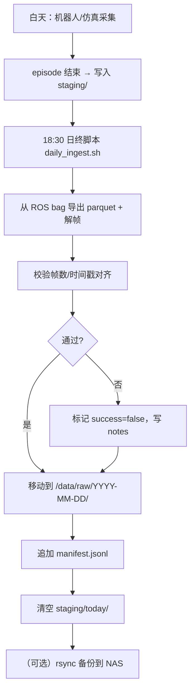
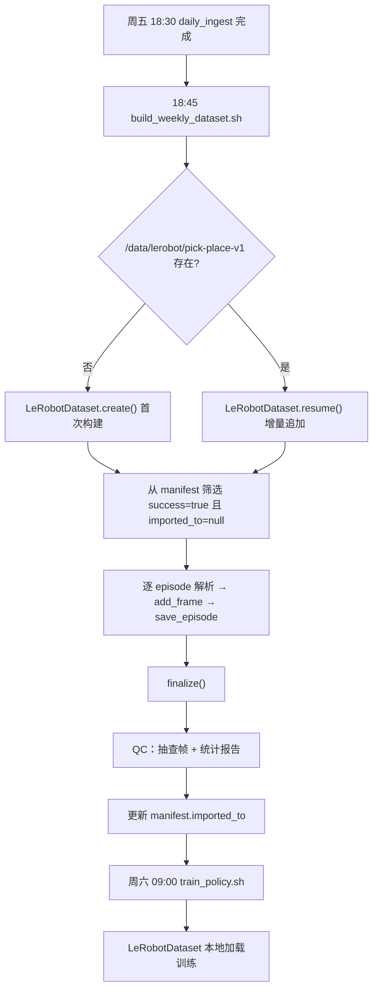

# LeRobotDataset v3.0 实践指南

> 基于 [Hugging Face 官方博客](https://huggingface.co/blog/lerobot-datasets-v3)、[LeRobot 官方文档](https://huggingface.co/docs/lerobot/en/lerobot-dataset-v3) 与真实数据集（如 [lerobot/aloha_static_coffee](https://huggingface.co/datasets/lerobot/aloha_static_coffee)）整理。

---

## 目录

1. [概述与 v2/v3 对比](#1-概述与-v2v3-对比)
2. [核心概念与字段词典](#2-核心概念与字段词典)
3. [目录结构与数据关系](#3-目录结构与数据关系)
4. [info.json 字段详解](#4-infojson-字段详解)
5. [其他元数据文件说明](#5-其他元数据文件说明)
6. [原始数据湖：日常批量采集管理](#6-原始数据湖日常批量采集管理)
7. [按需构建 LeRobot 数据集](#7-按需构建-lerobot-数据集)
8. [向已有数据集追加新数据](#8-向已有数据集追加新数据)
9. [训练使用](#9-训练使用)
10. [Checklist 与常见问题](#10-checklist-与常见问题)
11. [一周数据示例：本地服务器完整工作流](#11-一周数据示例本地服务器完整工作流)

---

## 1. 概述与 v2/v3 对比

**LeRobotDataset v3.0** 是 Hugging Face LeRobot 生态中面向机器人学习的标准化数据集格式，统一存储：

- 多模态时序数据（关节状态、力矩、末端位姿等）
- 多路相机视频流
- 遥操作 / 策略动作
- 任务描述、机器人类型、采样率等采集元信息

### v2 → v3 核心变化

| 维度 | v2.1 | v3.0 |
|------|------|------|
| 存储粒度 | 每个 episode 独立 `.parquet` / `.mp4` | 多个 episode 拼接进同一 `file-XXXX` |
| episode 边界 | 由文件名隐含 | 由 `meta/episodes/` 元数据显式记录 |
| 规模上限 | 数万 episode 尚可 | 面向百万 episode、亿级帧 |
| Hub 访问 | 需完整下载 | 支持 `StreamingLeRobotDataset` 流式读取 |
| 文件系统压力 | 高 | 低（少量大文件 + chunk 分块） |

**设计原则：存储与 API 解耦**

- **存储层**：高效序列化，少文件、大文件、分块（chunk）
- **API 层**：用户仍按 episode / frame 索引访问，loader 通过元数据还原边界

### 格式三大支柱

```
┌─────────────────────────────────────────────────────────────┐
│  meta/          关系型元数据：schema、episode 索引、统计量    │
├─────────────────────────────────────────────────────────────┤
│  data/          Parquet：state / action / timestamp 等表格  │
├─────────────────────────────────────────────────────────────┤
│  videos/        MP4：按相机 key 分目录，多 episode 拼接     │
└─────────────────────────────────────────────────────────────┘
```

---

## 2. 核心概念与字段词典

在深入文件格式之前，先厘清 LeRobot 中的核心概念。这些概念贯穿采集、存储、加载全流程。

### 2.1 层级概念

| 概念 | 含义 | 类比 |
|------|------|------|
| **Dataset（数据集）** | 一个完整的 LeRobot 格式仓库，包含 meta + data + videos | 数据库 |
| **Episode（回合/轨迹）** | 一次完整任务演示，有明确起止（成功或失败） | 数据库中的一行「记录」 |
| **Frame（帧）** | episode 内按固定 FPS 采样的一帧，所有模态时间对齐 | 记录中的一个「时间点」 |
| **Feature（特征）** | 某一类数据的 schema 定义，如 `observation.state`、`action` | 表的列定义 |
| **Chunk（分块）** | 文件系统上的子目录，用于控制单目录文件数量 | 分区（partition） |
| **Shard / File（分片文件）** | 一个 `.parquet` 或 `.mp4`，内含多个 episode 的数据 | 大文件 |
| **Task（任务）** | 自然语言描述的操作目标，映射为整数 `task_index` | 标签 |
| **Session（采集会话）** | 一次连续采集活动（非 LeRobot 内置概念，建议自建） | 原始数据管理单元 |

### 2.2 索引类字段（每帧都有）

这些字段由 LeRobot 在 `save_episode()` 时自动写入，**不需要**在 `add_frame()` 时手动提供（`task` 除外）。

| 字段 | dtype | 含义 |
|------|-------|------|
| `index` | int64 | **全局帧序号**，从 0 递增，跨 episode 连续编号。训练时 `dataset[i]` 的 `i` 就是这个 index |
| `episode_index` | int64 | **episode 编号**，从 0 开始。第 3 个 episode 的所有帧 `episode_index` 都是 2 |
| `frame_index` | int64 | **episode 内帧序号**，从 0 开始，每个 episode 独立计数 |
| `timestamp` | float32 | **episode 内相对时间**（秒），通常从 0 开始，步长 ≈ `1/fps`。用于视频 seek 与时序对齐 |
| `task_index` | int64 | 当前帧关联任务的整数 ID，对应 `meta/tasks` 中的任务表 |
| `next.done` | bool | 当前帧是否为 episode 的最后一帧（`true` 表示下一帧属于新 episode 或数据集结束） |

**关系示意：**

```
Episode 0:  frame_index 0..99   →  index 0..99     timestamp 0.00..3.30s
Episode 1:  frame_index 0..149  →  index 100..249  timestamp 0.00..4.97s
Episode 2:  frame_index 0..79   →  index 250..329  timestamp 0.00..2.63s
```

### 2.3 观测与动作字段（需自行定义 schema）

| 字段模式 | 含义 | 典型内容 |
|----------|------|----------|
| `observation.state` | 机器人本体状态观测 | 关节角、夹爪开合、末端位姿 |
| `observation.effort` | 力矩/电流等（可选） | 各关节力矩 |
| `observation.images.<name>` | 相机图像观测 | `front`、`wrist`、`top` 等 |
| `action` | 控制指令 / 遥操作目标 | 关节目标角、末端速度、离散动作 |
| `task` | 任务文本（`add_frame` 时传入） | `"Pick the red block"` |

**命名约定：**

- 状态/动作：直接用语义名，如 `observation.state`、`action`
- 图像：必须以 `observation.images.` 为前缀，后缀为相机 key
- 自定义字段可以添加，但需与 policy 训练配置一致

### 2.4 Feature 定义中的属性

每个 feature 在 `info.json` 的 `features` 字典中描述：

| 属性 | 含义 |
|------|------|
| `dtype` | 数据类型：`float32`、`int64`、`bool`、`video`、`image` 等 |
| `shape` | 张量形状。向量如 `[14]`；图像如 `[480, 640, 3]`（H, W, C） |
| `names` | 各维度的语义名称。可以是列表或嵌套字典（如 `{"motors": [...]}`） |
| `fps` | 该特征的采样率（通常与全局 fps 一致） |
| `video_info` | 仅 `dtype=video` 时有：编码器、像素格式、是否深度图等 |

### 2.5 Episode 元数据字段（`meta/episodes/` 中）

每个 episode 在 `meta/episodes/chunk-XXX/file-XXX.parquet` 中占一行：

| 字段 | 含义 |
|------|------|
| `episode_index` | episode 编号 |
| `length` | 该 episode 的帧数 |
| `tasks` | 关联的任务文本列表 |
| `dataset_from_index` | 该 episode 第一帧在全局 `index` 序列中的位置 |
| `dataset_to_index` | 该 episode 最后一帧的下一个 index（半开区间 `[from, to)`） |
| `data/chunk_index`, `data/file_index` | 表格数据所在的 parquet 分片位置 |
| `videos/<camera>/chunk_index`, `file_index` | 各相机视频所在的 mp4 分片位置 |

> **关键理解**：逻辑 episode 与物理文件解耦。一个 `file-000.parquet` 可能包含 episode 5、6、7 的帧数据，边界由上述元数据还原。

---

## 3. 目录结构

```
my-dataset/
├── meta/
│   ├── info.json              # 核心 schema 与全局配置
│   ├── stats.json             # 各特征 mean/std/min/max
│   ├── tasks.parquet          # 任务文本 ↔ task_index（v3 用 parquet）
│   └── episodes/
│       └── chunk-000/
│           ├── file-000.parquet
│           └── ...
├── data/
│   └── chunk-000/
│       ├── file-000.parquet       # 多 episode 帧级数据拼接
│       └── ...
└── videos/
    ├── observation.images.front/
    │   └── chunk-000/
    │       ├── file-000.mp4
    │       └── ...
    └── observation.images.wrist/
        └── ...
```

---

## 4. info.json 字段详解

`info.json` 是整个数据集的「契约」，loader、训练脚本、Hub 可视化都依赖它。**创建数据集时由 `LeRobotDataset.create()` 生成，追加 episode 时自动更新计数类字段。**

以下以真实数据集 [aloha_static_coffee](https://huggingface.co/datasets/lerobot/aloha_static_coffee) 为例说明。

### 4.1 顶层字段

```json
{
  "codebase_version": "v3.0",
  "robot_type": "aloha",
  "total_episodes": 50,
  "total_frames": 55000,
  "total_tasks": 1,
  "chunks_size": 1000,
  "fps": 50,
  "splits": { "train": "0:50" },
  "data_path": "data/chunk-{chunk_index:03d}/file-{file_index:03d}.parquet",
  "video_path": "videos/{video_key}/chunk-{chunk_index:03d}/file-{file_index:03d}.mp4",
  "data_files_size_in_mb": 100,
  "video_files_size_in_mb": 500,
  "features": { ... }
}
```

| 字段 | 类型 | 含义 | 注意事项 |
|------|------|------|----------|
| `codebase_version` | string | 数据集格式版本，当前为 `"v3.0"` | 决定如何解析其他元数据；v2.1 数据集需先转换 |
| `robot_type` | string | 采集使用的机器人类型标识 | 如 `aloha`、`so101`、`custom_arm`；用于 Hub 检索与兼容性检查 |
| `fps` | number | **全局采样帧率**（Hz） | 所有模态应以此频率对齐；`timestamp` 步长 ≈ `1/fps` |
| `total_episodes` | int | 数据集中 episode 总数 | 每次 `save_episode()` 后递增；追加数据后需更新 |
| `total_frames` | int | 所有 episode 的帧数之和 | 全局 `index` 范围为 `[0, total_frames)` |
| `total_tasks` | int | 不同任务描述的数量 | 新任务文本首次出现时递增 |
| `chunks_size` | int | 每个 chunk 目录最多容纳的 episode 数 | 控制目录分片粒度，默认 1000 |
| `splits` | dict | 数据集划分 | 如 `{"train": "0:50"}` 表示 episode 0–49 用于训练；`"0:40"` + `{"val": "40:50"}` 可拆分 |
| `data_path` | string | 表格数据的**路径模板** | `{chunk_index}`、`{file_index}` 为占位符，loader 据此定位 parquet |
| `video_path` | string | 视频数据的**路径模板** | 额外含 `{video_key}` 对应相机名 |
| `data_files_size_in_mb` | int | 单个 parquet 分片的目标大小（MB） | 达到阈值后滚动创建新 file；默认约 100 |
| `video_files_size_in_mb` | int | 单个 mp4 分片的目标大小（MB） | 默认约 500；影响文件数量与 seek 性能 |
| `features` | dict | **完整特征 schema**（见下节） | 创建后不应随意修改 shape/dtype |

### 4.2 `features` 字典

`features` 描述数据集中**每一列**的类型与形状，包括自动生成的索引列和用户定义的观测/动作列。

#### 用户定义的特征示例

```json
"observation.state": {
  "dtype": "float32",
  "shape": [14],
  "names": {
    "motors": [
      "left_waist", "left_shoulder", "left_elbow",
      "left_forearm_roll", "left_wrist_angle", "left_wrist_rotate", "left_gripper",
      "right_waist", "right_shoulder", "right_elbow",
      "right_forearm_roll", "right_wrist_angle", "right_wrist_rotate", "right_gripper"
    ]
  },
  "fps": 50.0
}
```

| 子字段 | 含义 |
|--------|------|
| `dtype: "float32"` | 浮点向量，存关节角等连续值 |
| `shape: [14]` | 14 维向量 |
| `names.motors` | 每一维的语义名，便于调试与可视化 |
| `fps` | 该特征采样率，通常等于全局 fps |

#### 视频特征示例

```json
"observation.images.cam_high": {
  "dtype": "video",
  "shape": [480, 640, 3],
  "names": ["height", "width", "channel"],
  "video_info": {
    "video.fps": 50.0,
    "video.codec": "av1",
    "video.pix_fmt": "yuv420p",
    "video.is_depth_map": false,
    "has_audio": false
  }
}
```

| 子字段 | 含义 |
|--------|------|
| `dtype: "video"` | 数据存于 `videos/` 目录的 MP4，而非 parquet 内嵌 |
| `shape: [H, W, C]` | 解码后图像尺寸 |
| `video_info.video.codec` | 编码格式：`h264`、`av1`、`hevc` 等 |
| `video_info.video.is_depth_map` | 是否为深度图（影响解码与可视化） |

#### 自动生成的索引特征

`episode_index`、`frame_index`、`timestamp`、`index`、`task_index`、`next.done` 也会出现在 `features` 中，由框架维护，**创建数据集时自动添加**，无需在 `create()` 的 features 参数里手写。

### 4.3 路径模板如何工作

```
data_path = "data/chunk-{chunk_index:03d}/file-{file_index:03d}.parquet"
```

- `chunk_index=0, file_index=0` → `data/chunk-000/file-000.parquet`
- 当单个 file 超过 `data_files_size_in_mb` 或 episode 数超过 `chunks_size` 时，自动递增 `file_index` 或 `chunk_index`
- `video_path` 同理，但多一个 `{video_key}`：

```
videos/observation.images.cam_high/chunk-000/file-000.mp4
```

---

## 5. 其他元数据文件说明

### 5.1 `meta/stats.json`

全数据集级别的特征统计，用于训练时归一化：

```python
stats = dataset.meta.stats
mean = stats["action"]["mean"]   # 各维均值
std  = stats["action"]["std"]    # 各维标准差
```

| 统计量 | 用途 |
|--------|------|
| `mean` / `std` | Z-score 归一化 |
| `min` / `max` | 缩放到 [-1, 1] 或 clip |
| `count` | 参与统计的样本数 |

> **追加新 episode 后**，`stats.json` 会在 `finalize()` 时重新计算。若只追加少量数据，统计量变化通常不大；若新数据分布差异大，建议重新训练或单独建数据集版本。

### 5.2 `meta/tasks.parquet`（v3）

| 列 | 含义 |
|----|------|
| `task_index` | 整数 ID |
| `task` | 自然语言任务描述 |

用于 language-conditioned policy：模型输入 `task_index` 或 task embedding。

### 5.3 `meta/episodes/`

每个 episode 一行 Parquet，是 v3「关系型索引」的核心。通过 `dataset_from_index` / `dataset_to_index` 实现：

```python
episodes = dataset.meta.episodes
ep = episodes[0]
print(ep["length"])                  # 帧数
print(ep["tasks"])                   # 任务列表
print(ep["dataset_from_index"])      # 全局起始 index
print(ep["dataset_to_index"])        # 全局结束 index（不含）
```

---

## 6. 原始数据湖：日常批量采集管理

**场景**：每天从 ROS bag、MP4 录像、仿真 rollout 等来源批量采集原始数据，但**只在需要训练时才构建 LeRobot 数据集**。

核心思路：**原始数据层与 LeRobot 数据集层分离**。

```
┌──────────────────────────────────────────────────────────────┐
│  Layer 1: 原始数据湖（Raw Data Lake）— 每天写入，长期保留      │
│  ROS bag / MP4 / HDF5 / JSON / 仿真日志                      │
└────────────────────────────┬─────────────────────────────────┘
                             │ 按需触发（构建脚本）
                             ▼
┌──────────────────────────────────────────────────────────────┐
│  Layer 2: LeRobot v3 数据集 — 训练就绪格式                    │
│  meta/ + data/ + videos/                                     │
└────────────────────────────┬─────────────────────────────────┘
                             │
                             ▼
┌──────────────────────────────────────────────────────────────┐
│  Layer 3: 训练（LeRobotDataset / StreamingLeRobotDataset）    │
└──────────────────────────────────────────────────────────────┘
```

### 6.1 推荐的原始数据目录结构

按 **日期 → 来源 → episode** 组织，与 LeRobot 格式无关，便于日常采集：

```
/data/raw/
├── manifest.jsonl                    # 全局索引（见下）
├── 2025-07-01/
│   ├── session_morning_001/
│   │   ├── session_meta.json         # 操作员、机器人、环境、schema 版本
│   │   ├── episode_000/
│   │   │   ├── episode_meta.json     # 任务、成功/失败、起止时间、备注
│   │   │   ├── ros/
│   │   │   │   └── recording.bag     # 或 .mcap
│   │   │   ├── cameras/
│   │   │   │   ├── front/
│   │   │   │   │   ├── 000000.jpg    # 或连续 MP4
│   │   │   │   │   └── timestamps.csv
│   │   │   │   └── wrist/
│   │   │   ├── states.npy            # 或 states.parquet
│   │   │   └── actions.npy
│   │   ├── episode_001/
│   │   └── ...
│   └── session_afternoon_002/
│       └── ...
├── 2025-07-02/
│   └── sim_rollouts/                 # 仿真数据同样结构
│       ├── episode_000/
│       │   ├── episode_meta.json
│       │   ├── states.hdf5
│       │   └── rgb_front.mp4
│       └── ...
└── schema/
    └── v1_features.json              # 冻结的 feature 定义（对齐 info.json）
```

### 6.2 `manifest.jsonl`：原始数据索引

每采集完一个 episode 追加一行，构建数据集时按条件筛选：

```jsonl
{"date":"2025-07-01","session":"session_morning_001","episode":"episode_000","source":"ros","task":"pick red block","success":true,"fps":30,"frames":120,"schema":"v1","path":"2025-07-01/session_morning_001/episode_000"}
{"date":"2025-07-01","session":"session_morning_001","episode":"episode_001","source":"ros","task":"pick red block","success":false,"fps":30,"frames":85,"schema":"v1","path":"2025-07-01/session_morning_001/episode_001"}
{"date":"2025-07-02","session":"sim_rollouts","episode":"episode_000","source":"sim","task":"place cube","success":true,"fps":50,"frames":200,"schema":"v1","path":"2025-07-02/sim_rollouts/episode_000"}
```

**好处：**

- 日常采集只写原始文件 + 一行 manifest，无需实时编码视频
- 构建时可按 `date`、`task`、`success`、`source` 过滤
- 同一条原始数据可多次构建不同版本的数据集（如只取成功 episode）

### 6.3 各来源采集要点

| 来源 | 建议落地格式 | 关键注意点 |
|------|-------------|-----------|
| **ROS / ROS2** | `.bag` / `.mcap` + 导出脚本 | 用统一 `clock`；记录 `/joint_states`、`/cmd`、相机 topic；episode 边界用 service 或按键标记 |
| **MP4 录像** | 每相机一个 MP4 + `timestamps.csv` | MP4 时间戳与机器人状态对齐；若只有视频需从文件名或 sidecar 获取帧时间 |
| **仿真** | HDF5 / NPZ / 逐帧图像 | 通常已有规整的 state/action 数组；注意仿真 fps 与真实机器人一致或可重采样 |
| **LeRobot 直录** | 直接写 v3 格式 | 适合已接入 lerobot 的机器人，跳过原始层 |

### 6.4 日常采集规范（写入原始层时）

1. **Schema 版本化**：在 `schema/v1_features.json` 冻结 feature 定义，原始层和后续 LeRobot 数据集共用
2. **Episode 边界明确**：每次任务演示有起止标记，不要靠事后猜
3. **时间对齐**：所有模态共享单调时钟；记录 `t0`（episode 起始绝对时间）
4. **元数据齐全**：`episode_meta.json` 至少含 `task`、`success`、`operator`、`notes`
5. **不删原始数据**：LeRobot 数据集可从原始层重建；原始层是 source of truth

---

## 7. 按需构建 LeRobot 数据集

当你决定训练时，从原始数据湖**批量转换**为 LeRobot v3。

### 7.1 构建流程

```
manifest.jsonl 筛选
       │
       ▼
读取 schema/v1_features.json
       │
       ▼
LeRobotDataset.create()  ← 首次构建
  或
LeRobotDataset.resume()  ← 追加到已有数据集
       │
       ▼
对每个 episode:
  解析原始数据 → 重采样到 fps → add_frame() × N → save_episode()
       │
       ▼
dataset.finalize()
       │
       ▼
（可选）dataset.push_to_hub()
```

### 7.2 首次构建：从原始数据批量导入

```python
import json
from pathlib import Path
import numpy as np
from lerobot.datasets.lerobot_dataset import LeRobotDataset

RAW_ROOT = Path("/data/raw")
DATASET_ROOT = Path("/data/lerobot/my-pick-place-v1")
SCHEMA = json.loads((RAW_ROOT / "schema/v1_features.json").read_text())

# 1. 从 manifest 筛选要纳入的 episode
episodes_to_build = []
with open(RAW_ROOT / "manifest.jsonl") as f:
    for line in f:
        rec = json.loads(line)
        if rec["success"] and rec["task"] == "pick red block":
            episodes_to_build.append(rec)

# 2. 创建数据集（仅首次）
dataset = LeRobotDataset.create(
    repo_id="my-org/my-pick-place-v1",
    root=DATASET_ROOT,
    fps=SCHEMA["fps"],
    robot_type=SCHEMA["robot_type"],
    features=SCHEMA["features"],
    use_videos=True,
)

# 3. 逐 episode 转换写入
for rec in episodes_to_build:
    ep_dir = RAW_ROOT / rec["path"]
    states, actions, images = load_episode(ep_dir, source=rec["source"])  # 自定义解析

    for t in range(len(states)):
        dataset.add_frame({
            "observation.state": states[t].astype(np.float32),
            "action": actions[t].astype(np.float32),
            "observation.images.front": images["front"][t],  # HWC uint8
            "task": rec["task"],
        })
    dataset.save_episode()

# 4. 必须 finalize
dataset.finalize()
```

### 7.3 按来源编写解析器

建议为每种来源实现统一接口：

```python
def load_episode(ep_dir: Path, source: str) -> tuple:
    """返回 (states, actions, images_dict)，均已对齐到相同帧数。"""
    if source == "ros":
        return load_from_ros_bag(ep_dir / "ros/recording.bag", ep_dir / "cameras")
    elif source == "sim":
        return load_from_hdf5(ep_dir / "states.hdf5", ep_dir / "rgb_front.mp4")
    elif source == "mp4":
        return load_from_mp4_and_csv(ep_dir)
    else:
        raise ValueError(f"Unknown source: {source}")
```

### 7.4 构建策略选择

| 策略 | 适用场景 |
|------|----------|
| **一次全量构建** | 数据量小（< 几百 episode），磁盘充足 |
| **按批次构建 + resume** | 每周从原始层增量导入 |
| **按任务/日期分数据集** | 不同实验需要隔离；如 `pick-v1`、`pick-v2-with-new-camera` |
| **只构建子集** | manifest 过滤 `success=true` + 特定日期范围 |

### 7.5 构建时的数据处理

| 步骤 | 说明 |
|------|------|
| **重采样** | 原始 fps 与目标 fps 不同时，对 state/action 线性插值，图像按最近帧选取 |
| **时间对齐** | 以最短模态为准截断，或插值补齐 |
| **图像格式** | `add_frame` 接受 `numpy` HWC `uint8`；框架负责编码为 MP4 |
| **失败 episode** | 建议不导入，或在 manifest 阶段过滤 |
| **变长 episode** | 正常处理，每个 episode 独立 `save_episode()` |

---

## 8. 向已有数据集追加新数据

数据集构建完成后，新采集的原始数据可通过 **`LeRobotDataset.resume()`** 追加，无需重建整个数据集。

### 8.1 核心 API

```python
from lerobot.datasets.lerobot_dataset import LeRobotDataset

# resume 必须指定本地 root，不能写入 Hub 缓存目录
dataset = LeRobotDataset.resume(
    repo_id="my-org/my-pick-place-v1",
    root="/data/lerobot/my-pick-place-v1",
    streaming_encoding=True,   # 可选：实时编码视频
)

# 新 episode 的 episode_index 会自动从 total_episodes 继续编号
for rec in new_episodes_from_manifest:
    states, actions, images = load_episode(...)
    for t in range(len(states)):
        dataset.add_frame({
            "observation.state": states[t],
            "action": actions[t],
            "observation.images.front": images["front"][t],
            "task": rec["task"],
        })
    dataset.save_episode()   # 自动更新 total_episodes、total_frames、stats

dataset.finalize()
dataset.push_to_hub()        # 增量上传
```

### 8.2 命令行追加（lerobot-record）

若使用 LeRobot 直录，可加 `--resume` 标志：

```bash
lerobot-record \
  --robot.type=so101_follower \
  --robot.port=/dev/tty.usbmodemXXXX \
  --dataset.repo_id=${HF_USER}/my-pick-place-v1 \
  --dataset.root=/data/lerobot/my-pick-place-v1 \
  --dataset.resume=true \
  --dataset.num_episodes=10 \
  --dataset.single_task="Pick the red block"
```

### 8.3 追加时的约束

| 约束 | 说明 |
|------|------|
| **feature schema 必须一致** | `observation.state` 的 shape、`action` 维度、相机 key 不能变 |
| **fps 必须一致** | 与 `info.json` 中 `fps` 相同 |
| **robot_type 建议一致** | 不强制，但混用会影响训练 |
| **必须提供 `root`** | `resume()` 不允许写入 Hub 缓存目录，避免损坏共享缓存 |
| **必须 `finalize()`** | 与新建相同，否则 parquet 损坏 |
| **stats 会重算** | `finalize()` 后 `stats.json` 包含新旧全部数据 |

### 8.4 推荐工作流：原始层增量 + 定期 resume

```
每天采集 → 写入 /data/raw/ + manifest.jsonl
                │
每周五或需要训练时 ──┐
                    ▼
         筛选新 episode（manifest 中尚未导入的）
                    ▼
         LeRobotDataset.resume() 追加
                    ▼
         finalize() → push_to_hub(tag="v1.3")
                    ▼
         在 manifest 中标记 imported_to="my-pick-place-v1"
```

manifest 可增加字段追踪导入状态：

```jsonl
{"date":"2025-07-08","path":"...","success":true,"imported_to":null}
{"date":"2025-07-09","path":"...","success":true,"imported_to":"my-org/my-pick-place-v1","imported_at":"2025-07-10"}
```

### 8.5 何时应新建数据集而非 resume

- 相机分辨率、feature shape 发生变化
- 任务定义或 action 空间改变（如从关节空间改为末端空间）
- 需要与旧数据严格隔离做对比实验
- 旧数据集已发布为论文 baseline 版本，不宜修改

此时应 `LeRobotDataset.create()` 创建新版本（如 `my-pick-place-v2`）。

---

## 9. 训练使用

### 9.1 本地加载

```python
from lerobot.datasets.lerobot_dataset import LeRobotDataset
import torch

dataset = LeRobotDataset(
    repo_id="my-org/my-pick-place-v1",
    root="/data/lerobot/my-pick-place-v1",
)

loader = torch.utils.data.DataLoader(dataset, batch_size=16, shuffle=True)
for batch in loader:
    obs = batch["observation.state"]
    act = batch["action"]
    img = batch["observation.images.front"]  # [B, C, H, W]
```

### 9.2 时序窗口

```python
delta_timestamps = {
    "observation.images.front": [-0.2, -0.1, 0.0],
    "action": [0.0, 0.033, 0.066, 0.1],
}
dataset = LeRobotDataset(repo_id, delta_timestamps=delta_timestamps)
# 图像 shape: [T, C, H, W]
```

### 9.3 流式训练（大规模数据集）

```python
from lerobot.datasets.streaming_dataset import StreamingLeRobotDataset

dataset = StreamingLeRobotDataset("yaak-ai/L2D-v3")
```

### 9.4 训练时图像增强

增强在加载时应用，不改变数据集中的原始图像：

```python
from lerobot.datasets.transforms import ImageTransforms, ImageTransformsConfig

dataset = LeRobotDataset(
    repo_id="my-org/my-pick-place-v1",
    image_transforms=ImageTransforms(ImageTransformsConfig(enable=True)),
)
```

---

## 10. Checklist 与常见问题

### 10.1 日常采集 Checklist

- [ ] 原始数据按 `日期/session/episode` 存放
- [ ] 每个 episode 有 `episode_meta.json`（task、success、notes）
- [ ] 追加一行到 `manifest.jsonl`
- [ ] 多模态时间戳对齐
- [ ] schema 版本未变时无需动 LeRobot 数据集

### 10.2 构建 / 追加数据集 Checklist

- [ ] 从 manifest 筛选目标 episode
- [ ] feature schema 与已有数据集一致（追加时）
- [ ] 逐 episode：`add_frame()` → `save_episode()`
- [ ] 调用 `finalize()`
- [ ] 用 Dataset Visualizer 抽查
- [ ] 更新 manifest 的 `imported_to` 字段
- [ ] （可选）`push_to_hub` 并打版本 tag

### 10.3 常见问题

| 问题 | 原因 | 处理 |
|------|------|------|
| 数据集无法加载 | 未调用 `finalize()` | 录制/导入结束后必须 `finalize()` |
| `resume()` 报错 | 未提供 `root` | 指定本地数据集目录 |
| schema 不兼容 | 追加时 shape 变了 | 创建新数据集版本 |
| 视频与状态不同步 | 原始采集未对齐 | 在导入脚本中重采样/对齐 |
| stats 过时 | 追加后未 finalize | 确保 `finalize()` 完成 |
| 训练 IO 慢 | MP4 解码瓶颈 | 流式 + torchcodec；或考虑 Lance 格式 |

---

## 11. 一周数据示例：本地服务器完整工作流

本章给出一个**可落地的完整示例**：假设你有一台本地服务器（`robot-server`，IP `192.168.1.100`），一台 6-DOF 机械臂 + 双相机，数据来自 ROS、MP4 录像和仿真三种来源。一周内每天批量采集，**只在周五下班后构建 LeRobot 数据集并启动训练**。

### 11.1 场景设定

| 项目 | 设定 |
|------|------|
| 服务器 | `robot-server`，本地磁盘 `/data`（建议独立大容量分区） |
| 机器人 | 6-DOF 臂 + `front` / `wrist` 双相机，ROS2 |
| 任务 | `pick_red_block`（主力）、`place_in_bin`（周四起加入） |
| 采样率 | 30 Hz |
| 仿真 | Isaac Sim，周末批量生成补充数据 |
| 训练触发 | 每周五 18:00 构建数据集；周六上午启动训练 |

### 11.2 本地服务器物理存储布局

```
/data/                                    # 数据根目录（建议独立磁盘挂载）
├── raw/                                  # Layer 1：原始数据湖（只增不改）
│   ├── manifest.jsonl                    # 全局 episode 索引
│   ├── schema/
│   │   └── v1_features.json              # 冻结的 feature 定义
│   ├── 2025-07-07/                       # 周一
│   ├── 2025-07-08/                       # 周二
│   ├── ...
│   └── 2025-07-13/                       # 周日（仅校验，无新采集）
│
├── staging/                              # 当日采集缓冲区（机器人本机或 NAS 同步到此）
│   └── today/                            # 每日清空，处理后归档到 raw/
│
├── lerobot/                              # Layer 2：LeRobot v3 训练就绪格式
│   └── pick-place-v1/                    # 本示例的数据集
│       ├── meta/
│       ├── data/
│       └── videos/
│
├── builds/                               # 构建日志与报告
│   └── 2025-W28/
│       ├── build.log
│       ├── import_report.json
│       └── qc_samples/                   # 抽查帧截图
│
├── training/                             # Layer 3：训练产物
│   └── 2025-W28-run01/
│       ├── checkpoints/
│       └── train.log
│
└── scripts/                              # 运维脚本（可放 git 仓库）
    ├── daily_ingest.sh
    ├── build_lerobot_dataset.py
    ├── validate_episode.py
    └── train_policy.sh
```

**磁盘规划建议：**

| 路径 | 预估一周增量 | 说明 |
|------|-------------|------|
| `/data/raw/` | 50–200 GB | ROS bag + 原始图像，最大头 |
| `/data/lerobot/` | 20–80 GB | 编码后 MP4 + Parquet，约为 raw 的 30–50% |
| `/data/training/` | 10–50 GB | checkpoint 视模型而定 |

### 11.3 一周采集数据明细（示例）

假设本周为 **2025-07-07（周一）至 2025-07-13（周日）**：

| 日期 | 来源 | Session | Episodes | 成功 | 失败 | 任务 | 备注 |
|------|------|---------|----------|------|------|------|------|
| 周一 07-07 | ROS | `am_real_001` | 20 | 16 | 4 | pick_red_block | 新操作员上手，失败偏多 |
| 周二 07-08 | ROS | `am_real_001` | 25 | 22 | 3 | pick_red_block | 状态稳定 |
| 周二 07-08 | ROS | `pm_real_001` | 15 | 14 | 1 | pick_red_block | 下午加采 |
| 周三 07-09 | ROS | `am_real_001` | 20 | 18 | 2 | pick_red_block | — |
| 周三 07-09 | 仿真 | `sim_batch_001` | 50 | 50 | 0 | pick_red_block | 夜间批量跑 |
| 周四 07-10 | ROS | `am_real_001` | 15 | 12 | 3 | pick_red_block | — |
| 周四 07-10 | ROS | `pm_real_001` | 20 | 15 | 5 | place_in_bin | 新任务首次采集 |
| 周五 07-11 | ROS | `am_real_001` | 25 | 23 | 2 | pick_red_block | 本周最后一批实机 |
| 周五 07-11 | ROS | `pm_real_001` | 20 | 17 | 3 | place_in_bin | — |
| 周六 07-12 | MP4 | `cam_backup_001` | 5 | 5 | 0 | pick_red_block | 相机独立录像补采 |
| 周日 07-13 | — | — | 0 | — | — | — | 仅做数据校验，不采集 |

**一周合计：**

- 原始 episode：**215** 条
- 成功：**192** 条（构建数据集时通常只用成功的）
- 失败：**23** 条（保留在 raw 层，不导入训练集）
- 来源分布：ROS 155 + 仿真 50 + MP4 5 + 备份 5

### 11.4 单日原始数据物理结构（以周三为例）

周三采集了 ROS 实机 20 条 + 仿真 50 条，归档后目录如下：

```
/data/raw/2025-07-09/
├── am_real_001/                              # ROS 实机上午
│   ├── session_meta.json
│   ├── episode_000/
│   │   ├── episode_meta.json
│   │   ├── ros/
│   │   │   └── recording.mcap                # ROS2 bag
│   │   ├── export/                             # 日终脚本从 bag 导出
│   │   │   ├── states.parquet                # 30Hz 关节状态
│   │   │   ├── actions.parquet               # 30Hz 动作
│   │   │   └── timestamps.parquet            # 统一时间轴
│   │   └── cameras/
│   │       ├── front/
│   │       │   ├── frames/                   # 000000.jpg ...（或单 MP4）
│   │       │   └── timestamps.csv
│   │       └── wrist/
│   │           ├── frames/
│   │           └── timestamps.csv
│   ├── episode_001/
│   └── ... (共 20 个 episode)
│
└── sim_batch_001/                              # 仿真夜间批量
    ├── session_meta.json
    ├── episode_000/
    │   ├── episode_meta.json
    │   ├── rollout.hdf5                      # state/action/图像数组
    │   └── rgb_front.mp4
    └── ... (共 50 个 episode)
```

**`episode_meta.json` 示例：**

```json
{
  "episode_id": "episode_000",
  "task": "pick_red_block",
  "success": true,
  "source": "ros",
  "fps": 30,
  "frames": 118,
  "duration_sec": 3.93,
  "operator": "alice",
  "robot_id": "arm_01",
  "started_at": "2025-07-09T09:15:32+08:00",
  "ended_at": "2025-07-09T09:15:36+08:00",
  "notes": "",
  "imported_to": null,
  "imported_at": null
}
```

**`manifest.jsonl` 当日追加行（每天结束时写入）：**

```jsonl
{"date":"2025-07-09","session":"am_real_001","episode":"episode_000","source":"ros","task":"pick_red_block","success":true,"fps":30,"frames":118,"schema":"v1","path":"2025-07-09/am_real_001/episode_000","imported_to":null}
{"date":"2025-07-09","session":"am_real_001","episode":"episode_001","source":"ros","task":"pick_red_block","success":false,"fps":30,"frames":72,"schema":"v1","path":"2025-07-09/am_real_001/episode_001","imported_to":null}
{"date":"2025-07-09","session":"sim_batch_001","episode":"episode_000","source":"sim","task":"pick_red_block","success":true,"fps":30,"frames":95,"schema":"v1","path":"2025-07-09/sim_batch_001/episode_000","imported_to":null}
```

### 11.5 每日处理流程（周一到周六）

每天采集结束后运行同一套日终流水线，**不构建 LeRobot 数据集**。



#### 每日时间线（以周二为例）

| 时间 | 动作 | 执行位置 | 产出 |
|------|------|----------|------|
| 09:00–12:00 | 实机遥操作采集 25 episodes | 机器人工控机 | `staging/today/` 下 ROS bag |
| 12:00–13:30 | 午休，staging 不动 | — | — |
| 14:00–17:30 | 继续采集 15 episodes | 机器人工控机 | 追加 staging |
| 18:00 | 操作员按停止键，最后一条 episode 封箱 | 工控机 | 完整 session |
| 18:30 | **自动执行 `daily_ingest.sh`** | `robot-server` | 见下方 |
| 18:35 | 收到钉钉/邮件日报 | `robot-server` | episode 数、成功率 |
| — | **不跑 LeRobot 构建** | — | — |

#### `daily_ingest.sh` 伪代码

```bash
#!/bin/bash
# /data/scripts/daily_ingest.sh
# cron: 30 18 * * 1-6  root

DATE=$(date +%Y-%m-%d)
STAGING=/data/staging/today
RAW=/data/raw/$DATE
MANIFEST=/data/raw/manifest.jsonl
LOG=/data/builds/${DATE}/ingest.log

mkdir -p $RAW $LOG

for session_dir in $STAGING/*/; do
  session=$(basename $session_dir)
  mkdir -p $RAW/$session

  for ep_dir in $session_dir/episode_*/; do
    ep=$(basename $ep_dir)

    # 1. ROS bag → parquet + 相机帧
    python /data/scripts/export_ros_episode.py $ep_dir

    # 2. 校验
    python /data/scripts/validate_episode.py $ep_dir \
      --schema /data/raw/schema/v1_features.json \
      --output $ep_dir/validation.json

    # 3. 读取 episode_meta，追加 manifest
    python /data/scripts/append_manifest.py \
      --episode-dir $ep_dir \
      --date $DATE \
      --session $session \
      --manifest $MANIFEST

    # 4. 归档到 raw
    mv $ep_dir $RAW/$session/
  done

  cp $session_dir/session_meta.json $RAW/$session/
done

# 5. 清空 staging
rm -rf $STAGING/*

# 6. 日报
python /data/scripts/daily_report.py --date $DATE --log $LOG
```

#### 各天差异说明

| 日期 | 采集内容 | 日终处理额外步骤 |
|------|----------|-----------------|
| **周一** | ROS 20 条 | 标准流程；失败 episode 多，QC 重点关注 |
| **周二** | ROS 40 条（上下午两场） | 两个 session 分别归档 |
| **周三** | ROS 20 + 仿真 50 | 仿真 episode 从 HDF5 校验，不走 ROS 导出 |
| **周四** | ROS 35 条，含新任务 `place_in_bin` | manifest 中出现新 task，**不影响日终** |
| **周五** | ROS 45 条 | 日终后 **额外触发** 周构建（见 11.6） |
| **周六** | MP4 补采 5 条 | 从 MP4 + CSV 导出帧，无 ROS bag |
| **周日** | 不采集 | 跑 `weekly_qc.sh` 全量校验 manifest 与文件一致性 |

### 11.6 需要训练时的流程（周五晚 → 周六训练）

本周五 18:30 日终 ingest 完成后，自动触发 **周构建流水线**。



#### 周五 18:45 — 构建 LeRobot 数据集

```bash
#!/bin/bash
# /data/scripts/build_weekly_dataset.sh
# cron: 45 18 * * 5

python /data/scripts/build_lerobot_dataset.py \
  --raw-root /data/raw \
  --dataset-root /data/lerobot/pick-place-v1 \
  --repo-id "local/pick-place-v1" \
  --schema /data/raw/schema/v1_features.json \
  --manifest /data/raw/manifest.jsonl \
  --filter "success==true and imported_to==null" \
  --resume \
  --log-dir /data/builds/$(date +%Y-W%V)
```

**`build_lerobot_dataset.py` 核心逻辑：**

```python
from pathlib import Path
import json
from lerobot.datasets.lerobot_dataset import LeRobotDataset

RAW_ROOT = Path("/data/raw")
DATASET_ROOT = Path("/data/lerobot/pick-place-v1")
SCHEMA = json.loads((RAW_ROOT / "schema/v1_features.json").read_text())

# 1. 读取待导入 episode
pending = []
with open(RAW_ROOT / "manifest.jsonl") as f:
    for line in f:
        rec = json.loads(line)
        if rec["success"] and rec.get("imported_to") is None:
            pending.append(rec)

# 2. 首次 or 增量
if DATASET_ROOT.exists() and (DATASET_ROOT / "meta/info.json").exists():
    dataset = LeRobotDataset.resume(
        repo_id="local/pick-place-v1",
        root=DATASET_ROOT,
        streaming_encoding=True,
    )
else:
    dataset = LeRobotDataset.create(
        repo_id="local/pick-place-v1",
        root=DATASET_ROOT,
        fps=SCHEMA["fps"],
        robot_type=SCHEMA["robot_type"],
        features=SCHEMA["features"],
        use_videos=True,
    )

# 3. 逐条导入
imported = []
for rec in pending:
    ep_dir = RAW_ROOT / rec["path"]
    states, actions, images = load_episode(ep_dir, source=rec["source"])

    for t in range(len(states)):
        dataset.add_frame({
            "observation.state": states[t],
            "action": actions[t],
            "observation.images.front": images["front"][t],
            "observation.images.wrist": images["wrist"][t],
            "task": rec["task"],
        })
    dataset.save_episode()
    imported.append(rec["path"])

# 4. 落盘
dataset.finalize()

# 5. 回写 manifest
update_manifest_imported(RAW_ROOT / "manifest.jsonl", imported, "local/pick-place-v1")
```

**本周五构建结果（示例）：**

```
导入前  /data/lerobot/pick-place-v1：不存在（首次构建）
导入后：
  total_episodes: 192
  total_frames:   ~28,800（假设平均 150 帧/episode）
  total_tasks:    2（pick_red_block, place_in_bin）

构建产物：
  /data/lerobot/pick-place-v1/meta/info.json     ← 已更新
  /data/lerobot/pick-place-v1/meta/stats.json
  /data/lerobot/pick-place-v1/data/chunk-000/file-000.parquet
  /data/lerobot/pick-place-v1/videos/observation.images.front/...
  /data/builds/2025-W28/import_report.json
```

**`import_report.json` 示例：**

```json
{
  "build_time": "2025-07-11T19:12:00+08:00",
  "dataset_root": "/data/lerobot/pick-place-v1",
  "imported_episodes": 192,
  "skipped_episodes": 23,
  "by_source": {"ros": 137, "sim": 50, "mp4": 5},
  "by_task": {"pick_red_block": 157, "place_in_bin": 35},
  "total_frames": 28810,
  "duration_min": 42
}
```

#### 周五 19:15 — 构建后 QC

```bash
# 抽查 10 个 episode 的首尾帧
python /data/scripts/qc_dataset.py \
  --dataset-root /data/lerobot/pick-place-v1 \
  --num-samples 10 \
  --output /data/builds/2025-W28/qc_samples/

# 打印 info.json 摘要
python -c "
import json
info = json.load(open('/data/lerobot/pick-place-v1/meta/info.json'))
print(f'episodes={info[\"total_episodes\"]}, frames={info[\"total_frames\"]}, tasks={info[\"total_tasks\"]}')
"
```

#### 周六 09:00 — 启动训练

```bash
#!/bin/bash
# /data/scripts/train_policy.sh
# cron: 0 9 * * 6  （或手动触发）

RUN_DIR=/data/training/2025-W28-run01
DATASET=/data/lerobot/pick-place-v1

lerobot-train \
  --dataset.repo_id=local/pick-place-v1 \
  --dataset.root=$DATASET \
  --policy.type=act \
  --output_dir=$RUN_DIR \
  --training.num_epochs=100 \
  --training.batch_size=32 \
  2>&1 | tee $RUN_DIR/train.log
```

**训练时数据流（全在本地，不走 Hub）：**

```
/data/lerobot/pick-place-v1/
        │
        ▼
LeRobotDataset(root="/data/lerobot/pick-place-v1")   # 本地加载，不下载
        │
        ▼
DataLoader(batch_size=32)                            # 从本地 MP4 seek 解码
        │
        ▼
GPU 训练 → /data/training/2025-W28-run01/checkpoints/
```

### 11.7 第二周增量追加示例

第二周（07-14 起）继续日终 ingest，**不重建数据集**，下周五再次 `resume()`：

```
第二周周五构建前：
  /data/raw/manifest.jsonl  新增 180 条 success=true, imported_to=null
  /data/lerobot/pick-place-v1  已有 192 episodes

第二周周五构建后：
  total_episodes: 192 + 180 = 372
  manifest 中对应行 imported_to = "local/pick-place-v1"
  stats.json 已重算（含两周全部数据）
```

```python
# 第二周：直接 resume，无需 create
dataset = LeRobotDataset.resume(
    repo_id="local/pick-place-v1",
    root="/data/lerobot/pick-place-v1",
)
# ... 只处理 imported_to=null 的新 episode
dataset.finalize()
```

### 11.8 一周全流程总览（时间轴）

```
周一 07-07
  09:00–17:00  采集 ROS ×20
  18:30        daily_ingest → raw/2025-07-07/ + manifest

周二 07-08
  09:00–17:30  采集 ROS ×40（两场 session）
  18:30        daily_ingest

周三 07-09
  09:00–12:00  采集 ROS ×20
  22:00–06:00  仿真批量 ×50（夜间 cron）
  18:30        daily_ingest（含上午 ROS）
  07:00        仿真完成后二次 ingest sim_batch

周四 07-10
  09:00–17:30  采集 ROS ×35（含新任务 place_in_bin）
  18:30        daily_ingest

周五 07-11  ★ 构建日
  09:00–17:30  采集 ROS ×45
  18:30        daily_ingest
  18:45        build_weekly_dataset.py → resume/create + finalize
  19:15        QC 抽查
  manifest     192 条标记 imported_to

周六 07-12
  10:00–11:00  MP4 补采 ×5
  18:30        daily_ingest（MP4 源）
  （可选）      手动 trigger 增量 build，或等下周五

周日 07-13
  10:00        weekly_qc.sh 校验 manifest 与文件一致性
  不采集、不构建

周六 07-12 09:00（若周五已构建）
  train_policy.sh → 本地 LeRobotDataset 训练
```

### 11.9 cron 配置参考（robot-server）

```cron
# /etc/cron.d/robot-data

# 周一至周六 18:30 日终归档
30 18 * * 1-6 root /data/scripts/daily_ingest.sh

# 周三至周四 07:00 处理夜间仿真结果
0 7 * * 3,4 root /data/scripts/ingest_sim_batch.sh

# 每周五 18:45 构建 LeRobot 数据集
45 18 * * 5 root /data/scripts/build_weekly_dataset.sh

# 每周六 09:00 启动训练（可按需关闭，改手动）
0 9 * * 6 root /data/scripts/train_policy.sh

# 每周日 10:00 全量校验
0 10 * * 0 root /data/scripts/weekly_qc.sh

# 每天 02:00 备份 raw 到 NAS
0 2 * * * root rsync -a --delete /data/raw/ nas:/backup/robot-raw/
```

### 11.10 关键原则（本地服务器场景）

1. **raw 层是 source of truth**：LeRobot 数据集可随时从 raw + manifest 重建
2. **日终只处理 raw，不碰 lerobot**：构建与训练解耦，采集不被编码视频拖慢
3. **manifest 追踪导入状态**：`imported_to=null` 表示尚未进入训练集，避免重复导入
4. **训练只读本地 `/data/lerobot/`**：无需 Hub，适合内网服务器
5. **失败 episode 保留但不导入**：raw 层全留，构建时 `success=true` 过滤
6. **每周五统一构建**：减少频繁 `finalize()` 和 stats 重算；紧急时可手动 trigger

---

## 参考资源

- 博客：[LeRobotDataset v3.0](https://huggingface.co/blog/lerobot-datasets-v3)
- 文档：[LeRobot Dataset v3 官方文档](https://huggingface.co/docs/lerobot/en/lerobot-dataset-v3)
- API：[LeRobotDataset 概念文档](https://huggingface-lerobot.mintlify.app/concepts/lerobot-dataset)
- 示例数据集：[lerobot/aloha_static_coffee](https://huggingface.co/datasets/lerobot/aloha_static_coffee)
- 可视化：[LeRobot Dataset Visualizer](https://huggingface.co/spaces/lerobot/visualize_dataset)
- v2 迁移：`python -m lerobot.datasets.v30.convert_dataset_v21_to_v30 --repo-id=<ID>`

---

## 一句话总结

**日常采集只维护原始数据湖 + manifest 索引；需要训练时用脚本按需构建或 `resume()` 追加 LeRobot v3 数据集；`info.json` 是全局契约，`meta/episodes/` 是 episode 与物理文件的映射桥梁；任何写入流程都必须以 `finalize()` 结束。**
