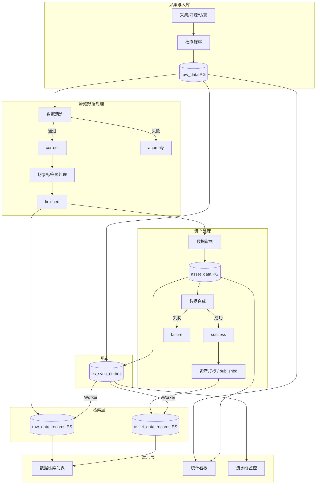
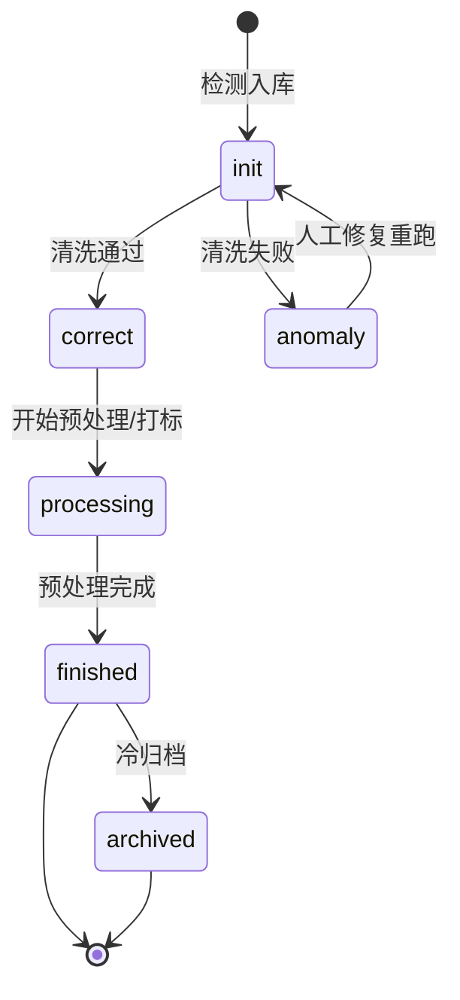
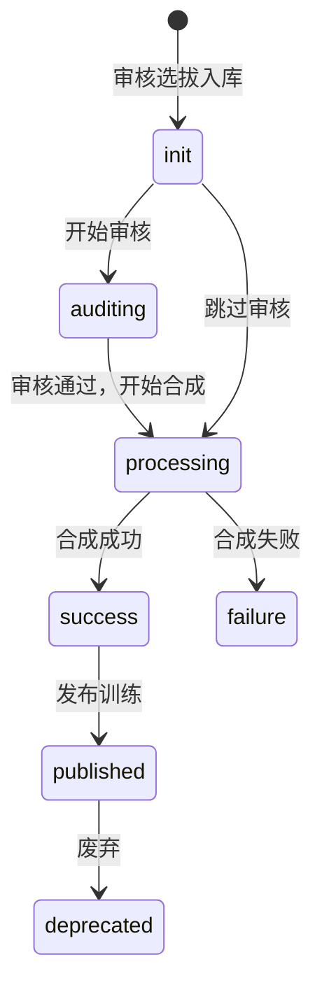
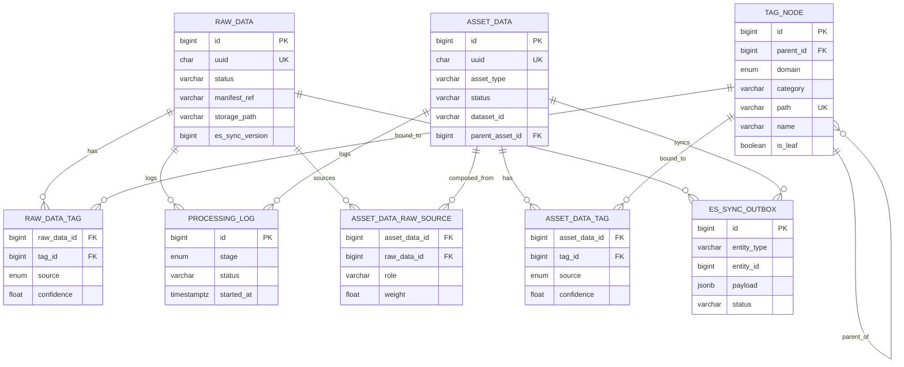
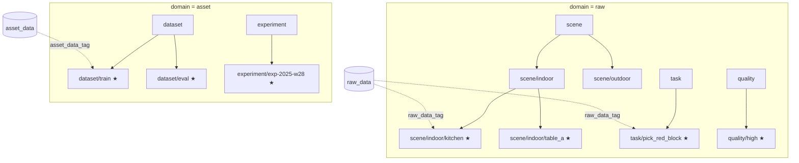
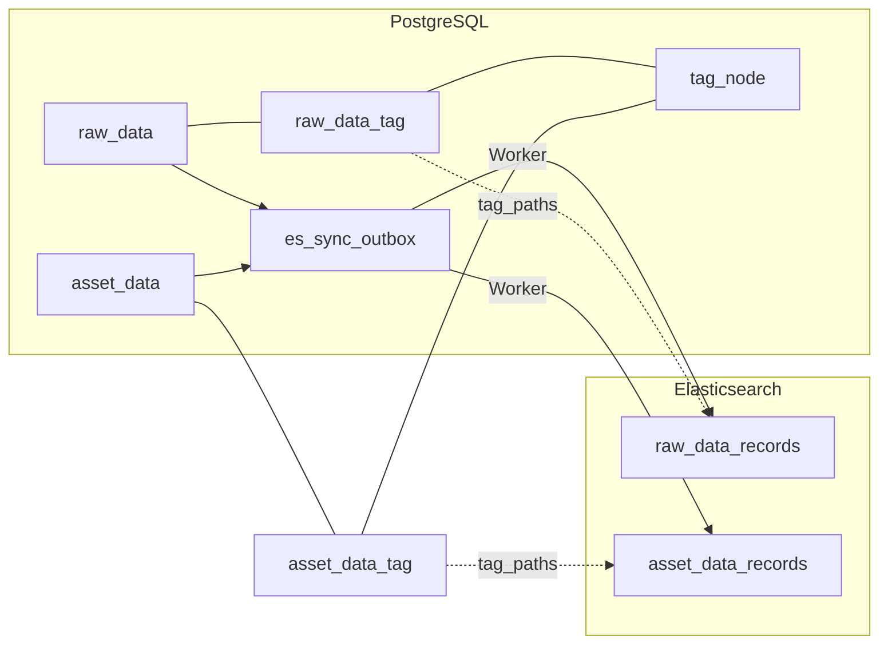
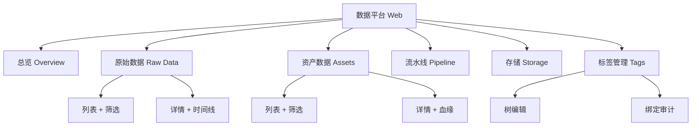
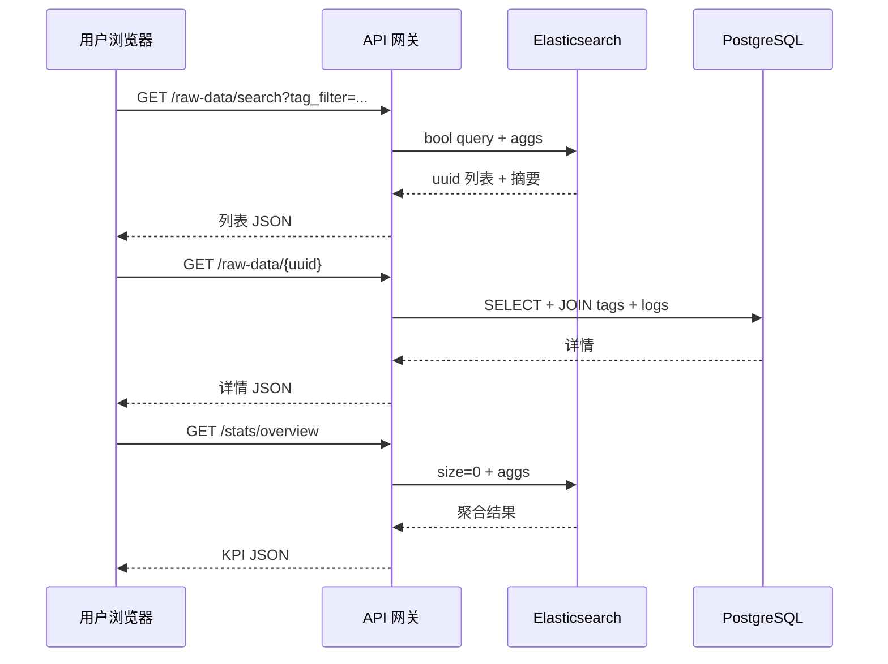

# 机器人数据平台 · 详细设计文档

> **版本**：v1.0  
> **范围**：原始数据（raw）与资产数据（asset）的存储、标签、检索、看板展示  
> **定位**：纯设计文档，与代码实现解耦。DDL 见 [appendix-ddl.sql](./appendix-ddl.sql)，ES Mapping 见 [appendix-es-mapping/](./appendix-es-mapping/)

---

## 目录

1. [系统概述](#1-系统概述)
2. [架构设计](#2-架构设计)
3. [业务流程与状态机](#3-业务流程与状态机)
4. [PostgreSQL 表结构设计](#4-postgresql-表结构设计)
5. [标签树设计](#5-标签树设计)
6. [Elasticsearch 索引设计](#6-elasticsearch-索引设计)
7. [检索设计](#7-检索设计)
8. [ER 图设计](#8-er-图设计)
9. [展示设计（UI / 看板）](#9-展示设计ui--看板)
10. [同步与一致性](#10-同步与一致性)
11. [与 manifest 流水线映射](#11-与-manifest-流水线映射)

---

## 1. 系统概述

### 1.1 背景

机器人数据采集流水线产生 ROS bag、MCAP、MP4、episode 目录等多种原始格式；经检测、清洗、打标后进入 LeRobot 等训练资产。平台需要：

- **权威存储**：事务性状态管理、标签树、血缘关系
- **高效检索**：按标签树、状态、时间、任务等多维过滤与聚合
- **可视化**：处理漏斗、分布统计、任务流成败、存储占用

### 1.2 设计目标

| 目标 | 方案 |
|------|------|
| 状态可追溯 | PG 状态机 + `processing_log` 阶段日志 |
| 标签灵活组合 | 大类 OR、同大类 AND；ES 单字段 `tag_paths` |
| 检索性能 | ES 承担列表/聚合；PG 承担详情/写入 |
| 最终一致 | Outbox 模式 PG → ES |
| 与现有流水线兼容 | `manifest_ref` 对齐 manifest.jsonl |

### 1.3 不在本期范围

- 多机房联邦检索
- 细粒度 RBAC（一期管理员/只读）
- 实时视频预览

---

## 2. 架构设计

### 2.1 逻辑架构



### 2.2 存储职责划分

| 组件 | 职责 | 典型操作 |
|------|------|----------|
| **PostgreSQL** | 权威数据、状态机、外键、标签树、绑定关系 | INSERT/UPDATE 状态、绑定标签、详情查询 |
| **Elasticsearch** | 全文检索、标签组合过滤、看板聚合 | search、aggs、prefix |
| **es_sync_outbox** | 可靠异步同步 | 业务事务后投递，Worker 消费 |
| **文件系统** | 物理数据 `/data/raw`、`/data/lerobot` | manifest、episode_meta、info.json |

### 2.3 读写路径

```
写入：业务 API → PG 事务（实体 + 标签绑定 + outbox）→ COMMIT → Worker bulk index ES
读取列表：前端 → API → ES（过滤/排序/分页）→ 返回 uuid 列表 → 按需 PG 补全详情
读取详情：前端 → API → PG（主键/uuid）
看板聚合：前端 → API → ES aggs 或 PG 物化表
```

---

## 3. 业务流程与状态机

### 3.1 原始数据状态机



| 状态 | 值 | 触发 | 副作用 |
|------|-----|------|--------|
| 初始化 | `init` | 检测程序扫描入库 | 写 `detected_at` |
| 数据正确 | `correct` | 清洗通过 | 写 `cleaned_at` |
| 数据异常 | `anomaly` | 清洗失败 | `status_message` 记录原因 |
| 处理中 | `processing` | 打标预处理开始 | — |
| 处理完成 | `finished` | 预处理完成 | 写 `preprocessed_at`；**同步 ES** |
| 已归档 | `archived` | 冷存储迁移 | 写 `archived_at` |

### 3.2 资产数据状态机



| 状态 | 值 | 触发 | 副作用 |
|------|-----|------|--------|
| 初始化 | `init` | 从 finished raw 选拔 | — |
| 审核中 | `auditing` | 自动/人工审核 | 写 `audited_at` |
| 合成中 | `processing` | build LeRobot 等 | — |
| 成功 | `success` | 合成完成 | 写 `synthesized_at`；**同步 ES** |
| 失败 | `failure` | 合成失败 | `status_message` |
| 已发布 | `published` | 发布训练 | 写 `published_at`；**同步 ES** |

### 3.3 流水线阶段（processing_log）

| stage | 对应任务 | 关联实体 |
|-------|----------|----------|
| `detect` | 检测程序 | raw_data |
| `clean` | 数据清洗 | raw_data |
| `preprocess` | 场景标签预处理 | raw_data |
| `audit` | 数据审核 | asset_data |
| `synthesize` | 数据合成 | asset_data |
| `tag` | 资产打标 | asset_data |

---

## 4. PostgreSQL 表结构设计

> 完整 DDL：[appendix-ddl.sql](./appendix-ddl.sql)

### 4.1 表清单

| 表名 | 说明 | 行数量级（预估） |
|------|------|------------------|
| `raw_data` | 原始数据主表 | 10⁵–10⁶ |
| `asset_data` | 资产数据主表 | 10²–10⁴ |
| `asset_data_raw_source` | 资产←原始 多对多 | 10⁵–10⁶ |
| `tag_node` | 标签树节点 | 10²–10³ |
| `raw_data_tag` | 原始数据标签绑定 | 10⁵–10⁶ |
| `asset_data_tag` | 资产标签绑定 | 10³–10⁵ |
| `processing_log` | 流水线阶段日志 | 10⁶+ |
| `es_sync_outbox` | ES 同步队列 | 滚动清理 |

### 4.2 `raw_data` 原始数据表

**用途**：每条原始 episode / bag / 视频的唯一权威记录。

| 字段 | 类型 | 约束 | 说明 |
|------|------|------|------|
| `id` | BIGSERIAL | PK | 内部主键 |
| `uuid` | CHAR(36) | UNIQUE NOT NULL | 对外 ID，**ES `_id` 同源** |
| `data_type` | enum/varchar(32) | NOT NULL | `ros_bag`/`ros_mcap`/`mp4`/`hdf5`/`episode_dir`/`multi_modal` |
| `source_type` | enum/varchar(32) | NOT NULL | `collected`/`open_source`/`simulation`/`imported` |
| `status` | enum/varchar(32) | NOT NULL | 状态机，默认 `init` |
| `status_message` | varchar(512) | | 失败原因 |
| `prev_status` | varchar(32) | | 上一状态（审计） |
| `name` | varchar(256) | NOT NULL | 显示名 |
| `code` | varchar(128) | UNIQUE | 业务编码 `RAW-20250716-0007` |
| `description` | text | | 描述 |
| `storage_path` | varchar(1024) | NOT NULL | 物理根路径 |
| `metadata_uri` | varchar(1024) | | episode_meta.json 路径 |
| `manifest_ref` | varchar(512) | INDEX | manifest.jsonl 的 `path` |
| `preview_uri` | varchar(1024) | | 缩略图/首帧 |
| `checksum` | char(64) | | SHA256 |
| `file_count` | int | | 文件数 |
| `total_bytes` | bigint | | 字节数 |
| `total_frames` | int | | 帧数 |
| `duration_sec` | double | | 时长（秒） |
| `fps` | float | | 帧率 |
| `robot_id` | varchar(64) | INDEX | 机器人 |
| `operator_id` | varchar(64) | INDEX | 操作员 |
| `scene_code` | varchar(128) | INDEX | 场景编码 |
| `task_name` | varchar(256) | INDEX | 任务名 |
| `session_key` | varchar(128) | INDEX | 采集会话 |
| `episode_name` | varchar(64) | | episode 目录名 |
| `success_flag` | boolean | NULL | 采集是否成功 |
| `collected_at` | timestamptz | INDEX | 采集开始 |
| `collection_end` | timestamptz | | 采集结束 |
| `detected_at` | timestamptz | | 检测入库 |
| `cleaned_at` | timestamptz | | 清洗完成 |
| `preprocessed_at` | timestamptz | | 预处理完成 |
| `archived_at` | timestamptz | | 归档 |
| `extra_meta` | jsonb | | 扩展（validation 摘要等） |
| `schema_ver` | varchar(16) | default v1 | feature schema 版本 |
| `es_sync_version` | bigint | | 每次变更递增 |
| `es_indexed_at` | timestamptz | | 最近 ES 同步时间 |
| `es_doc_id` | varchar(64) | | 默认 = uuid |
| `version` | int | | 乐观锁 |
| `created_by` / `updated_by` | varchar(64) | | 操作人 |
| `created_at` / `updated_at` | timestamptz | | |
| `deleted_at` | timestamptz | INDEX | 软删除 |

**索引**：

- `idx_raw_type_status (data_type, status)`
- `idx_raw_robot_scene (robot_id, scene_code)`
- `idx_raw_manifest_ref (manifest_ref)`
- `idx_raw_collected_at (collected_at)`

### 4.3 `asset_data` 资产数据表

**用途**：LeRobot 数据集、训练包、评测包等合成产物。

| 字段 | 类型 | 约束 | 说明 |
|------|------|------|------|
| `id` | BIGSERIAL | PK | |
| `uuid` | CHAR(36) | UNIQUE NOT NULL | ES `_id` |
| `asset_type` | enum/varchar(32) | NOT NULL | `lerobot_dataset`/`training_pack`/`eval_pack`/`synthetic` |
| `status` | enum/varchar(32) | NOT NULL | 状态机 |
| `status_message` | varchar(512) | | |
| `prev_status` | varchar(32) | | |
| `name` | varchar(256) | NOT NULL | 资产名 |
| `code` | varchar(128) | UNIQUE | `ASSET-pick-place-v1` |
| `description` | text | | |
| `storage_path` | varchar(1024) | NOT NULL | `/data/lerobot/...` |
| `dataset_id` | varchar(256) | INDEX | `local/pick-place-v1` |
| `metadata_uri` | varchar(1024) | | meta/info.json |
| `output_uri` | varchar(1024) | | 训练入口 |
| `checksum` | char(64) | | |
| `episode_count` | int | | |
| `frame_count` | bigint | | |
| `task_count` | int | | |
| `total_bytes` | bigint | | |
| `fps` | float | | |
| `robot_type` | varchar(64) | INDEX | |
| `synthesis_config` | jsonb | | 合成参数 date_from/filter 等 |
| `audit_result` | jsonb | | 审核结果 |
| `auditor_id` | varchar(64) | | |
| `audit_score` | float | | 0–1 |
| `parent_asset_id` | bigint | FK | 增量构建父版本 |
| `build_job_id` | bigint | | 关联批任务 |
| `audited_at` / `synthesized_at` / `published_at` / `deprecated_at` | timestamptz | | 时间线 |
| `extra_meta` | jsonb | | |
| ES 同步字段 | | | 同 raw_data |
| 审计字段 | | | 同 raw_data |

### 4.4 `asset_data_raw_source` 血缘关联

| 字段 | 类型 | 说明 |
|------|------|------|
| `asset_data_id` | bigint FK | 资产 |
| `raw_data_id` | bigint FK | 来源原始数据 |
| `role` | varchar(32) | `primary` / `supplement` |
| `weight` | float | 合成权重，默认 1 |

约束：`UNIQUE(asset_data_id, raw_data_id)`

### 4.5 `tag_node` 标签树

| 字段 | 类型 | 说明 |
|------|------|------|
| `id` | BIGSERIAL PK | |
| `parent_id` | bigint FK NULL | 父节点，NULL=根 |
| `domain` | enum | `raw` 场景标签 / `asset` 资产标签 |
| `category` | varchar(64) | **大类**，= path 首段 |
| `path` | varchar(1024) | 物化路径 `scene/indoor/kitchen` |
| `name` | varchar(256) | 显示名 |
| `is_leaf` | boolean | 是否可绑定 |
| `is_active` | boolean | 是否启用 |

约束：`UNIQUE(domain, path)`

### 4.6 `raw_data_tag` / `asset_data_tag` 绑定表

| 字段 | 类型 | 说明 |
|------|------|------|
| `raw_data_id` / `asset_data_id` | bigint FK | 实体 |
| `tag_id` | bigint FK | 标签节点（须为叶子） |
| `source` | enum | `auto` / `manual` / `rule` |
| `confidence` | float | 0–1，自动打标置信度 |
| `bound_at` | timestamptz | 绑定时间 |
| `bound_by` | varchar(64) | 操作人 |

约束：`UNIQUE(实体_id, tag_id)`

### 4.7 `processing_log` 阶段日志

| 字段 | 类型 | 说明 |
|------|------|------|
| `raw_data_id` | bigint NULL | 二选一 |
| `asset_data_id` | bigint NULL | 二选一 |
| `stage` | enum | detect/clean/preprocess/audit/synthesize/tag |
| `job_id` | bigint | 批任务 ID |
| `status` | varchar(32) | running/success/failed |
| `input_json` / `output_json` | jsonb | 阶段输入输出 |
| `error_msg` | text | |
| `started_at` / `finished_at` | timestamptz | |
| `duration_ms` | bigint | |

### 4.8 `es_sync_outbox` 同步队列

| 字段 | 类型 | 说明 |
|------|------|------|
| `entity_type` | varchar(32) | `raw_data` / `asset_data` |
| `entity_id` | bigint | PG 主键 |
| `entity_uuid` | char(36) | |
| `op` | varchar(16) | index / update / delete |
| `payload` | jsonb | ES 文档 JSON |
| `status` | varchar(16) | pending / done / failed |
| `retry_count` | int | 最大 5 次 |

---

## 5. 标签树设计

### 5.1 路径规范

- 格式：`{category}/{...}/{leaf}`，**无 leading `/`**
- `category` = path 第一段，代表标签大类
- 仅 **叶子节点**（`is_leaf=true`）可绑定到数据
- 树深度建议 ≤ 5，path 长度 ≤ 1024

### 5.2 查询语义

| 层级 | 逻辑 | 说明 |
|------|------|------|
| **不同 category** | **OR** | 满足任一大类条件即可 |
| **同一 category 内多选** | **AND** | 必须同时包含所有选中标签 |

**示例**：用户选择

- 场景类：`厨房` + `桌A`（AND）
- 任务类：`抓红块`（单选）

语义 = （含厨房 **且** 含桌A）**或**（含抓红块）

### 5.3 树示例（domain=raw）

```
scene                          [category=scene]
├── scene/indoor               室内
│   ├── scene/indoor/kitchen   厨房 ★叶子
│   └── scene/indoor/table_a   桌A ★叶子
├── scene/outdoor              室外
task                           [category=task]
└── task/pick_red_block        抓红块 ★叶子
quality                        [category=quality]
└── quality/high               高质量 ★叶子
```

### 5.4 树示例（domain=asset）

```
dataset                        [category=dataset]
├── dataset/train              训练集 ★叶子
└── dataset/eval               评测集 ★叶子
experiment                     [category=experiment]
└── experiment/exp-2025-w28    第28周实验 ★叶子
```

### 5.5 PG 与 ES 分工

| 信息 | 存储位置 | 说明 |
|------|----------|------|
| 树结构、父子关系 | PG `tag_node` | 权威 |
| 绑定关系、source、confidence | PG 绑定表 | 权威，不同步 ES |
| 绑定叶子的 path 列表 | ES `tag_paths` | 检索用 |

---

## 6. Elasticsearch 索引设计

> 完整 Mapping：[appendix-es-mapping/](./appendix-es-mapping/)

### 6.1 索引划分

| 索引名 | 文档 | PG 来源 | 写入时机 |
|--------|------|---------|----------|
| `raw_data_records` | 原始数据检索文档 | raw_data + 标签绑定 | status→`finished` 或标签变更 |
| `asset_data_records` | 资产检索文档 | asset_data + 标签 + 血缘 | status→`success`/`published` 或标签变更 |

**通用约定**：

- `_id` = `uuid`（与 PG 一致，幂等 upsert）
- `dynamic: strict`（禁止未声明字段）
- `refresh_interval: 5s`（近实时，非强一致）

### 6.2 `raw_data_records` 文档结构

| 字段 | ES 类型 | 可检索 | 说明 |
|------|---------|--------|------|
| `raw_data_id` | long | filter | PG 主键 |
| `uuid` | keyword | filter | 对外 ID |
| `code` | keyword | filter | 业务编码 |
| `data_type` | keyword | filter/aggs | |
| `source_type` | keyword | filter/aggs | |
| `status` | keyword | filter/aggs | |
| `name` | text + keyword | match/sort | |
| `description` | text | match | 全文 |
| `task_name` | keyword | filter/aggs | |
| `scene_code` | keyword | filter | |
| `robot_id` | keyword | filter/aggs | |
| `operator_id` | keyword | filter/aggs | |
| `session_key` | keyword | filter | |
| `episode_name` | keyword | filter | |
| `storage_path` | keyword | 不索引 | 仅存储 |
| `metadata_uri` | keyword | 不索引 | 仅存储 |
| `manifest_ref` | keyword | filter | |
| `checksum` | keyword | filter | |
| `file_count` | integer | aggs | |
| `total_bytes` | long | aggs | |
| `total_frames` | integer | aggs | |
| `duration_sec` | double | aggs | |
| `fps` | float | | |
| `success_flag` | boolean | filter/aggs | |
| **`tag_paths`** | **keyword[]** | **term/prefix** | **唯一标签字段** |
| `collected_at` … `preprocessed_at` | date | range/aggs | |
| `created_at` / `updated_at` | date | sort | |
| `sync_version` | long | 内部 | 幂等校验 |

**文档示例**：

```json
{
  "raw_data_id": 10001,
  "uuid": "550e8400-e29b-41d4-a716-446655440000",
  "code": "RAW-20250716-0007",
  "data_type": "episode_dir",
  "source_type": "collected",
  "status": "finished",
  "name": "pick episode 007",
  "task_name": "pick_red_block",
  "robot_id": "am_real_001",
  "manifest_ref": "2025-07-16/am_real_001/episode_007",
  "success_flag": true,
  "total_frames": 150,
  "tag_paths": [
    "scene/indoor/kitchen",
    "task/pick_red_block"
  ],
  "collected_at": "2025-07-16T10:00:00Z",
  "preprocessed_at": "2025-07-16T22:30:00Z",
  "sync_version": 3
}
```

### 6.3 `asset_data_records` 文档结构

在 raw 基础上增加：

| 字段 | ES 类型 | 说明 |
|------|---------|------|
| `asset_data_id` | long | |
| `asset_type` | keyword | |
| `dataset_id` | keyword | |
| `robot_type` | keyword | |
| `output_uri` | keyword | |
| `episode_count` / `frame_count` / `task_count` | int/long | 规模 |
| `source_raw_data_ids` | long[] | 反查血缘 |
| `source_raw_data_uuids` | keyword[] | |
| `auditor_id` / `audit_score` | keyword/float | |
| `parent_asset_id` | long | 版本链 |
| `audited_at` / `synthesized_at` / `published_at` | date | |

**文档示例**：

```json
{
  "asset_data_id": 2001,
  "uuid": "660e8400-e29b-41d4-a716-446655440001",
  "asset_type": "lerobot_dataset",
  "status": "success",
  "name": "pick-place-w2-202507",
  "dataset_id": "local/pick-place-w2-202507",
  "episode_count": 175,
  "frame_count": 26250,
  "source_raw_data_ids": [10001, 10002],
  "tag_paths": ["dataset/train", "experiment/exp-2025-w28"],
  "sync_version": 2
}
```

### 6.4 字段设计原则

| 原则 | 说明 |
|------|------|
| 标签只存 `tag_paths` | 去掉 nested、tag_ids、tag_codes、tag_text 等冗余 |
| 物理路径不索引 | `storage_path` index=false，减少体积 |
| keyword 用于过滤/聚合 | status、data_type、robot_id 等 |
| text 用于模糊搜 | name、description |
| 时间字段统一 date | ISO8601 |

---

## 7. 检索设计

### 7.1 场景矩阵

| 场景 | 数据源 | 查询类型 |
|------|--------|----------|
| 原始数据列表（多维筛选） | ES `raw_data_records` | bool filter + sort |
| 资产列表 | ES `asset_data_records` | 同上 |
| 标签树节点下全部数据 | ES | prefix on `tag_paths` |
| 多大类标签组合筛选 | ES | bool should + must（见 §7.2） |
| 单条详情 | PG | uuid / id |
| 状态变更 | PG | 事务 |
| 看板分布统计 | ES aggs 或 PG 物化表 | terms / date_histogram |
| 资产反查来源 raw | ES | term on `source_raw_data_ids` |
| raw 查生成了哪些资产 | ES | term on `source_raw_data_ids` 反向 |

### 7.2 标签组合查询（核心）

**输入结构**（API 层）：

```json
{
  "tag_filter": {
    "scene": ["scene/indoor/kitchen", "scene/indoor/table_a"],
    "task": ["task/pick_red_block"]
  }
}
```

**ES DSL**：

```json
{
  "query": {
    "bool": {
      "should": [
        {
          "bool": {
            "must": [
              { "term": { "tag_paths": "scene/indoor/kitchen" } },
              { "term": { "tag_paths": "scene/indoor/table_a" } }
            ]
          }
        },
        {
          "bool": {
            "must": [
              { "term": { "tag_paths": "task/pick_red_block" } }
            ]
          }
        }
      ],
      "minimum_should_match": 1
    }
  }
}
```

**语义**：`(厨房 AND 桌A) OR (抓红块)`

**仅单一大类、多选 AND**：

```json
{
  "query": {
    "bool": {
      "must": [
        { "term": { "tag_paths": "scene/indoor/kitchen" } },
        { "term": { "tag_paths": "quality/high" } }
      ]
    }
  }
}
```

### 7.3 子树检索（点选树节点）

用户点击树节点 `scene/indoor`，需命中其下所有叶子绑定。

```json
{
  "query": {
    "prefix": { "tag_paths": "scene/indoor/" }
  }
}
```

> 尾斜杠 `/` 避免 `scene/indoor` 误匹配 `scene/indoor2`。

### 7.4 列表页组合查询（典型）

```json
{
  "query": {
    "bool": {
      "filter": [
        { "terms": { "status": ["finished", "correct"] } },
        { "term": { "source_type": "collected" } },
        { "range": { "collected_at": { "gte": "2025-07-01", "lte": "2025-07-31" } } }
      ],
      "must": [
        {
          "bool": {
            "should": [
              { "bool": { "must": [
                { "term": { "tag_paths": "scene/indoor/kitchen" } }
              ]}}
            ],
            "minimum_should_match": 1
          }
        }
      ]
    }
  },
  "sort": [{ "collected_at": "desc" }],
  "from": 0,
  "size": 20
}
```

### 7.5 看板聚合

```json
GET raw_data_records/_search
{
  "size": 0,
  "query": {
    "bool": {
      "filter": [
        { "range": { "collected_at": { "gte": "now-30d/d" } } }
      ]
    }
  },
  "aggs": {
    "by_status": { "terms": { "field": "status" } },
    "by_data_type": { "terms": { "field": "data_type", "size": 20 } },
    "by_source_type": { "terms": { "field": "source_type" } },
    "success_breakdown": { "terms": { "field": "success_flag" } },
    "top_tag_paths": { "terms": { "field": "tag_paths", "size": 50 } },
    "episodes_over_time": {
      "date_histogram": {
        "field": "collected_at",
        "calendar_interval": "day"
      }
    }
  }
}
```

### 7.6 资产血缘反查

```json
GET asset_data_records/_search
{
  "query": { "term": { "source_raw_data_ids": 10001 } }
}
```

### 7.7 API 检索接口设计（建议）

| 方法 | 路径 | 说明 |
|------|------|------|
| GET | `/api/v1/raw-data/search` | ES 列表，返回 uuid 列表 + 摘要 |
| GET | `/api/v1/raw-data/{uuid}` | PG 详情 |
| GET | `/api/v1/assets/search` | ES 资产列表 |
| GET | `/api/v1/assets/{uuid}` | PG 详情 + 来源 raw 列表 |
| GET | `/api/v1/tags/tree` | PG 标签树（按 domain） |
| GET | `/api/v1/stats/overview` | 看板 KPI |
| GET | `/api/v1/stats/distribution` | 分布聚合 |

**search 请求体**：

```json
{
  "q": "kitchen pick",
  "status": ["finished"],
  "data_type": ["episode_dir"],
  "date_from": "2025-07-01",
  "date_to": "2025-07-31",
  "robot_id": "am_real_001",
  "tag_filter": {
    "scene": ["scene/indoor/kitchen"],
    "task": ["task/pick_red_block"]
  },
  "tag_mode": "group_or",
  "page": 1,
  "page_size": 20,
  "sort": "collected_at:desc"
}
```

---

## 8. ER 图设计

### 8.1 核心实体关系（逻辑 ER）



### 8.2 标签树结构（示意）



★ = 可绑定叶子节点

### 8.3 数据流 ER（跨存储）



---

## 9. 展示设计（UI / 看板）

### 9.1 信息架构



### 9.2 页面清单

| 页面 | 路由 | 数据源 | 核心功能 |
|------|------|--------|----------|
| 总览 | `/` | ES aggs + PG | KPI 卡片、趋势、漏斗 |
| 原始数据列表 | `/raw-data` | ES | 多维筛选、标签树、分页 |
| 原始数据详情 | `/raw-data/:uuid` | PG | 元数据、标签、阶段日志、预览 |
| 资产列表 | `/assets` | ES | 筛选、按 dataset 分组 |
| 资产详情 | `/assets/:uuid` | PG | 合成配置、来源 raw 列表、版本链 |
| 流水线 | `/pipeline` | PG `processing_log` | 任务流历史、成败、耗时 |
| 分布统计 | `/distribution` | ES aggs | 按类型/来源/任务/标签分布 |
| 存储 | `/storage` | 文件扫描 | 磁盘占用、分层占比 |
| 标签管理 | `/tags` | PG | 树 CRUD、启用/停用 |

### 9.3 总览页（Overview）

```
┌─────────────────────────────────────────────────────────────────────────┐
│  机器人数据平台                                    [日期范围 ▼] [刷新]   │
├─────────────────────────────────────────────────────────────────────────┤
│ ┌──────────┐ ┌──────────┐ ┌──────────┐ ┌──────────┐ ┌──────────┐       │
│ │原始数据  │ │已完成    │ │待处理    │ │资产数据集│ │磁盘占用  │       │
│ │ 12,450   │ │  9,820   │ │  1,230   │ │    28    │ │  2.4 TB  │       │
│ │ +120 今日│ │ 78.9%    │ │          │ │ +2 本周  │ │ raw 1.8T │       │
│ └──────────┘ └──────────┘ └──────────┘ └──────────┘ └──────────┘       │
├──────────────────────────────┬──────────────────────────────────────────┤
│  采集趋势（折线）             │  处理漏斗（漏斗图）                       │
│  episodes / 帧数 / 日        │  init→correct→finished→imported         │
├──────────────────────────────┼──────────────────────────────────────────┤
│  来源分布（饼图）             │  任务成功率（柱状）                       │
│  ros / sim / mp4             │  按 task_name 分组                       │
└──────────────────────────────┴──────────────────────────────────────────┘
```

**KPI 定义**：

| 卡片 | 指标 | 来源 |
|------|------|------|
| 原始数据 | count(raw) | ES `raw_data_records` 或 PG |
| 已完成 | status=finished | ES filter aggs |
| 待处理 | status in (init,correct,processing) | ES |
| 资产数据集 | count(asset) status=success | ES |
| 磁盘占用 | storage_snapshots | 扫描脚本 |

### 9.4 原始数据列表页（核心检索页）

```
┌─────────────────────────────────────────────────────────────────────────┐
│ 原始数据                                                                │
├──────────────┬──────────────────────────────────────────────────────────┤
│ 标签树       │  [搜索框: 名称/任务/manifest...]                          │
│              │  状态[▼] 类型[▼] 来源[▼] 机器人[▼] 日期[──●──]  [搜索]   │
│ ▼ scene      │ ─────────────────────────────────────────────────────────  │
│   ▼ indoor   │  ☐ 名称          状态      标签              采集时间    │
│     ☑ kitchen│  ☐ ep_007        finished  厨房,抓红块      07-16 10:00  │
│     ☑ table_a│  ☐ ep_008        finished  厨房,桌A,抓红块  07-16 10:15  │
│   outdoor    │  ☐ ep_009        anomaly   —                07-16 11:00  │
│ ▼ task       │                                                          │
│   ☑ pick_red │  < 1 2 3 ... 50 >                         共 9,820 条   │
│ ▼ quality    │                                                          │
│   ☐ high     │  已选: scene 厨房+桌A (AND) | task 抓红块 → OR 组合      │
└──────────────┴──────────────────────────────────────────────────────────┘
```

**标签树交互规则**：

| 操作 | 行为 |
|------|------|
| 勾选同 category 下多个叶子 | 该 category 内 **AND** |
| 勾选不同 category 的叶子 | category 之间 **OR** |
| 点击非叶子节点 | 切换为 **子树模式**（prefix 检索），勾选清空 |
| 树上方显示已选摘要 | `scene: 厨房+桌A OR task: 抓红块` |

**列表列**：

| 列 | 字段 | 说明 |
|----|------|------|
| 名称 | name + episode_name | 可点击进详情 |
| 状态 | status | 色块：init 灰、finished 绿、anomaly 红 |
| 标签 | tag_paths → name | 最多显示 3 个，超出 +N |
| 类型 | data_type | |
| 机器人 | robot_id | |
| 任务 | task_name | |
| 帧数 | total_frames | |
| 采集时间 | collected_at | 默认排序 |

### 9.5 原始数据详情页

```
┌─────────────────────────────────────────────────────────────────────────┐
│ ← 返回   pick episode 007                    [finished]  RAW-20250716-007 │
├─────────────────────────────────────────────────────────────────────────┤
│  基本信息          │  标签                                    [编辑]    │
│  manifest: ...     │  scene/indoor/kitchen  厨房   auto 0.95            │
│  路径: /data/raw/..│  task/pick_red_block   抓红块  auto 0.88           │
│  帧数: 150  fps:30 │                                                    │
├────────────────────┴────────────────────────────────────────────────────┤
│  阶段时间线                                                              │
│  ● detected  07-16 22:00  ● cleaned 22:10  ● finished 22:30             │
├─────────────────────────────────────────────────────────────────────────┤
│  处理日志                                                                │
│  stage      status   duration   operator                                │
│  detect     success  120ms     system                                   │
│  clean      success  3.2s      system                                   │
│  preprocess success  45s       tag-worker                               │
├─────────────────────────────────────────────────────────────────────────┤
│  关联资产（由本 raw 参与合成）                                           │
│  pick-place-w2-202507  success  175 episodes                          │
└─────────────────────────────────────────────────────────────────────────┘
```

### 9.6 资产列表与详情

**列表列**：名称、dataset_id、状态、episode_count、frame_count、标签、合成时间

**详情页区块**：

1. 基本信息（dataset_id、storage_path、规模）
2. 资产标签（domain=asset）
3. 来源 raw 表格（raw uuid、manifest_ref、weight、role）
4. 版本链（parent_asset_id 链接）
5. 合成配置 JSON（synthesis_config 可视化）

### 9.7 流水线页

```
┌─────────────────────────────────────────────────────────────────────────┐
│ 流水线监控                              job_type [▼]  status [▼]        │
├─────────────────────────────────────────────────────────────────────────┤
│  任务流执行历史                                                          │
│  时间          类型           状态     耗时    in/ok/fail               │
│  07-16 22:00   daily_ingest   success  5m     120/118/2                 │
│  07-17 02:00   build_weekly   success  45m    500/498/2                 │
├─────────────────────────────────────────────────────────────────────────┤
│  阶段成功率（按 stage × 近7天）                                          │
│  detect ████████████████████ 99.2%                                      │
│  clean  ██████████████████░░ 95.1%                                      │
│  preprocess ████████████████░ 92.0%                                     │
└─────────────────────────────────────────────────────────────────────────┘
```

### 9.8 分布统计页

| 图表 | 类型 | 维度 |
|------|------|------|
| 数据类型分布 | 饼图 | data_type |
| 来源分布 | 饼图 | source_type |
| 状态分布 | 柱状 | status |
| 任务分布 | 条形 | task_name top 20 |
| 标签热度 | 条形 | tag_paths top 30 |
| 采集趋势 | 折线 | date × count/frames |
| 成功率趋势 | 折线 | date × success_rate |

### 9.9 存储页

| 区块 | 内容 |
|------|------|
| 总览卡片 | raw / staging / lerobot / training 占用 |
| 趋势图 | storage_snapshots 时序 |
| 目录树 | 可展开子目录占用（details_json） |

### 9.10 视觉规范（建议）

| 项 | 规范 |
|----|------|
| 主色 | `#1677ff`（操作）、`#52c41a` 成功、`#ff4d4f` 失败、`#faad14` 警告 |
| 状态色 | init `#8c8c8c`、processing `#1677ff`、finished/success `#52c41a`、anomaly/failure `#ff4d4f` |
| 布局 | 左侧导航 220px，内容区自适应，列表页左侧标签树 260px |
| 组件库 | Ant Design / 同类组件库 |
| 响应式 | ≥1280 完整布局；<1280 标签树折叠为抽屉 |

### 9.11 前后端分工（展示层）



---

## 10. 同步与一致性

### 10.1 Outbox 流程

```
1. BEGIN
2. UPDATE raw_data SET status='finished', es_sync_version=es_sync_version+1
3. UPSERT raw_data_tag ...
4. INSERT es_sync_outbox (entity_type, entity_id, payload, op='index')
5. COMMIT
6. Worker 轮询 pending → bulk index ES → UPDATE es_indexed_at, outbox.status='done'
7. 失败：retry_count++，指数退避，超 5 次告警
```

### 10.2 触发同步的事件

| 事件 | 动作 |
|------|------|
| raw status → finished | index raw_data_records |
| raw 标签变更且 status≥correct | update raw_data_records |
| raw 软删除 | delete ES 文档 |
| asset status → success/published | index asset_data_records |
| asset 标签变更 | update |
| tag_node.path 修改 | 批量刷新所有绑定实体 |

### 10.3 一致性级别

| 场景 | 保证 |
|------|------|
| 状态变更后立即读详情 | 强一致（读 PG） |
| 列表/看板检索 | 最终一致（ES 落后 ≤5s + Worker 延迟） |
| 幂等 | `_id=uuid` + `sync_version` 防旧覆盖新 |

---

## 11. 与 manifest 流水线映射

| manifest / episode 字段 | raw_data 字段 | 说明 |
|-------------------------|---------------|------|
| `path` | `manifest_ref` + `storage_path` | 业务唯一键 |
| `source` | `data_type` / `source_type` | ros→episode_dir, sim→hdf5 等 |
| `success` | `success_flag` | |
| `task` | `task_name` | |
| `frames` | `total_frames` | |
| `date` | `collected_at` | |
| `imported_to` | 资产合成后 → `asset_data.dataset_id` | |

**流水线衔接**：

```
日终 ingest → INSERT raw_data (init)
           → processing_log (detect)
清洗       → UPDATE status=correct|anomaly
预处理打标 → UPDATE status=finished + raw_data_tag
           → outbox → ES
build 完成 → INSERT asset_data (success) + asset_data_raw_source
           → asset_data_tag → outbox → ES
```

---

## 附录

| 文件 | 说明 |
|------|------|
| [appendix-ddl.sql](./appendix-ddl.sql) | PostgreSQL 建表脚本 |
| [appendix-es-mapping/raw_data_records.json](./appendix-es-mapping/raw_data_records.json) | 原始数据索引 Mapping |
| [appendix-es-mapping/asset_data_records.json](./appendix-es-mapping/asset_data_records.json) | 资产索引 Mapping |
| [../lerobot-workflow/data-dashboard-design.md](../lerobot-workflow/data-dashboard-design.md) | 统计看板（episodes/jobs 层）补充设计 |

---

*文档结束 · 实现代码见 `robot-data-platform/` 与 `robot-data-dashboard/`，以本设计为准演进。*
