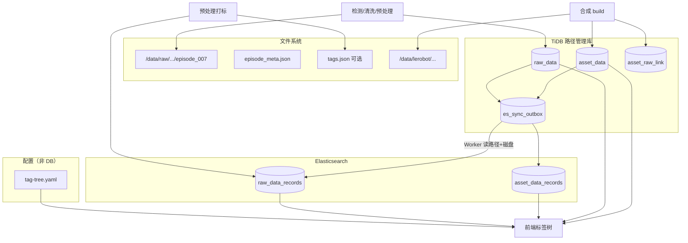
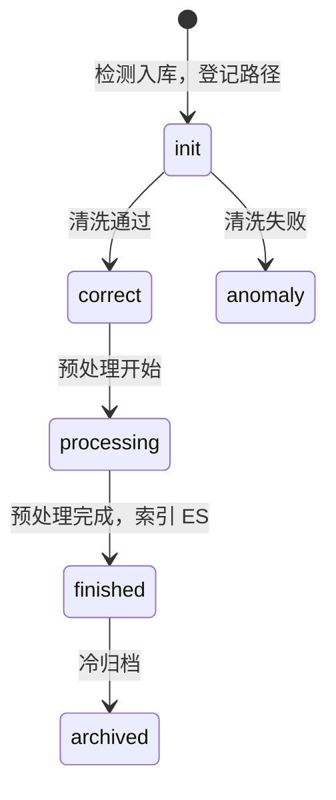
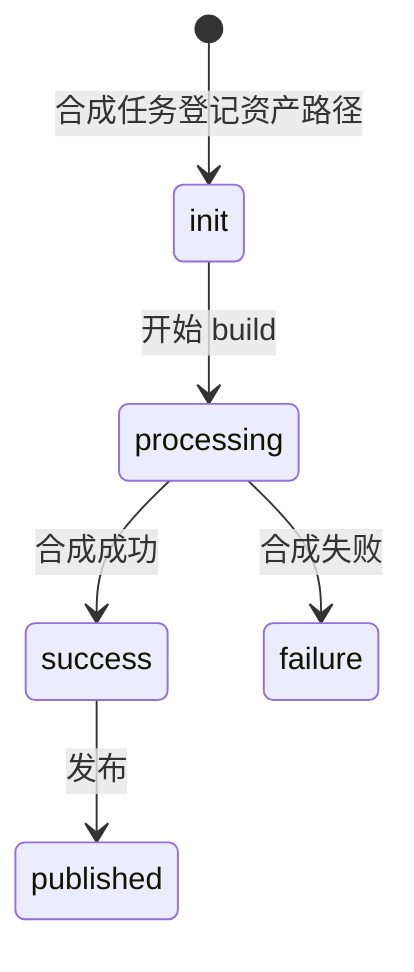
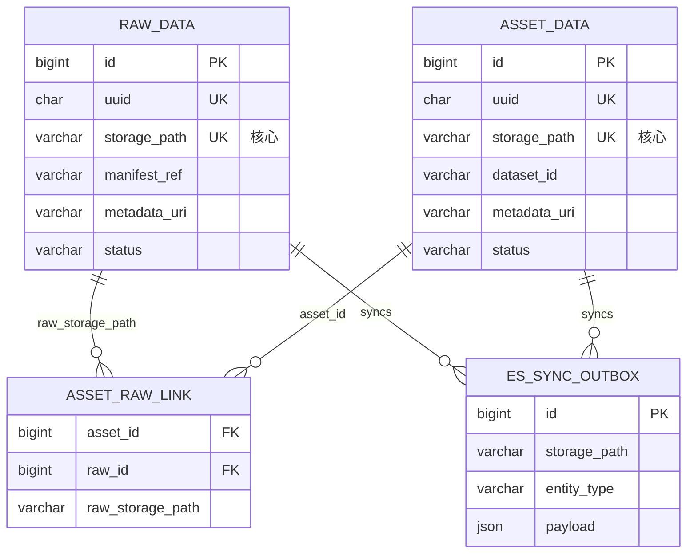
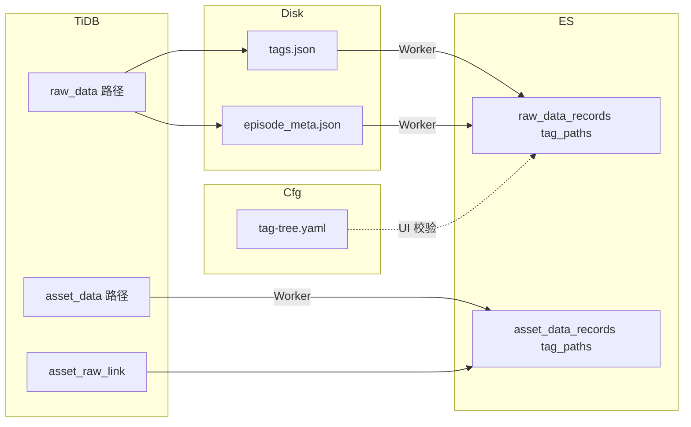
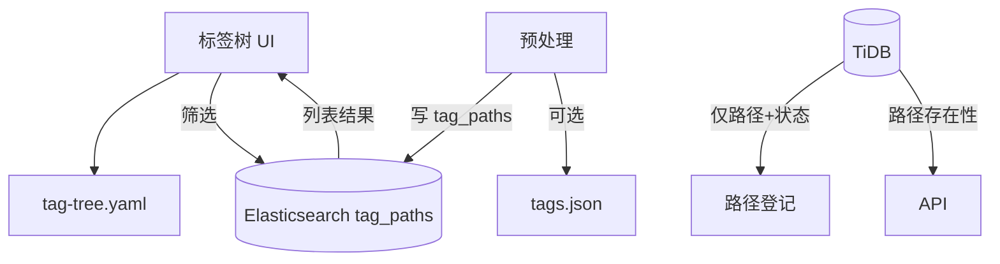
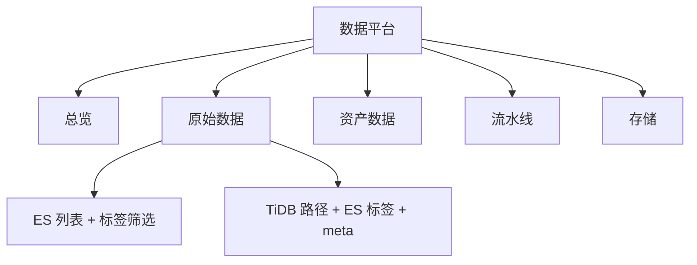
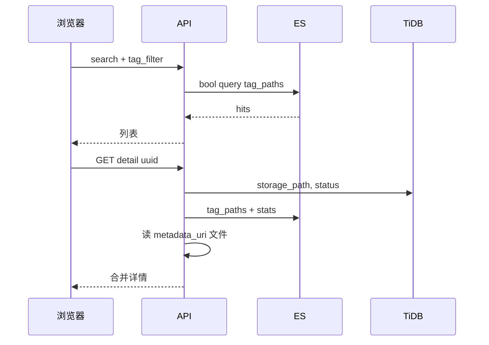

# 机器人数据平台 · 详细设计文档

> **版本**：v1.2  
> **范围**：原始数据（raw）与资产数据（asset）的路径管理、ES 检索与标签、看板展示  
> **定位**：纯设计文档，与代码实现解耦  
> **DDL**：[appendix-ddl.sql](./appendix-ddl.sql)（TiDB） · **ES Mapping**：[appendix-es-mapping/](./appendix-es-mapping/) · **标签树**：[appendix-tag-tree.yaml](./appendix-tag-tree.yaml)

---

## 目录

1. [系统概述](#1-系统概述)
2. [架构设计](#2-架构设计)
3. [业务流程与状态机](#3-业务流程与状态机)
4. [TiDB 表结构设计（路径管理库）](#4-tidb-表结构设计路径管理库)
5. [标签设计（仅存 ES）](#5-标签设计仅存-es)
6. [Elasticsearch 索引设计](#6-elasticsearch-索引设计)
7. [检索设计](#7-检索设计)
8. [ER 图设计](#8-er-图设计)
9. [展示设计（UI / 看板）](#9-展示设计ui--看板)
10. [同步与一致性](#10-同步与一致性)
11. [与 manifest 流水线映射](#11-与-manifest-流水线映射)

---

## 1. 系统概述

### 1.1 核心分工

| 存储 | 职责 | 不做什么 |
|------|------|----------|
| **TiDB** | 登记**数据路径**、流水线状态、路径血缘 | 不存标签、不存检索元数据 |
| **Elasticsearch** | 检索、聚合、**标签**（`tag_paths`） | 不做事务状态权威 |
| **文件系统** | 物理数据与元数据 JSON | — |
| **标签树配置** | UI 展示与 path 校验（YAML） | 不进任何数据库 |

### 1.2 设计目标

| 目标 | 方案 |
|------|------|
| 管理库极简 | TiDB 4 张表，核心字段是 `storage_path` |
| 标签灵活检索 | 标签只写 ES；**大类之间 OR**；**同大类内多选由用户选 AND / OR** |
| 检索性能 | 列表/筛选/看板走 ES |
| 路径可追溯 | TiDB 路径登记 + `asset_raw_link` |
| 与 manifest 对齐 | `manifest_ref` / `storage_path` 对应 manifest `path` |

### 1.3 数据流一句话

```
检测入库 → TiDB 登记路径 + 状态
预处理打标 → 写 tags 到 ES（或 sidecar tags.json，Worker 索引进 ES）
列表检索 → 只查 ES（含 tag_paths）
详情路径 → TiDB 查路径，磁盘读 episode_meta，ES 补标签与统计字段
```

---

## 2. 架构设计

### 2.1 逻辑架构



### 2.2 存储职责

| 组件 | 存什么 | 典型操作 |
|------|--------|----------|
| **TiDB** | `storage_path`、`manifest_ref`、`metadata_uri`、status | 登记路径、推进状态、血缘 |
| **ES** | 可检索字段 + **`tag_paths`** + 从 meta 冗余的统计字段 | search、aggs、更新标签 |
| **tag-tree.yaml** | 树结构、显示名、category | 前端渲染、path 校验 |
| **磁盘 meta** | episode_meta、info.json、可选 tags.json | Worker 索引时读取 |

### 2.3 读写路径

```
写入路径：
  检测 → INSERT raw_data(storage_path, manifest_ref, status=init)
  预处理完成 → UPDATE status=finished → Worker 读 metadata_uri + tags.json → index ES（含 tag_paths）
  人工改标签 → 直接 UPDATE ES 文档 tag_paths（TiDB 不变）

读取：
  列表/筛选/看板 → ES
  路径是否存在/当前状态 → TiDB
  单条完整详情 → TiDB 路径 + 读磁盘 meta + ES 文档合并
```

---

## 3. 业务流程与状态机

### 3.1 原始数据状态机



| 状态 | 触发 | TiDB | ES |
|------|------|------|-----|
| `init` | 扫描到新路径 | INSERT path | — |
| `correct` / `anomaly` | 清洗 | UPDATE status | — |
| `processing` | 打标开始 | UPDATE status | — |
| `finished` | 打标完成 | UPDATE status | **index/update**，写入 `tag_paths` |
| `archived` | 冷存储 | UPDATE status | 可选 delete 或保留 |

### 3.2 资产数据状态机



| 状态 | TiDB | ES |
|------|------|-----|
| `init` | INSERT asset path | — |
| `success` / `published` | UPDATE status | index，写入 `tag_paths` + `source_raw_data_ids` |

### 3.3 标签写入时机（仅 ES）

| 阶段 | 标签写入方式 |
|------|----------------|
| 自动打标（预处理） | 预处理程序输出 `tags.json` 或写 ES；Worker 索引时带入 `tag_paths` |
| 人工修正 | API 直接 `POST /_update` ES 文档 `tag_paths` |
| 资产打标 | 合成完成后同上，仅 ES |

**TiDB 全程不涉及标签表。**

---

## 4. TiDB 表结构设计（路径管理库）

> 完整 DDL：[appendix-ddl.sql](./appendix-ddl.sql)

### 4.1 表清单

| 表名 | 说明 | 核心 |
|------|------|------|
| `raw_data` | 原始数据路径登记 | `storage_path` UNIQUE |
| `asset_data` | 资产路径登记 | `storage_path` UNIQUE |
| `asset_raw_link` | 资产←原始路径血缘 | `raw_storage_path` |
| `es_sync_outbox` | TiDB → ES 同步队列 | `storage_path` |

**明确不建的表**：`tag_node`、`raw_data_tag`、`asset_data_tag`（标签不进库）

### 4.2 `raw_data` 原始数据路径表

| 字段 | 类型 | 约束 | 说明 |
|------|------|------|------|
| `id` | BIGINT | PK AUTO_INCREMENT | |
| `uuid` | CHAR(36) | UNIQUE NOT NULL | 对外 ID，ES `_id` 同源 |
| **`storage_path`** | VARCHAR(1024) | **UNIQUE NOT NULL** | **物理根路径，管理主键** |
| `manifest_ref` | VARCHAR(512) | INDEX | manifest.jsonl 的 `path` |
| `metadata_uri` | VARCHAR(1024) | | episode_meta.json 绝对路径 |
| `status` | VARCHAR(32) | NOT NULL | 状态机 |
| `data_type` | VARCHAR(32) | NOT NULL | 路由用：`episode_dir`/`ros_bag`/… |
| `source_type` | VARCHAR(32) | NOT NULL | `collected`/`open_source`/… |
| `es_sync_version` | BIGINT | | 变更版本 |
| `es_indexed_at` | DATETIME | | 最近索引时间 |
| `created_at` / `updated_at` | DATETIME | | |

**刻意不存的字段**（改由 ES / 磁盘 meta 承担）：

`name`、`task_name`、`robot_id`、`total_frames`、`tag_*`、描述文本等检索字段。

### 4.3 `asset_data` 资产路径表

| 字段 | 类型 | 约束 | 说明 |
|------|------|------|------|
| `id` | BIGINT | PK | |
| `uuid` | CHAR(36) | UNIQUE NOT NULL | ES `_id` |
| **`storage_path`** | VARCHAR(1024) | **UNIQUE NOT NULL** | 资产根路径 |
| `dataset_id` | VARCHAR(256) | INDEX | 逻辑 ID `local/pick-place-v1` |
| `metadata_uri` | VARCHAR(1024) | | meta/info.json |
| `status` | VARCHAR(32) | NOT NULL | |
| `asset_type` | VARCHAR(32) | NOT NULL | `lerobot_dataset` 等 |
| `es_sync_version` / `es_indexed_at` | | | 同步控制 |
| `created_at` / `updated_at` | DATETIME | | |

### 4.4 `asset_raw_link` 路径血缘

| 字段 | 类型 | 说明 |
|------|------|------|
| `asset_id` | BIGINT FK | 资产 |
| `raw_id` | BIGINT FK | 原始数据 |
| `raw_storage_path` | VARCHAR(1024) | **冗余原始路径**，支持按路径反查资产 |

约束：`UNIQUE(asset_id, raw_id)`

### 4.5 `es_sync_outbox`

| 字段 | 类型 | 说明 |
|------|------|------|
| `entity_type` | VARCHAR(32) | `raw_data` / `asset_data` |
| `entity_id` | BIGINT | |
| `entity_uuid` | CHAR(36) | |
| **`storage_path`** | VARCHAR(1024) | Worker 定位磁盘 |
| `op` | VARCHAR(16) | index / update / delete |
| `payload` | JSON | 可选预组装文档；空则 Worker 从路径读取 |
| `status` | VARCHAR(16) | pending / done / failed |

### 4.6 TiDB 使用注意

| 项 | 建议 |
|----|------|
| 引擎 | TiDB 7.x+，MySQL 协议 |
| 主键 | `AUTO_INCREMENT`，避免热点可用 `AUTO_RANDOM` |
| 事务 | 路径登记 + outbox 同一事务 |
| 字符集 | `utf8mb4` |
| 路径列 | 长度 1024，建 UNIQUE 前统一规范化（无尾斜杠） |

---

## 5. 标签设计（仅存 ES）

### 5.1 原则

| 项 | 说明 |
|----|------|
| 存储位置 | **仅 ES 文档字段 `tag_paths`** |
| 树结构 | [appendix-tag-tree.yaml](./appendix-tag-tree.yaml)，不进 TiDB |
| 绑定关系 | 不建绑定表；`tag_paths` 数组即绑定结果 |
| 可选 sidecar | 预处理可写 `{storage_path}/tags.json` 供 Worker 读取 |

### 5.2 路径规范

- 格式：`{category}/{...}/{leaf}`，无 leading `/`
- `category` = 首段，代表大类
- 示例：`scene/indoor/kitchen`、`task/pick_red_block`

### 5.3 查询语义

| 层级 | 逻辑 | 是否可配置 |
|------|------|------------|
| **不同 category 之间** | **OR** | 固定（满足任一大类条件即可） |
| **同一 category 内多选** | **AND 或 OR** | **用户可选**，默认 `and` |

**组合公式**：

```
命中 ⟺ 满足 category_A 组条件  OR  category_B 组条件  OR  …
其中每组条件 = 按该组 op 对组内 path 做 AND 或 OR
```

| 场景 | scene 组 | task 组 | 语义 |
|------|----------|-------|------|
| 默认 | `op: and` 厨房+桌A | `op: and` 抓红块 | (厨房∧桌A) ∨ 抓红块 |
| 场景任选 | `op: or` 厨房\|室外 | — | 厨房 ∨ 室外 |
| 混合 | `op: or` 厨房\|桌A | `op: and` 抓红∧高质量 | (厨房∨桌A) ∨ (抓红∧高质量) |

详见 [§7.2](#72-标签组合查询核心)。

### 5.4 标签树配置（YAML）

树仅供 UI 展示与提交前校验，示例见 [appendix-tag-tree.yaml](./appendix-tag-tree.yaml)。

```yaml
raw:
  - category: scene
    name: 场景
    children:
      - path: scene/indoor/kitchen
        name: 厨房
        leaf: true
```

API 建议：`GET /api/v1/tag-tree?domain=raw` 直接返回 YAML 解析结果，**不查数据库**。

### 5.5 预处理输出 `tags.json`（可选）

```json
{
  "tag_paths": ["scene/indoor/kitchen", "task/pick_red_block"],
  "source": "auto",
  "updated_at": "2025-07-16T22:30:00Z"
}
```

路径：`{storage_path}/tags.json`。Worker 索引 ES 时合并进文档；**不写入 TiDB**。

### 5.6 人工改标流程

```
用户在前端勾选标签 → PATCH /api/v1/raw-data/{uuid}/tags
  → 校验 path 在 tag-tree.yaml 内且为 leaf
  → 更新 ES tag_paths only
  → TiDB 无变更（或可选 bump es_sync_version 仅用于审计）
```

---

## 6. Elasticsearch 索引设计

> Mapping：[appendix-es-mapping/](./appendix-es-mapping/)

### 6.1 索引划分

| 索引 | 写入时机 | `_id` |
|------|----------|-------|
| `raw_data_records` | raw `status=finished` 或标签/meta 变更 | `uuid` |
| `asset_data_records` | asset `success`/`published` 或标签变更 | `uuid` |

### 6.2 字段分层

| 层级 | 字段来源 | 示例 |
|------|----------|------|
| 关联 TiDB | Worker 从 TiDB/outbox 带入 | `uuid`, `storage_path`, `manifest_ref`, `status` |
| 磁盘 meta | 读 `metadata_uri` | `name`, `task_name`, `robot_id`, `total_frames`, `collected_at` |
| **标签** | **tags.json 或打标程序** | **`tag_paths`** |
| 血缘 | `asset_raw_link` + TiDB | `source_raw_data_ids`, `source_raw_data_uuids` |

### 6.3 `raw_data_records` 文档示例

```json
{
  "uuid": "550e8400-e29b-41d4-a716-446655440000",
  "storage_path": "/data/raw/2025-07-16/am_real_001/episode_007",
  "manifest_ref": "2025-07-16/am_real_001/episode_007",
  "status": "finished",
  "data_type": "episode_dir",
  "source_type": "collected",
  "name": "pick episode 007",
  "task_name": "pick_red_block",
  "robot_id": "am_real_001",
  "total_frames": 150,
  "tag_paths": [
    "scene/indoor/kitchen",
    "task/pick_red_block"
  ],
  "collected_at": "2025-07-16T10:00:00Z",
  "sync_version": 3
}
```

### 6.4 `asset_data_records` 文档示例

```json
{
  "uuid": "660e8400-e29b-41d4-a716-446655440001",
  "storage_path": "/data/lerobot/pick-place-w2-202507",
  "dataset_id": "local/pick-place-w2-202507",
  "status": "success",
  "asset_type": "lerobot_dataset",
  "episode_count": 175,
  "frame_count": 26250,
  "source_raw_data_ids": [10001, 10002],
  "source_raw_data_uuids": ["550e...", "551e..."],
  "tag_paths": ["dataset/train", "experiment/exp-2025-w28"],
  "sync_version": 2
}
```

### 6.5 标签字段

| 字段 | 类型 | 说明 |
|------|------|------|
| `tag_paths` | keyword[] | **唯一标签字段**；term 精确、prefix 子树 |

---

## 7. 检索设计

### 7.1 场景矩阵

| 场景 | 数据源 |
|------|--------|
| 多维列表筛选（含标签） | **ES** |
| 看板聚合 | **ES** |
| 路径是否已登记 / 当前状态 | **TiDB** |
| 标签树 UI | **tag-tree.yaml** |
| 改标签 | **ES only** |
| 资产血缘 | ES `source_raw_data_ids` 或 TiDB `asset_raw_link` |

### 7.2 标签组合查询（核心）

**请求结构**：每个 category 带 `paths` + `op`（`and` | `or`，默认 `and`）。

```json
{
  "tag_filter": {
    "scene": {
      "paths": ["scene/indoor/kitchen", "scene/indoor/table_a"],
      "op": "and"
    },
    "task": {
      "paths": ["task/pick_red_block", "task/place_blue_block"],
      "op": "or"
    }
  }
}
```

**语义**：`(厨房 AND 桌A) OR (抓红块 OR 放蓝块)`

#### 7.2.1 ES DSL（上例）

```json
{
  "query": {
    "bool": {
      "should": [
        {
          "bool": {
            "must": [
              { "term": { "tag_paths": "scene/indoor/kitchen" } },
              { "term": { "tag_paths": "scene/indoor/table_a" } }
            ]
          }
        },
        {
          "bool": {
            "should": [
              { "term": { "tag_paths": "task/pick_red_block" } },
              { "term": { "tag_paths": "task/place_blue_block" } }
            ],
            "minimum_should_match": 1
          }
        }
      ],
      "minimum_should_match": 1
    }
  }
}
```

#### 7.2.2 仅单 category、组内 OR

请求：

```json
{
  "tag_filter": {
    "scene": {
      "paths": ["scene/indoor/kitchen", "scene/outdoor"],
      "op": "or"
    }
  }
}
```

DSL（无需外层 should，单组即可）：

```json
{
  "query": {
    "bool": {
      "should": [
        { "term": { "tag_paths": "scene/indoor/kitchen" } },
        { "term": { "tag_paths": "scene/outdoor" } }
      ],
      "minimum_should_match": 1
    }
  }
}
```

#### 7.2.3 仅单 category、组内 AND

```json
{
  "tag_filter": {
    "scene": {
      "paths": ["scene/indoor/kitchen", "scene/indoor/table_a"],
      "op": "and"
    }
  }
}
```

```json
{
  "query": {
    "bool": {
      "must": [
        { "term": { "tag_paths": "scene/indoor/kitchen" } },
        { "term": { "tag_paths": "scene/indoor/table_a" } }
      ]
    }
  }
}
```

#### 7.2.4 构建规则（实现参考）

| 步骤 | 规则 |
|------|------|
| 1 | 每个 category → 一个子句 `buildCategoryClause(paths, op)` |
| 2 | `op=and` → `bool.must`；`op=or` → `bool.should` + `minimum_should_match:1` |
| 3 | 仅 1 个 path → 直接 `term`，忽略 op |
| 4 | 多个 category → 外层 `bool.should` + `minimum_should_match:1` |
| 5 | 仅 1 个 category → 直接返回该组子句，不加外层 should |

### 7.3 子树检索

点击树节点 `scene/indoor`：

```json
{ "prefix": { "tag_paths": "scene/indoor/" } }
```

### 7.4 按路径精确查

```json
{ "term": { "storage_path": "/data/raw/2025-07-16/am_real_001/episode_007" } }
```

或 TiDB：`SELECT * FROM raw_data WHERE storage_path = ?`

### 7.5 看板聚合

```json
GET raw_data_records/_search
{
  "size": 0,
  "aggs": {
    "by_status": { "terms": { "field": "status" } },
    "by_data_type": { "terms": { "field": "data_type" } },
    "top_tag_paths": { "terms": { "field": "tag_paths", "size": 50 } },
    "episodes_over_time": {
      "date_histogram": { "field": "collected_at", "calendar_interval": "day" }
    }
  }
}
```

### 7.6 API 建议

| 方法 | 路径 | 存储 |
|------|------|------|
| GET | `/api/v1/raw-data/search` | ES |
| GET | `/api/v1/raw-data/{uuid}` | TiDB 路径 + ES + 磁盘 meta |
| PATCH | `/api/v1/raw-data/{uuid}/tags` | **仅 ES** |
| GET | `/api/v1/tag-tree` | YAML 配置 |
| POST | `/api/v1/raw-data/register` | TiDB 登记路径 |
| GET | `/api/v1/assets/search` | ES |

---

## 8. ER 图设计

### 8.1 TiDB 路径管理 ER



### 8.2 跨存储关系（含 ES 标签）



**注意**：虚线表示标签树只参与 UI，与 TiDB 无实体关系。

### 8.3 标签不在 DB 的示意



---

## 9. 展示设计（UI / 看板）

### 9.1 信息架构



**移除「标签管理 DB 页」**，改为「标签树配置」只读展示 + ES 改标。

### 9.2 原始数据列表页

```
┌─────────────────────────────────────────────────────────────────────────┐
│ 原始数据                                                                │
├──────────────┬──────────────────────────────────────────────────────────┤
│ 标签树       │  [搜索] 状态[▼] 类型[▼] 日期[──●──]           [搜索]      │
│ (YAML 加载)  │ ─────────────────────────────────────────────────────────  │
│ ▼ scene      │  路径 manifest_ref          状态    标签        采集时间  │
│  组内 [且▼]  │  .../episode_007            finished 厨房,抓红块  07-16    │
│   ☑ kitchen  │  .../episode_008            finished 厨房,桌A      07-16    │
│   ☑ table_a  │                                                          │
│ ▼ task       │  已选摘要: scene(且) 厨房+桌A | task(或) 抓红块          │
│  组内 [或▼]  │  大类之间固定 OR · 组内 AND/OR 用户可切换                  │
│   ☑ pick_red │                                                          │
│   ☐ place_bl │                                                          │
└──────────────┴──────────────────────────────────────────────────────────┘
```

**组内逻辑切换**：每个 category 标题旁下拉 `且(AND)` / `或(OR)`，仅当该组勾选 ≥2 个叶子时生效；单选时 op 无影响。

### 9.3 详情页分区

| 区块 | 数据来源 |
|------|----------|
| 路径信息 | **TiDB**：`storage_path`、`manifest_ref`、`metadata_uri`、`status` |
| 采集元数据 | **磁盘** episode_meta.json |
| 标签 | **ES** `tag_paths`；编辑保存只调 ES API |
| 关联资产 | **ES** 或 TiDB `asset_raw_link` |

### 9.4 标签筛选交互

| 操作 | 行为 |
|------|------|
| 勾选叶子 | 加入该 category 组 |
| 切换「且/或」 | 更新该组 `op`，立即重查 ES |
| 组内 AND | 数据须**同时**含组内所有已选 tag |
| 组内 OR | 数据含组内**任一**已选 tag 即可 |
| 跨组 | 固定 **OR**（满足任一组即可） |
| 保存标签（详情页） | PATCH ES，不写 TiDB |
| 树节点展示名 | 来自 YAML |

### 9.5 总览 KPI

| 卡片 | 来源 |
|------|------|
| 已登记路径数 | TiDB `COUNT(*)` |
| 可检索 finished 数 | ES `status=finished` |
| 标签分布 TopN | ES aggs `tag_paths` |
| 磁盘占用 | 扫描脚本（与 TiDB 无关） |

### 9.6 时序：列表检索



---

## 10. 同步与一致性

### 10.1 Outbox 流程

```
1. BEGIN (TiDB 事务)
2. UPDATE raw_data SET status='finished', es_sync_version=es_sync_version+1
3. INSERT es_sync_outbox(storage_path, entity_uuid, op='index')
4. COMMIT
5. Worker: 读 storage_path → metadata_uri + tags.json → 组装 ES 文档 → bulk index
6. UPDATE es_indexed_at, outbox.status='done'
```

### 10.2 标签变更（不经 TiDB）

```
预处理 / 人工 → 更新 tags.json 或直接写 ES
若走 ES：POST raw_data_records/_update/{uuid} { doc: { tag_paths: [...] } }
TiDB 无需事务
```

### 10.3 一致性

| 场景 | 级别 |
|------|------|
| 路径已登记 | TiDB 强一致 |
| 列表含标签 | ES 最终一致（秒级） |
| 标签刚改完 | ES 读后即新（直接写 ES 时） |

---

## 11. 与 manifest 流水线映射

| manifest 字段 | TiDB | ES / 磁盘 |
|---------------|------|-----------|
| `path` | `manifest_ref` + `storage_path` | `manifest_ref` |
| `source` | `data_type` / `source_type` | 冗余到 ES |
| `success` | — | ES `success_flag`（来自 meta） |
| `task` | — | ES `task_name` |
| `frames` | — | ES `total_frames` |
| 场景标签 | — | **ES `tag_paths` only** |
| `imported_to` | `asset_data.dataset_id` | ES asset 文档 |

**流水线**：

```
ingest  → TiDB INSERT path (init)
clean   → TiDB UPDATE status
preprocess → tags.json + TiDB finished + outbox → ES index (tag_paths)
build   → TiDB asset path + link + outbox → ES asset index
```

---

## 附录

| 文件 | 说明 |
|------|------|
| [appendix-ddl.sql](./appendix-ddl.sql) | TiDB 建表（4 表） |
| [appendix-es-mapping/](./appendix-es-mapping/) | ES Mapping |
| [appendix-tag-tree.yaml](./appendix-tag-tree.yaml) | 标签树配置 |

---

*v1.1 · TiDB 路径管理 + ES 标签 · 实现以本文档为准*
