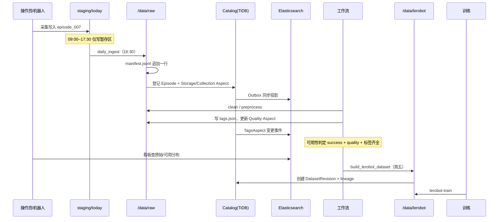

# 机器人数据平台 · 端到端业务流程举例

> **版本**：v1.0  
> **目的**：用一条具体 episode 走通「采集 → 上传 → 存储 → 入库 → 清洗 → 筛选 → 预处理 → 标注 → 可用数据 → 打 Tag → 统计展示 → 打包数据集 → 训练」全链路。  
> **架构主线**：v2（Catalog + Aspect + 工作流 + ES 投影），与现有 [LeRobot 流水线](../lerobot-workflow/README.md)、[manifest.jsonl](../lerobot-workflow/examples/manifest_sample.jsonl) 对齐。  
> **相关文档**：[业内调研与 redesign](./industry-benchmark-and-redesign.md) · [v1 详细设计](./DESIGN.md) · [统计看板设计](../lerobot-workflow/data-dashboard-design.md)

---

## 目录

1. [业务场景设定](#1-业务场景设定)
2. [全流程总览](#2-全流程总览)
3. [阶段 1：现场采集与暂存](#3-阶段-1现场采集与暂存)
4. [阶段 2：日终上传与归档（Bronze）](#4-阶段-2日终上传与归档bronze)
5. [阶段 3：写入数据库与检索索引](#5-阶段-3写入数据库与检索索引)
6. [阶段 4：清洗与筛选](#6-阶段-4清洗与筛选)
7. [阶段 5：预处理（Silver）](#7-阶段-5预处理silver)
8. [阶段 6：标注](#8-阶段-6标注)
9. [阶段 7：认定「可用数据」](#9-阶段-7认定可用数据)
10. [阶段 8：对可用数据打 Tag](#10-阶段-8对可用数据打-tag)
11. [阶段 9：原始数据分布与统计](#11-阶段-9原始数据分布与统计)
12. [阶段 10：可用数据分布与统计](#12-阶段-10可用数据分布与统计)
13. [阶段 11：打包 LeRobot 数据集（Gold）](#13-阶段-11打包-lerobot-数据集gold)
14. [阶段 12：用数据集训练](#14-阶段-12用数据集训练)
15. [附录：命令与文件速查](#15-附录命令与文件速查)
16. [v1 / v2 实现对照](#16-v1--v2-实现对照)

---

## 1. 业务场景设定

### 1.1 背景

| 项 | 取值 |
|----|------|
| 任务 | `pick_red_block`（桌面抓红块） |
| 机器人 | `arm_01` |
| 操作员 | `bob` |
| 采集日 | `2025-07-16` 上午场 |
| 会话 | `am_real_001` |
| 本条 episode | `episode_007` |
| 数据来源 | ROS（实机遥操作） |

### 1.2 业务目标

1. 当天采集的轨迹**只写原始层**，不立刻构建训练集。
2. 经清洗、预处理、标注后，episode 被标记为**可用于训练**。
3. 数据工程师按标签/日期筛选子集，**打包 LeRobot v3 数据集**。
4. 算法工程师在 `/data/lerobot/` 上启动 `lerobot-train`。
5. 看板能分别展示**原始层**与**可用/已打包层**的分布与漏斗。

---

## 2. 全流程总览

### 2.1 五层 + Medallion 映射

```
┌──────────────────────────────────────────────────────────────────────────┐
│ L5 应用：采集台 · 标注台 · 数据看板 · 训练任务入口                          │
├──────────────────────────────────────────────────────────────────────────┤
│ L4 发现：Elasticsearch（筛选、聚合、标签查询）                              │
├──────────────────────────────────────────────────────────────────────────┤
│ L3 目录：Catalog — Episode / DatasetRevision + Aspect（权威元数据）       │
├──────────────────────────────────────────────────────────────────────────┤
│ L2 编排：WorkflowRun + StageEvent（detect→clean→preprocess→tag→build）   │
├──────────────────────────────────────────────────────────────────────────┤
│ L1 字节：staging → /data/raw（Bronze）→ /data/lerobot（Gold）             │
└──────────────────────────────────────────────────────────────────────────┘
```

### 2.2 一条 episode 的生命周期（时序）



### 2.3 关键原则

| 原则 | 说明 |
|------|------|
| **manifest 是日终真相源** | 磁盘上 `manifest.jsonl` 每行对应一条 Bronze episode；Catalog 可从 raw 重建 |
| **Catalog 是治理权威** | 路径、标签、质量分、工作流状态以 Aspect 为准 |
| **ES 是检索投影** | 看板列表/筛选/聚合读 ES，不双写业务逻辑 |
| **构建时 raw 只读** | LeRobot 编码结果写入 `/data/lerobot/`，不回写 raw 字节 |

---

## 3. 阶段 1：现场采集与暂存

### 3.1 何时发生

工作日 **09:00–17:30**，实机或仿真采集程序持续写入暂存区。

### 3.2 写到哪里

```
/data/staging/today/am_real_001/episode_007/
├── episode_meta.json          # 采集侧填写
├── ros/recording.mcap         # 原始 ROS 录制
├── cameras/
│   ├── front/frames/000000.jpg
│   └── wrist/frames/000000.jpg
└── （日终前尚无 export/、validation.json、tags.json）
```

### 3.3 episode_meta.json 示例

采集完成时由采集程序或操作员写入（参考 [episode_meta.json](../lerobot-workflow/examples/episode_meta.json)）：

```json
{
  "episode_id": "episode_007",
  "task": "pick_red_block",
  "success": true,
  "source": "ros",
  "fps": 30,
  "frames": 122,
  "duration_sec": 4.07,
  "operator": "bob",
  "robot_id": "arm_01",
  "started_at": "2025-07-16T10:23:15+08:00",
  "ended_at": "2025-07-16T10:23:19+08:00",
  "notes": ""
}
```

### 3.4 此阶段不做什么

- 不写 `manifest.jsonl`
- 不写 Catalog / ES
- 不构建 LeRobot 数据集

> **业务含义**：采集与治理解耦；现场只关心「轨迹是否录全」，治理流水线日终统一处理。

---

## 4. 阶段 2：日终上传与归档（Bronze）

### 4.1 触发

每天 **18:30** cron 执行 [daily_ingest.sh](../lerobot-workflow/scripts/daily_ingest.sh)：

```bash
DATA_ROOT=/data /data/scripts/daily_ingest.sh
```

### 4.2 逐步做了什么

| 步骤 | 脚本/动作 | 输入 | 输出 |
|------|-----------|------|------|
| 1 检测 | 遍历 `staging/today/*` | 会话目录 | 待处理 episode 列表 |
| 2 ROS 导出（可选） | `export_ros_episode.py` | `ros/recording.mcap` | `export/*.parquet` |
| 3 校验 | `validate_episode.py` | episode 目录 + schema | `validation.json` |
| 4 登记 manifest | `append_manifest.py` | episode_meta + 校验结果 | manifest 新行 |
| 5 归档 | `mv` | staging 目录 | `/data/raw/2025-07-16/...` |
| 6 清空 staging | `rm -rf staging/today/*` | — | 次日可重新采集 |

### 4.3 归档后的磁盘布局（Bronze）

```
/data/raw/2025-07-16/am_real_001/episode_007/
├── episode_meta.json
├── validation.json              # {"valid": true, "errors": []}
├── ros/recording.mcap
├── export/
│   ├── states.parquet
│   ├── actions.parquet
│   └── timestamps.parquet
└── cameras/front/...  wrist/...
```

### 4.4 manifest.jsonl 新增一行

路径：`/data/raw/manifest.jsonl`（append-only，source of truth）

```jsonl
{"date":"2025-07-16","session":"am_real_001","episode":"episode_007","source":"ros","task":"pick_red_block","success":true,"fps":30,"frames":122,"schema":"v1","path":"2025-07-16/am_real_001/episode_007","imported_to":null,"imported_at":null}
```

| 字段 | 含义 |
|------|------|
| `path` | 相对 `raw/` 的路径，全局唯一键 |
| `success` | 采集侧判定任务是否成功 |
| `imported_to` | `null` 表示尚未进入任何 LeRobot 数据集 |

### 4.5 工作流视角（v2）

`daily_ingest` 完成时，为 `episode_007` 创建 **WorkflowRun**，并写入 **StageEvent**：

```yaml
workflow_id: bronze_ingest_v1
run_id: wr-20250716-episode_007
current_stage: detect          # detect 阶段 succeeded
events:
  - stage: detect
    status: succeeded
    started_at: "2025-07-16T18:30:01+08:00"
    finished_at: "2025-07-16T18:30:12+08:00"
    outputs:
      storage_path: "2025-07-16/am_real_001/episode_007"
      validation_valid: true
```

---

## 5. 阶段 3：写入数据库与检索索引

日终归档后，**元数据同步**进入 Catalog；ES 通过 Outbox 异步投影。

### 5.1 Catalog 登记（v2 推荐）

**实体**：`Episode`，URN 示例：`urn:episode:2025-07-16/am_real_001/episode_007`

**Aspect 写入**（同一事务内多行 JSONB 或 aspect 表）：

| Aspect | 内容示例 |
|--------|----------|
| `storage` | `uri: file:///data/raw/2025-07-16/am_real_001/episode_007`，`data_type: bronze`，`size_bytes: 48MB` |
| `collection` | `robot_id: arm_01`，`operator: bob`，`task: pick_red_block`，`success: true`，`collected_at: 2025-07-16T10:23:15+08:00` |
| `quality` | `validation_score: 1.0`，`validation_errors: []` |
| `pipeline` | `current_stage: detect`，`workflow_run_id: wr-20250716-episode_007` |

### 5.2 ES 投影文档（raw 层索引）

索引：`raw_episode_records`（或 v1 的 `raw_data_records`）

```json
{
  "urn": "urn:episode:2025-07-16/am_real_001/episode_007",
  "storage_path": "2025-07-16/am_real_001/episode_007",
  "date": "2025-07-16",
  "source": "ros",
  "task": "pick_red_block",
  "success": true,
  "frames": 122,
  "robot_id": "arm_01",
  "operator": "bob",
  "pipeline_stage": "detect",
  "usable": false,
  "tag_paths": [],
  "imported_to": null
}
```

### 5.3 同步路径

```
daily_ingest 结束
    → Catalog UPSERT Episode + Aspects
    → es_sync_outbox INSERT
    → Worker 消费 Outbox → 更新 ES 文档
    → （可选）sync_stats_db.py 刷新看板物化表
```

> **v1 兼容**：若 Catalog 尚未落地，可用 TiDB `raw_data` 表登记 `storage_path`，字段与 [DESIGN.md](./DESIGN.md) §4 一致；标签列仍不写 TiDB。

### 5.4 谁负责触发

| 方式 | 说明 |
|------|------|
| **钩子（推荐）** | `daily_ingest.sh` 末尾调用 `catalog_register.py` + `sync_stats_db.py` |
| **定时扫描** | 每 5 分钟扫描 manifest 增量，补偿写入 Catalog |
| **事件驱动** | 文件系统 watcher → 发 Metadata Change Event |

---

## 6. 阶段 4：清洗与筛选

清洗与筛选是**两个不同层次**的操作：前者改/标记单条数据，后者从集合中挑出子集。

### 6.1 清洗（Clean）— 单 episode 质量治理

**目标**：去掉不可用轨迹，或打上质量标记，不删除原始字节（Bronze 保留）。

**典型规则**（可配置为 `workflow_definition.yaml` 的 `clean` 阶段）：

| 规则 | 动作 |
|------|------|
| `validation.valid == false` | 标记 `usable=false`，`quality/reject_reason=validation_failed` |
| `frames < 30` | 标记低质量 |
| 相机缺帧率 > 5% | 标记 `quality/low` |
| 关节超限 | 标记失败，保留 raw 供审计 |

**本例**：`episode_007` 校验通过，清洗阶段输出：

```
episode_007/
└── clean_report.json
    {"passed": true, "rules_applied": ["min_frames", "camera_drop_rate"], "dropped_frames": 0}
```

Catalog 更新 `QualityAspect`；`pipeline.current_stage` → `clean`。

### 6.2 筛选（Filter）— 从 manifest 生成 import 候选集

**目标**：按业务条件从全量 manifest 中选出「准备进入预处理/构建」的 episode 列表。

**工具**：[filter_manifest.py](../lerobot-workflow/scripts/filter_manifest.py)

```bash
python /data/scripts/filter_manifest.py \
  --input /data/raw/manifest.jsonl \
  --output /data/builds/2025-07-w3/import_list.jsonl \
  --date-from 2025-07-14 \
  --date-to 2025-07-20 \
  --success-only \
  --task pick_red_block
```

输出 [import_list_week2.jsonl](../lerobot-workflow/examples/import_list_week2.jsonl) 风格，每行仍是一条 manifest 记录。

**与 ES 筛选的关系**：

| 场景 | 用法 |
|------|------|
| 定时批处理（周五构建） | manifest 文件筛选，简单可审计 |
| 交互式探索（看板点选） | ES 按 `tag_paths`、日期、机器人聚合后导出 URN 列表 |
| 复杂组合 | ES 查 URN → 生成 `import_list.jsonl` → 再走构建脚本 |

**本例**：`episode_007` 在 `2025-07-14`–`2025-07-20` 且 `success=true` 且 `task=pick_red_block` 时，会进入 `import_list.jsonl`。

---

## 7. 阶段 5：预处理（Silver）

### 7.1 目标

在 **不移动 Bronze 目录** 的前提下，生成训练友好的中间产物，并更新元数据。

### 7.2 典型预处理项

| 项 | 说明 | 落盘位置 |
|----|------|----------|
| 时间对齐 | 相机帧与关节状态对齐到统一时间轴 | `export/` 内 parquet 更新 |
| 坐标归一化 | 关节角、末端位姿转到统一坐标系 | `export/states.parquet` |
| 降采样 | 30fps → 15fps（可选） | 更新 `frames` 元数据 |
| 图像裁剪 | 去黑边、固定 ROI | `cameras/*/frames/` 或仅构建时用 |
| Schema 校验 | 对照 `v1_features.json` | `validation.json` 追加项 |

### 7.3 工作流事件

```yaml
- stage: preprocess
  status: succeeded
  inputs:
    storage_path: "2025-07-16/am_real_001/episode_007"
  outputs:
  preprocess_version: "v1.2"
    export_checksum: "sha256:abc..."
```

Catalog：`pipeline.current_stage` → `preprocess`；可选增加 `PreprocessAspect` 记录版本与参数，便于重跑。

### 7.4 重跑策略

预处理参数变更时，**不覆盖 Bronze**，只：

1. 更新 `preprocess_version`
2. 重写 `export/`
3. 追加 `stage_event`
4. 若已导入 LeRobot，需新建 **DatasetRevision** 而非原地改 Gold

---

## 8. 阶段 6：标注

### 8.1 标注类型

| 类型 | 示例 | 存储 |
|------|------|------|
| **任务/场景标签** | `scene/indoor/table_a`、`task/pick_red_block` | TagsAspect + ES `tag_paths` |
| **质量标签** | `quality/high` | 同上 |
| **时序标注** | 关键帧「抓取瞬间」 | `annotations/timestamps.json`（sidecar） |
| **人工审核** | 通过 / 驳回 | QualityAspect + WorkflowRun |

### 8.2 标注入口

1. **自动标注**：预处理脚本根据 `episode_meta.task` 写入默认 tag  
2. **标注台 UI**：从 ES 拉待标注队列（`pipeline_stage=preprocess` 且 `tag_paths` 为空）  
3. **批量脚本**：读取 CSV 映射表，调用 Catalog API 更新 TagsAspect  

### 8.3 sidecar：tags.json（可选）

```
/data/raw/2025-07-16/am_real_001/episode_007/tags.json
```

```json
{
  "tag_paths": [
    "scene/indoor/table_a",
    "task/pick_red_block",
    "quality/high"
  ],
  "source": "auto+human",
  "labeled_by": "alice",
  "labeled_at": "2025-07-17T11:00:00+08:00"
}
```

**写入顺序（v2）**：

```
标注员提交 / 自动标注脚本
    → 写 tags.json（可选，便于离线审计）
    → Catalog TagsAspect UPSERT（权威）
    → Outbox → ES tag_paths 更新
```

标签合法性由 [appendix-tag-tree.yaml](./appendix-tag-tree.yaml) 校验；**标签树不进数据库**。

### 8.4 本例结果

`episode_007` 标注完成后，ES 文档变为：

```json
{
  "tag_paths": ["scene/indoor/table_a", "task/pick_red_block", "quality/high"],
  "pipeline_stage": "tag",
  "usable": true
}
```

---

## 9. 阶段 7：认定「可用数据」

### 9.1 「可用」的业务定义

一条 Bronze episode 被认定为 **可用（usable）**，需同时满足：

| 条件 | 本例 |
|------|------|
| 采集成功 | `success=true` ✓ |
| 校验通过 | `validation.valid=true` ✓ |
| 清洗通过 | `clean_report.passed=true` ✓ |
| 预处理完成 | `pipeline_stage >= preprocess` ✓ |
| 必要标签齐全 | 至少含 `task/*`；若训练场景要求则含 `scene/*` ✓ |
| 未被人工驳回 | `quality/reject` 未出现 ✓ |

### 9.2 状态写入

- Catalog：`UsabilityAspect` 或 `QualityAspect.usable = true`
- ES：`usable: true`，供看板与筛选
- **仍保持** `imported_to: null`，直到进入 LeRobot 构建

### 9.3 与「已导入数据集」的区别

| 状态 | `usable` | `imported_to` | 含义 |
|------|----------|---------------|------|
| 刚采集 | false | null | 仅 Bronze |
| 治理完成 | true | null | 可被选入数据集，但尚未打包 |
| 已构建 | true | `local/pick-place-v1` | 已进入 Gold 数据集 |

---

## 10. 阶段 8：对可用数据打 Tag

### 10.1 何时打 Tag

| 时机 | 典型标签 |
|------|----------|
| 预处理完成（自动） | `task/pick_red_block` |
| 人工质检后 | `quality/high` 或 `quality/low` |
| 实验划分时 | `dataset/train` 或 `dataset/eval`（打在 **DatasetRevision** 或 episode 上，视策略而定） |
| 周报归档 | `experiment/exp-2025-w28` |

### 10.2 检索语义（ES）

与 [DESIGN.md](./DESIGN.md) §5 一致：

- **不同 category（大类）之间**：OR — 命中任一类即可
- **同 category 内多个 tag**：用户选 AND 或 OR

示例查询意图：「室内场景 **且**（抓红块 **或** 放蓝块）」

```
category scene: scene/indoor/table_a
category task:  task/pick_red_block OR task/place_blue_block
→ 组间 OR，组内 task 用 OR
```

### 10.3 操作方式

**看板 / 检索 UI**：

1. ES 筛选 `usable=true` 且未 `imported_to`
2. 勾选 episode → 批量打标
3. 调用 Catalog `PATCH /episodes/{urn}/aspects/tags`
4. ES 秒级投影更新

**命令行示例**（概念性）：

```bash
python catalog_cli.py tag append \
  --urn "urn:episode:2025-07-16/am_real_001/episode_007" \
  --tag "experiment/exp-2025-w28" \
  --source manual
```

---

## 11. 阶段 9：原始数据分布与统计

### 11.1 统计对象

**原始数据** = 所有已进入 `/data/raw` 的 episode（含失败、未标注、未可用）。

### 11.2 数据来源

| 层级 | 来源 | 用途 |
|------|------|------|
| 真相源 | `manifest.jsonl` | 全量重算、审计 |
| 在线查询 | ES `raw_episode_records` | 筛选、聚合、看板 |
| 加速 | PostgreSQL 物化表（见 [data-dashboard-design.md](../lerobot-workflow/data-dashboard-design.md)） | 日汇总、漏斗 |

### 11.3 看板模块示例

| 模块 | 指标 | 维度 |
|------|------|------|
| 数据分布饼图 | episode 数、帧数 | `source`（ros/sim/mp4） |
| 任务质量 | 成功率 | `task` |
| 处理漏斗 | staging → raw → cleaned → usable | 系统阶段 |
| 趋势折线 | 日采集量 | `date` |
| 存储概览 | 磁盘占用 | raw / lerobot / training |

### 11.4 本例在原始层统计中的呈现

- `date=2025-07-16` 的 ros episode +1
- `task=pick_red_block` 成功 +1
- `operator=bob` 采集量 +1
- 漏斗：处于 `raw` 已归档；若尚未跑 preprocess，则不在「可用」计数中

### 11.5 同步触发

[daily_ingest.sh](../lerobot-workflow/scripts/daily_ingest.sh) 末尾：

```bash
python3 /data/dashboard/api/scripts/sync_stats_db.py \
  --data-root /data --event ingest --job-type daily_ingest
```

---

## 12. 阶段 10：可用数据分布与统计

### 12.1 与原始统计的差异

| 对比项 | 原始数据统计 | 可用数据统计 |
|--------|--------------|--------------|
| 过滤条件 | 无（或仅 `in raw`） | `usable=true` |
| 核心问题 | 采了多少、质量如何 | 能训练的有多少、标签覆盖如何 |
| 典型图表 | 来源/任务/成功率 | 标签分布、待导入池、场景覆盖 |

### 12.2 ES 聚合示例（概念）

**可用 episode 按标签大类分布**：

```json
{
  "query": { "term": { "usable": true } },
  "aggs": {
    "by_scene": { "terms": { "field": "tag_paths", "include": "scene/.*" } },
    "by_task":  { "terms": { "field": "tag_paths", "include": "task/.*" } }
  }
}
```

**待打包池**（可用但未导入）：

```
usable=true AND imported_to IS NULL
```

本例 `episode_007` 在 2025-07-17 标注完成后，进入「待打包池」；看板显示 `pick_red_block` 可用 +1，`scene/indoor/table_a` +1。

### 12.3 资产层（Gold）统计

构建 LeRobot 数据集后，增加 **DatasetRevision** 维度：

| 指标 | 来源 |
|------|------|
| 数据集 episode 数 | `lerobot/.../meta/info.json` → Catalog |
| 总帧数 | `info.json` 或构建报告 |
| 血缘 | DatasetRevision.lineage → episode URN 列表 |

---

## 13. 阶段 11：打包 LeRobot 数据集（Gold）

### 13.1 何时执行

默认 **每周五 18:45** [build_weekly_dataset.sh](../lerobot-workflow/scripts/build_weekly_dataset.sh)，或按需子集构建。

### 13.2 构建流程

```
manifest.jsonl
    ↓ filter（success=true, imported_to=null, 可选日期/标签）
import_list.jsonl
    ↓ build_lerobot_dataset.py（create 或 resume）
/data/lerobot/pick-place-v1/
    ├── meta/info.json
    ├── data/chunk-000/file-000.parquet
    └── videos/...
    ↓ update_manifest_imported.py
manifest.imported_to = "local/pick-place-v1"
    ↓ Catalog
DatasetRevision + lineage Aspect
```

### 13.3 本例参与构建

假设周五 import_list 包含 `episode_007`：

```bash
DATA_ROOT=/data /data/scripts/build_weekly_dataset.sh
```

核心 Python：[build_lerobot_dataset.py](../lerobot-workflow/scripts/build_lerobot_dataset.py)

```bash
python /data/scripts/build_lerobot_dataset.py \
  --mode resume \
  --raw-root /data/raw \
  --dataset-root /data/lerobot/pick-place-v1 \
  --repo-id "local/pick-place-v1" \
  --schema /data/raw/schema/v1_features.json \
  --import-list /data/builds/2025-07-w3/import_list.jsonl
```

**磁盘结果（Gold）**：

```
/data/lerobot/pick-place-v1/
├── meta/
│   ├── info.json
│   └── episodes.jsonl
├── data/
│   └── chunk-000/file-000.parquet
└── videos/
    └── observation.images.front/chunk-000/file-000.mp4
```

### 13.4 manifest 回写

```jsonl
{"date":"2025-07-16",...,"path":"2025-07-16/am_real_001/episode_007","imported_to":"local/pick-place-v1","imported_at":"2025-07-18T18:50:00+08:00"}
```

### 13.5 Catalog：DatasetRevision

```json
{
  "urn": "urn:dataset:local/pick-place-v1@rev3",
  "aspects": {
    "storage": { "uri": "file:///data/lerobot/pick-place-v1" },
    "schema": { "ref": "meta/info.json", "fps": 30 },
    "lineage": {
      "source_episodes": [
        "urn:episode:2025-07-16/am_real_001/episode_007",
        "..."
      ],
      "build_config": {
        "import_list": "/data/builds/2025-07-w3/import_list.jsonl",
        "mode": "resume"
      }
    }
  }
}
```

### 13.6 子集构建（举例：只要第二周）

```bash
python filter_manifest.py --date-from 2025-07-14 --date-to 2025-07-20 ...
python build_lerobot_dataset.py --mode create --repo-id "local/pick-place-w2-202507" ...
```

子集 = 新的 DatasetRevision + 新目录，**不删除** raw 中其他 episode。

---

## 14. 阶段 12：用数据集训练

### 14.1 前置检查

```bash
test -f /data/lerobot/pick-place-v1/meta/info.json && echo OK
```

### 14.2 启动训练

[train_policy.sh](../lerobot-workflow/scripts/train_policy.sh)：

```bash
DATASET_NAME=pick-place-v1 DATA_ROOT=/data /data/scripts/train_policy.sh
```

等价于：

```bash
lerobot-train \
  --dataset.repo_id="local/pick-place-v1" \
  --dataset.root="/data/lerobot/pick-place-v1" \
  --policy.type=act \
  --output_dir="/data/training/pick-place-v1-20250719-1000" \
  --training.num_epochs=100 \
  --training.batch_size=32
```

### 14.3 训练产物

```
/data/training/pick-place-v1-20250719-1000/
├── train.log
├── checkpoints/
└── config.yaml
```

看板可将 `processing_jobs` 记一条 `job_type=train`，关联 `dataset_revision` URN。

### 14.4 血缘闭环

```
episode_007 (Bronze)
    → import_list → build → DatasetRevision rev3
    → TrainingRun run-20250719
```

算法同学可追溯：**该 checkpoint 用了哪些 episode、哪次构建、哪份 import_list**。

---

## 15. 附录：命令与文件速查

### 15.1 路径一览

| 路径 | 层级 | 说明 |
|------|------|------|
| `/data/staging/today/` | 暂存 | 当日采集 |
| `/data/raw/manifest.jsonl` | Bronze 索引 | 日终 append |
| `/data/raw/YYYY-MM-DD/.../episode_XXX/` | Bronze 字节 | 长期保留 |
| `/data/builds/<job>/import_list.jsonl` | 构建输入 | 筛选结果 |
| `/data/lerobot/<name>/` | Gold | LeRobot v3 |
| `/data/training/<run>/` | 训练产物 | checkpoint |

### 15.2 关键脚本

| 脚本 | 阶段 |
|------|------|
| `daily_ingest.sh` | 归档 + manifest |
| `validate_episode.py` | 清洗前校验 |
| `filter_manifest.py` | 筛选 |
| `build_lerobot_dataset.py` | 打包数据集 |
| `update_manifest_imported.py` | 回写 imported_to |
| `train_policy.sh` | 训练 |
| `sync_stats_db.py` | 看板统计同步 |

### 15.3 一张表串起全流程

| 阶段 | 物理存储 | 权威元数据 | 检索/统计 | 本例 episode_007 状态 |
|------|----------|------------|-----------|------------------------|
| 采集 | staging | — | — | 写入 episode_meta |
| 日终 | raw + manifest | Catalog Episode | ES 投影 | manifest 一行 |
| 清洗 | raw（原地） | QualityAspect | ES usable=false/true | passed |
| 预处理 | export/ 更新 | PreprocessAspect | pipeline_stage | preprocess done |
| 标注 | tags.json | TagsAspect | tag_paths | 3 个标签 |
| 可用 | — | usable=true | 待打包池 | 可进 import_list |
| 构建 | lerobot/ | DatasetRevision | asset 索引 | imported_to 已填 |
| 训练 | training/ | TrainingRun | 看板 job 历史 | checkpoint 产出 |

---

## 16. v1 / v2 实现对照

当前仓库中 **v1 与 v2 文档并存**；落地时可分阶段迁移。

| 能力 | v1（现有 DESIGN + 代码） | v2（推荐方向） |
|------|--------------------------|----------------|
| 路径登记 | TiDB `raw_data.storage_path` | Catalog `StorageAspect` |
| 标签 | 仅 ES `tag_paths` | Catalog `TagsAspect` → ES 投影 |
| 任务完成度 | `data_task_rel` | `workflow_run` + `stage_event` |
| 资产血缘 | `asset_data` + `asset_raw_link` | `DatasetRevision.lineage` |
| manifest | 真相源（不变） | 真相源（不变） |
| 看板 | PostgreSQL 物化 + ES | 同左，读 Catalog URN |

**迁移建议**：manifest 与 shell 脚本**无需重写**；在 `daily_ingest` / 标注 / 构建钩子处，将「写 TiDB 路径表」逐步替换为「写 Catalog Aspect + Outbox」。

---

## 相关链接

| 文档 | 说明 |
|------|------|
| [LeRobot 操作流程](../lerobot-workflow/README.md) | 日终/周构建/训练命令 |
| [业内调研与 redesign](./industry-benchmark-and-redesign.md) | v2 架构依据 |
| [统计看板设计](../lerobot-workflow/data-dashboard-design.md) | 指标与 API |
| [标签树配置](./appendix-tag-tree.yaml) | 合法 tag path |

---

*本文档为业务方案举例，描述「应该发生什么」；Catalog v2 API 与表结构确认后可另写 `DESIGN-v2.md` 与对应 Worker 实现。*
