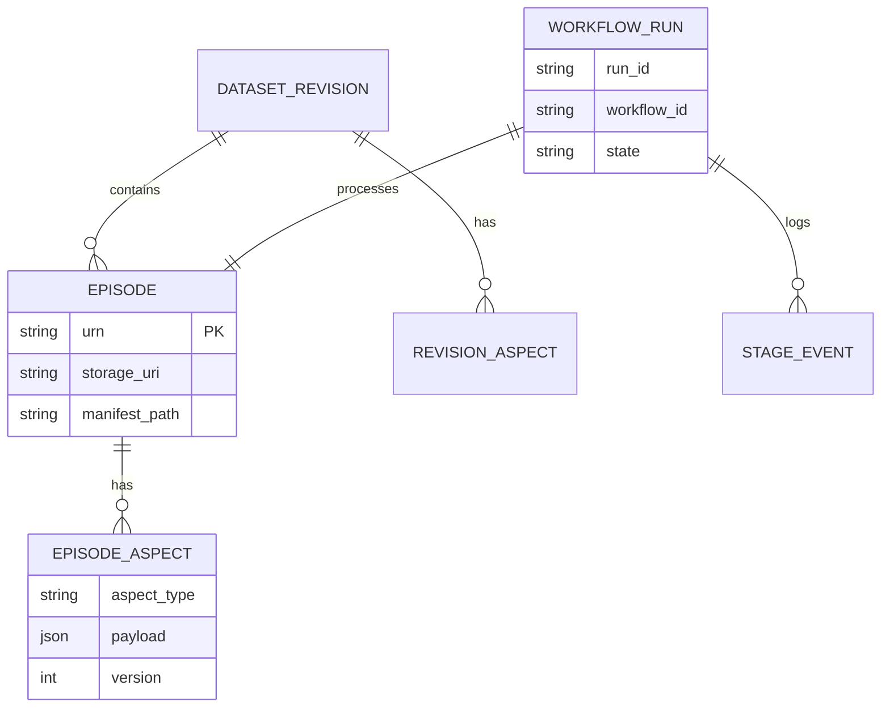

# 机器人数据平台 · 业内优秀方案调研与架构启示

> **版本**：v2.0 调研稿  
> **目的**：摒弃「TiDB 只存路径 + ES 只存标签 + 自建 task_rel」的局部最优，对照业内成熟做法，提炼可落地的 redesign 方向。  
> **读者**：架构评审、数据平台产品设计

---

## 目录

1. [我们要解决的本质问题](#1-我们要解决的本质问题)
2. [业内共识：五层分离](#2-业内共识五层分离)
3. [代表方案深度拆解](#3-代表方案深度拆解)
4. [横向对比矩阵](#4-横向对比矩阵)
5. [对旧设计的反思](#5-对旧设计的反思)
6. [推荐的新架构方向](#6-推荐的新架构方向)
7. [与现有 LeRobot 流水线的衔接](#7-与现有-lerobot-流水线的衔接)
8. [落地路线建议](#8-落地路线建议)

---

## 1. 我们要解决的本质问题

机器人数据平台通常要同时满足四类需求，而**不能用一张宽表或一个 ES 索引全部承担**：

| 需求 | 典型问题 | 错配后果 |
|------|----------|----------|
| **字节存储** | episode 目录、bag、mp4、LeRobot 数据集放哪 | 把路径当唯一真相时，版本与血缘丢失 |
| **元数据治理** | 谁采集、什么任务、成功与否、能否训练 | 检索库当权威库，事务与审计不可靠 |
| **发现与筛选** | 按标签/任务/时间/质量多维过滤、看板聚合 | 用 OLTP 做全文检索，性能与表达力不足 |
| **流水线编排** | 检测→清洗→打标→构建→发布，可追踪、可重跑 | 用「每任务一行状态表」模拟工作流，扩展性差 |

业内优秀方案的共同点：**先分层，再选型**；不在一层里硬塞标签、状态、路径、统计。

---

## 2. 业内共识：五层分离

综合 Databricks Medallion、DataHub 三代架构、LakeFS 版本模型、机器人垂直平台（Fearless / Mosaico / RLDS），可归纳为：

```
┌─────────────────────────────────────────────────────────────────┐
│ L5 应用层：看板 / 检索 UI / 标注台 / 训练任务入口                  │
├─────────────────────────────────────────────────────────────────┤
│ L4 发现层：Elasticsearch / OpenSearch（筛选、聚合、模糊搜）        │
├─────────────────────────────────────────────────────────────────┤
│ L3 元数据目录：Catalog（实体 + 方面 Aspect + 血缘 + 工作流实例）   │
├─────────────────────────────────────────────────────────────────┤
│ L2 版本与编排：Git-like 版本（lakeFS）/ 工作流状态机 / 事件流       │
├─────────────────────────────────────────────────────────────────┤
│ L1 对象存储：/data/raw、/data/lerobot（manifest、meta、字节真身）  │
└─────────────────────────────────────────────────────────────────┘
```

**三条铁律（来自 Unity Catalog、DataHub、Atlan 等实践）：**

1. **字节在对象存储，元数据在 Catalog，检索在 Search** — 三者通过 URN/路径 + 事件同步，不双写业务字段。
2. **元数据在流水线执行时自动采集**，不靠人工填表（DataHub Ingestion、Databricks 自动 lineage）。
3. **标签、schema、血缘、质量分是同一实体的不同「方面（Aspect）」**，应可独立更新、独立版本（DataHub Aspect 模型）。

---

## 3. 代表方案深度拆解

### 3.1 Databricks Unity Catalog + Medallion（数据湖治理标杆）

**做法：**

- **统一命名空间**：`catalog.schema.table` 管理表、卷、模型等资产（约 1 亿级表规模的生产验证）。
- **Medallion 分层**：Bronze（原始）→ Silver（清洗）→ Gold（可消费），schema 变更走版本化迁移，breaking change 并行双版本过渡。
- **职责边界清晰**：UC 管权限、血缘、发现；**不是**数据质量引擎、**不是**完整 Collibra 式企业词表，需与 Great Expectations 等配合。

**启示：**

| 可借鉴 | 不宜照搬 |
|--------|----------|
| 原始 raw 与训练资产 asset 分层命名 | 重度依赖 Databricks 运行时 |
| 状态推进与资产登记一体 | 云厂商锁定 |
| 中心 Catalog + 外置搜索/质量工具 | — |

参考：[Unity Catalog 论文](https://www.databricks.com/sites/default/files/2025-06/unity-catalog-open-universal-governance-lakehouse-beyond.pdf)、[Data Pipeline Best Practices](https://www.databricks.com/blog/data-pipeline-best-practices)

---

### 3.2 DataHub / Amundsen / Atlan（元数据目录三代架构）

**DataHub 核心模型（LinkedIn 生产实践）：**

```
Entity（如 Dataset、DataJob）
  └── Aspect（原子写入单元，可独立版本）
        ├── schemaMetadata
        ├── ownership
        ├── globalTags
        ├── upstreamLineage
        └── datasetProperties
```

**存储分工：**

| 组件 | 用途 |
|------|------|
| MySQL / Neo4j | 实体与 Aspect 权威存储 |
| Elasticsearch | 全文检索、过滤 |
| Kafka | 元数据变更事件流（秒级同步到搜索） |

**启示：**

- **不要**把 `tag_paths`、`task_status`、`robot_id` 揉进一张「大宽表」。
- **应该**：`Episode` 实体 + 多个 Aspect（TagsAspect、PipelineAspect、QualityAspect、StorageAspect）。
- 标签变更是 **Aspect 更新事件** → 异步刷 ES，而非应用双写。

参考：[DataHub Architecture](https://github.com/datahub-project/datahub/blob/master/docs/architecture/architecture.md)、[Metadata Model](https://docs.datahub.com/docs/metadata-modeling/metadata-model)

---

### 3.3 LakeFS（数据版本与血缘）

**做法：**

- 对象存储上的 **Git 语义**：branch / commit / merge / tag。
- Medallion 每层独立 repo 或 branch；Silver 的 commit metadata **指向上游 Bronze 的 commit ID**，形成可复现血缘。
- MLflow 实验记录 `repo@branch@commit`，训练可精确复现。

**启示：**

- `manifest.jsonl` 的一行 episode 应对应一个 **可寻址版本**（commit 或 dataset revision），而不是仅 `storage_path` 字符串。
- 「第二周子集构建」= 在新 branch 上 commit 筛选结果，merge 到 `main`，而非另建一张关联表硬编码。

参考：[Version Control + Medallion](https://lakefs.io/blog/version-control-data-pipelines-medallion-architecture/)、[MLflow 集成](https://docs.lakefs.io/integrations/mlflow/)

---

### 3.4 RLDS / Open X-Embodiment / Croissant（机器人 & ML 数据集标准）

**RLDS  episode 模型：**

```
Episode
├── metadata（episode 级：episode_id, success, language_instruction, invalid, ...）
└── steps（逐步：observation, action, is_first, is_last, ...）
```

**Open X-Embodiment 实践：**

- 跨 22 种本体、100 万+ 轨迹，靠 **统一 episode 结构 + 元数据字段约定** 做程序化筛选。
- 质量过滤在 **读取时** 用 `invalid`、`is_terminal`、动作统计完成，而非事后补一张任务表。

**Croissant（Google / MLCommons）：**

- 机器可读的 **数据集描述标准**（JSON-LD），被 Dataset Search、TensorFlow Datasets 消费。
- 把 schema、资源、RecordSet 声明清楚，**互操作**优先于自建字段。

**启示：**

- 平台内核应有一个 **Canonical Episode 模型**（类似 [Forge](https://github.com/arpitg1304/forge) 的 Episode/Frame），ROS bag / LeRobot v3 / MP4 都 **读入同一中间表示** 再写出。
- 标签与任务语义尽量落在 **episode metadata 标准字段**，而非私有 DB 列。

参考：[RLDS](https://github.com/google-research/rlds)、[Croissant 论文](https://arxiv.org/pdf/2403.19546)、[Open X-Embodiment](https://github.com/google-deepmind/open_x_embodiment)

---

### 3.5 Fearless / Mosaico（机器人垂直数据平台）

**Fearless（SVRC）模块化流水线：**

```
Collect → Ingest → Annotate → Train
  │         │          │         │
 API/S3   校验/元数据   标签/指令   模型注册
```

- **Episode Browser**：帧级回放 + 关节/相机同步。
- **格式插件**：HDF5、RLDS、LeRobot Parquet、ROS Bag、MP4+JSON 统一接入。
- **标注**：语言指令、关键帧、标签；导出 COCO/VIA/JSON。
- **Metadata 自动抽取**，不是手填路径表。

**Mosaico（开源机器人基础设施）：**

- **SDK + daemon**：应用侧 ingestion/retrieval，daemon 管存储、索引、状态。
- **Ontology 内置模型**：IMU、GPS、Image 等；可扩展。
- **Generator I/O**：超内存数据集流式 ingest。
- **全链路 traceability**：原始传感器 → 训练集，强调 on-premise。

**启示：**

- 产品形态应是 **「Episode 中心的数据运营平台」**，不是「路径登记表 + ES」。
- 检测/清洗/打标/构建是 **流水线阶段**，应有可视化 replay 与 QA，而不只是 DB 里的 status 字段。

参考：[Fearless Platform](https://www.roboticscenter.ai/platform)、[Mosaico](https://mosaico.dev/)

---

### 3.6 Labelbox / Scale AI（标注与工作流）

**Labelbox Workflow = 显式状态机：**

```
Nodes: InitialLabeling → Review → Logic(条件路由) → Done / Rework
Edges: 连接节点，Logic 节点支持 filter 组合
```

- 工作流是 **图（Graph）**，不是 `(entity, task_code)` 笛卡尔积表。
- **Catalog 零拷贝**指向云存储；血缘链：数据源 → 标注项目 → 训练实验。

**Scale AI Multi-Stage Blueprint：**

- 复杂标注拆 **多 stage 流水线**，stage 间可并行/串行，按 task 或 stage 交付。
- Nucleus 数据集版本 + 与标注任务、评测结果 **自动血缘**。

**启示：**

- `data_task_rel` 这种「每任务一行」适合 **看板统计**，但 **不能替代工作流引擎**。
- 优秀做法：**Workflow Definition（配置）** + **Workflow Run Instance（每 episode 一条运行实例）** + **Stage Event Log（每次执行）** 三层。

参考：[Labelbox Workflow](https://docs.labelbox.com/reference/workflow)、[Scale Multi-Stage](https://api-reference.scale.com/docs/api-reference/multi-stage-reference)

---

### 3.7 Activeloop Deeplake（多模态张量数据集）

**核心观点：**

- Episode 不是「文件夹 + 外部 meta 表」，而是 **一条对齐的多模态记录**（视频、LiDAR、关节、标签同一 record）。
- **版本分支 + 标量/向量混合查询**（metadata filter + embedding search 一体）。

**启示：**

- 若规模继续增大，可评估 **Tensor-native 存储** 作为 Gold 层，Catalog 仍管发现与治理。
- 中小团队可先用 **LeRobot v3 + Catalog**，不必一步到位 Deeplake。

参考：[Deeplake Robotics FAQ](https://deeplake.ai/answers/robotics-training-data-video-sensor-metadata)

---

## 4. 横向对比矩阵

| 维度 | 我们旧设计 | DataHub 系 | LakeFS | RLDS/Forge | Fearless/Mosaico | Labelbox |
|------|-----------|------------|--------|------------|------------------|----------|
| 字节真身 | 文件系统 | 外部存储 | 对象存储+版本 | 各格式文件 | 统一 ingest | 零拷贝 Catalog |
| 权威元数据 | TiDB 路径表 | Entity+Aspect | Commit 元数据 | Episode metadata | 平台统一模型 | Catalog |
| 检索 | ES tag_paths | ES 索引 Aspect | 不主打 | TFDS 索引 | 内置查询 | Catalog 过滤 |
| 标签 | 仅 ES | Tags Aspect | — | episode 字段 | Annotate 模块 | 标注工作流 |
| 流水线 | status + task_rel | DataJob lineage | branch/merge | — | 五段模块化 | Workflow 图 |
| 血缘 | asset_raw_link | upstreamLineage | commit 指针 | episode_id | 全链路 trace | 自动 lineage |
| 版本 | es_sync_version | Aspect 版本 | Git commit | dataset 版本 | — | 数据集版本 |

---

## 5. 对旧设计的反思

### 5.1 做得对的地方

- **读写分离**：重检索走 ES，事务走 DB（与 DataHub 一致）。
- **manifest 对齐**：`manifest_ref` 与流水线 source of truth 一致（类似 Bronze 登记）。
- **标签组合语义**（大类 OR、组内 AND/OR）：属于发现层能力，放 ES 合理。

### 5.2 需要摒弃或弱化的部分

| 旧设计 | 问题 | 业内更好做法 |
|--------|------|--------------|
| TiDB **只存路径** | 无法表达版本、方面、工作流图 | Catalog 存实体 + 多 Aspect |
| 标签**不进 DB** | 治理、审计、血缘断裂 | Tags 作为 Aspect 存 Catalog，**索引**到 ES |
| `data_task_rel` 扁平表 | 难表达分支、重试、并行 stage | Workflow 定义 + Run Instance + Event Log |
| raw / asset **两张孤岛表** | 血缘靠 link 表补 | 统一 Episode → DatasetRevision 血缘图 |
| 无 **Canonical 模型** | 格式越多，字段越多 | Episode/Frame 中间层（Forge 模式） |
| 无 **显式版本** | 子集构建、回滚困难 | manifest revision / lakeFS commit |

### 5.3 根本问题一句话

旧设计是 **「用数据库表模拟平台」**；优秀方案是 **「用对象存储存字节 + 用目录存元数据 + 用搜索引擎做发现 + 用工作流引擎管状态」**。

---

## 6. 推荐的新架构方向

> 以下为基于调研的 **v2 推荐架构**，供替换 `DESIGN.md` v1.x 时的主线。

### 6.1 核心实体（Catalog 层）



**Aspect 类型建议（可独立更新）：**

| Aspect | 内容 | 索引到 ES |
|--------|------|-----------|
| `storage` | uri、checksum、size、data_type | 可选 |
| `collection` | robot_id、operator、collected_at、success | 是 |
| `tags` | tag_paths 数组 + 打标来源 | 是 |
| `quality` | 校验分、失败原因 | 是 |
| `pipeline` | 当前阶段、最后 job_id | 是 |
| `lineage` | 来源 episode、构建配置 | 关系图 |

TiDB / PostgreSQL 存 **Entity + Aspect 行**（或 JSONB 文档），**不**再拆「只路径表」。

### 6.2 工作流：定义 vs 实例 vs 事件（三层）

借鉴 Labelbox + Temporal/Argo 思路：

```
workflow_definition.yaml     # 图：detect → clean → preprocess → tag
        ↓ 启动
workflow_run (per episode)   # 实例状态：running / succeeded / failed
        ↓ 每次执行
stage_event                  # 审计：输入输出、耗时、错误（≈ processing_log）
```

**统计「该数据任务完成情况」：**

- 看板：对 `workflow_run` 按 `workflow_id` + `current_stage` 聚合。
- 详情：展开 `stage_event` 时间线。
- **不再**用 `data_task_rel` 单独维护一套语义。

### 6.3 存储与同步

```
Episode 登记 / Aspect 更新
    → 写 Catalog（TiDB）
    → 发 Metadata Change Event（Kafka / Outbox）
    → Consumer 更新 ES 文档（仅检索字段 + tag_paths）
```

与 DataHub 一致：**Catalog 是权威，ES 是投影（Projection）**。

### 6.4 标签策略（修正版）

| 层 | 职责 |
|----|------|
| **tag-tree.yaml** | UI 树 + 校验合法 path |
| **Catalog TagsAspect** | 权威绑定、source、confidence、审计 |
| **ES tag_paths** | 检索投影，由事件同步 |
| **tags.json（可选）** | 流水线 sidecar，ingest 时写入 Aspect |

大类 OR、组内 AND/OR **仍在 ES 查询层**实现，但 **写入以 Catalog 为准**。

### 6.5 版本与资产

```
/data/raw/.../episode_007          → Episode v1（Bronze）
manifest.jsonl 行更新              → Aspect 更新
build 产出 /data/lerobot/ds@v3     → DatasetRevision（Gold）
DatasetRevision.lineage            → 指向 Episode urn 列表 + build commit/config
```

子集构建 = 新 **DatasetRevision** + lineage，不是仅改 `asset_data` 一行。

### 6.6 技术选型建议（务实）

| 组件 | 推荐 | 说明 |
|------|------|------|
| Catalog | TiDB 或 PostgreSQL | JSONB Aspect，团队已有 MySQL 协议则用 TiDB |
| Search | Elasticsearch | 投影索引，mapping 保持精简 |
| 事件 | Outbox → ES（先期）；Kafka（规模上来后） | |
| 工作流 | 先期：DB 状态机 + YAML 定义；后期：Temporal / Argo | |
| 字节 | 现有 `/data/raw` + LeRobot v3 | 可加 lakeFS 做版本（可选） |
| 标准 | 对齐 RLDS episode metadata + Croissant  subset | 便于对外交换 |

---

## 7. 与现有 LeRobot 流水线的衔接

| 现有资产 | v2 映射 |
|----------|---------|
| `manifest.jsonl` | Bronze 登记源；每行 → Episode Aspect `collection` |
| `episode_meta.json` | ingest 时合并进 Aspect |
| `daily_ingest.sh` | 触发 WorkflowRun `detect` stage 完成事件 |
| `build_lerobot_dataset.py` | 创建 `DatasetRevision` + lineage |
| `info.json` | DatasetRevision 的 `schema` Aspect |
| 看板 `episodes` 表 | 可逐步迁移为 Catalog Episode 的投影 |

**原则不变**：manifest 仍是日终 source of truth；Catalog 是 **索引与治理层**，可随时从 raw 重建。

---

## 8. 落地路线建议

### Phase 1 — 统一模型（2–4 周人力当量）

- 定义 **Canonical Episode** 结构（参考 Forge / RLDS）。
- Catalog 表：`episode`、`episode_aspect`、`dataset_revision`、`workflow_run`、`stage_event`。
- Outbox 同步 ES；标签进 `TagsAspect`。

### Phase 2 — 工作流与看板

- `workflow_definition.yaml` 描述 detect/clean/preprocess/build。
- 看板读 ES 聚合 + Catalog 详情；流水线页读 `stage_event`。

### Phase 3 — 版本与可选增强

- DatasetRevision 版本号；构建参数入 lineage Aspect。
- 评估 lakeFS 管理 LeRobot 数据集分支（若多实验并行）。

---

## 附录：参考链接

| 主题 | 链接 |
|------|------|
| Unity Catalog | https://www.databricks.com/sites/default/files/2025-06/unity-catalog-open-universal-governance-lakehouse-beyond.pdf |
| DataHub 架构 | https://github.com/datahub-project/datahub/blob/master/docs/architecture/architecture.md |
| LakeFS + Medallion | https://lakefs.io/blog/version-control-data-pipelines-medallion-architecture/ |
| RLDS | https://github.com/google-research/rlds |
| Croissant | https://arxiv.org/pdf/2403.19546 |
| Forge 架构 | https://github.com/arpitg1304/forge/blob/main/docs/architecture.md |
| Fearless | https://www.roboticscenter.ai/platform |
| Mosaico | https://mosaico.dev/ |
| Labelbox Workflow | https://docs.labelbox.com/reference/workflow |

---

*本文档为架构调研与 redesign 建议，替代 v1.x「路径表 + ES 标签」路线。确认方向后，可另写 `DESIGN-v2.md` 详细表结构与 API。*
