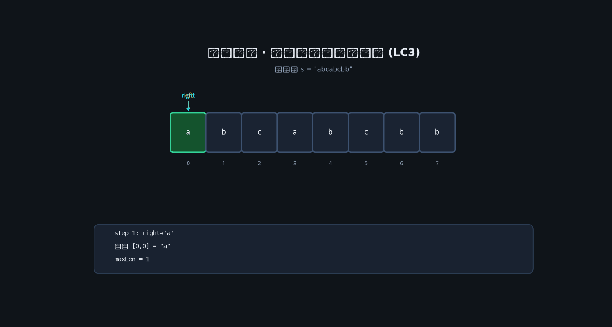
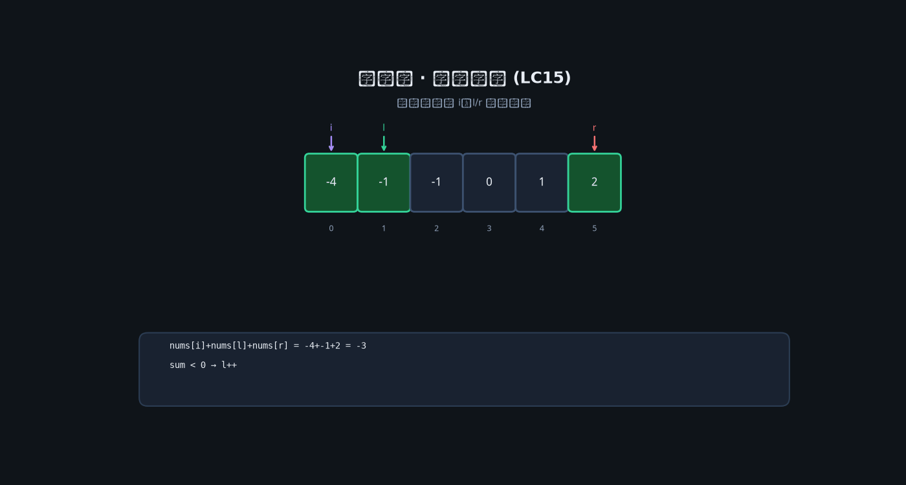

# 01 · 数组 & 字符串

## 为何产生？要解决什么问题？

**数组**源于计算机**连续内存**模型：通过基地址 + 偏移量 O(1) 随机访问。工程上用于批量存储同质数据（成绩表、像素缓冲、日志批次）。

**字符串**本质是字符数组 + 长度/编码语义，额外要解决：编码（UTF-8）、不可变语义（Go 中 string 不可变）、子串搜索、模式匹配。

| 痛点 | 数组/字符串的应对 |
|------|------------------|
| 需要 O(1) 按下标访问 | 数组 |
| 频繁头部插入删除 | ❌ 数组不适合 → 用链表 |
| 子串/子数组统计 | 双指针、滑动窗口、前缀和 |
| 有序数据查找 | 二分（见专题 08） |

---

## 核心考点

1. **双指针**：同向（滑动窗口）、相向（两数之和、盛水）
2. **滑动窗口**：维护窗口内不变量（无重复、覆盖、和≥K）
3. **前缀和 / 差分**：区间和 O(1)、子数组和问题
4. **原地操作**：快慢指针分区（荷兰国旗、移除元素）
5. **排序后双指针**：去重 + 多指针（三数之和）

---

## 高频题 1：无重复字符的最长子串（LeetCode 3）

### 思路

滑动窗口 `[left, right]`，用 `map[byte]int` 记录字符最后出现位置。`right` 右扩；若字符重复且上次位置 ≥ `left`，则 `left` 跳到 `last+1`。

### 核心考点

- 窗口不变量：窗口内无重复字符
- 哈希表存**最后索引**而非仅 bool，避免 left 错误回退

### 动图演示（高清逐步推演）



*分辨率 1400×750 · 每步展示 left/right 指针与窗口状态*

### 测试用例逐步推演

**输入**：`s = "abcabcbb"`

| step | right | char | map | left | window | max |
|------|-------|------|-----|------|--------|-----|
| 1 | 0 | a | a:0 | 0 | "a" | 1 |
| 2 | 1 | b | a:0,b:1 | 0 | "ab" | 2 |
| 3 | 2 | c | a:0,b:1,c:2 | 0 | "abc" | 3 |
| 4 | 3 | a | a:3,... | 1 | "bca" | 3 |
| 5 | 4 | b | b:4,... | 2 | "cab" | 3 |
| 6 | 5 | c | c:5,... | 3 | "abc" | 3 |
| 7 | 6 | b | b:6,... | 5 | "cb" | 3 |
| 8 | 7 | b | — | — | — | **3** |

### Go 代码

```go
func lengthOfLongestSubstring(s string) int {
    last := make(map[byte]int)
    left, maxLen := 0, 0
    for right := 0; right < len(s); right++ {
        c := s[right]
        if idx, ok := last[c]; ok && idx >= left {
            left = idx + 1
        }
        last[c] = right
        if right-left+1 > maxLen {
            maxLen = right - left + 1
        }
    }
    return maxLen
}
```

---

## 高频题 2：三数之和（LeetCode 15）

### 思路

排序后固定 `i`，双指针 `l,r` 在 `[i+1, n-1]` 找 `nums[l]+nums[r] == -nums[i]`。注意去重：相同值跳过。

### 动图演示



### 推演：`nums = [-1,0,1,2,-1,-4]`

排序后：`[-4,-1,-1,0,1,2]`

- i=0, val=-4: l,r 找不到和为 4
- i=1, val=-1: 找到 (-1,0,1), (-1,-1,2)

### Go 代码

```go
func threeSum(nums []int) [][]int {
    sort.Ints(nums)
    var res [][]int
    n := len(nums)
    for i := 0; i < n-2; i++ {
        if i > 0 && nums[i] == nums[i-1] {
            continue
        }
        l, r := i+1, n-1
        for l < r {
            sum := nums[i] + nums[l] + nums[r]
            if sum == 0 {
                res = append(res, []int{nums[i], nums[l], nums[r]})
                l++
                r--
                for l < r && nums[l] == nums[l-1] {
                    l++
                }
                for l < r && nums[r] == nums[r+1] {
                    r--
                }
            } else if sum < 0 {
                l++
            } else {
                r--
            }
        }
    }
    return res
}
```

---

## 高频题 3：和为 K 的子数组（LeetCode 560）

### 思路

前缀和 `pre[j] - pre[i] = k` → 遍历时查 `pre-sum` 出现次数。哈希表 `map[int]int` 存前缀和频次。

### 核心考点

前缀和 + 哈希；初始化 `cnt[0]=1` 处理从 0 开始的子数组。

### Go 代码

```go
func subarraySum(nums []int, k int) int {
    cnt := map[int]int{0: 1}
    pre, ans := 0, 0
    for _, x := range nums {
        pre += x
        ans += cnt[pre-k]
        cnt[pre]++
    }
    return ans
}
```

---

## 本章模板速记

| 模板 | 适用信号 |
|------|----------|
| 相向双指针 | 有序数组、回文、盛水 |
| 同向滑动窗口 | 「最长/最短子串/子数组」+ 约束 |
| 前缀和+哈希 | 子数组和、连续区间计数 |
| 快慢指针原地 | 分区、去重、移除 |
