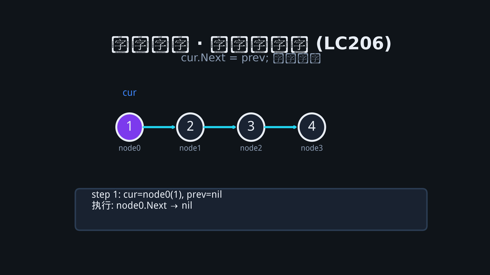
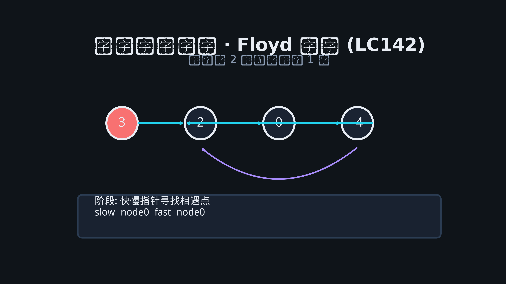

# 02 · 链表

## 为何产生？要解决什么问题？

**数组**插入删除需 O(n) 移动元素；**链表**用指针将节点串联，在已知节点处 O(1) 插入删除（需维护前驱）。

| 场景 | 选型 |
|------|------|
| 频繁头插、队列实现 | 链表 |
| 随机访问、缓存友好 | 数组 |
| LRU 缓存 | 哈希 + **双向链表**（O(1) 移动节点） |

Go 中：`container/list` 为双向链表；面试常自定义 `ListNode`。

---

## 核心考点

1. **虚拟头节点 dummy**：统一处理头节点删除/插入
2. **快慢指针**：找中点、判环、找环入口
3. **反转**：迭代三指针 / 递归
4. **合并**：归并思想，双指针
5. **相交链表**：对齐长度后同步走

---

## 高频题 1：反转链表（LeetCode 206）

### 思路（迭代）

维护 `prev, cur, next`：`cur.Next = prev`，整体前移。

### 动图演示



### 逐步推演

初始：`nil ← prev | cur=1→2→3`

| 步 | prev | cur | 操作后链表 |
|----|------|-----|-----------|
| 1 | 1 | 2 | 1→nil, 2→3 |
| 2 | 2 | 3 | 2→1→nil, 3 |
| 3 | 3 | nil | 3→2→1→nil |

### Go 代码

```go
type ListNode struct {
    Val  int
    Next *ListNode
}

func reverseList(head *ListNode) *ListNode {
    var prev *ListNode
    cur := head
    for cur != nil {
        next := cur.Next
        cur.Next = prev
        prev = cur
        cur = next
    }
    return prev
}
```

---

## 高频题 2：环形链表 II — 找入口（LeetCode 142）

### 思路

1. 快慢指针相遇说明有环
2. 设头到入口距离 a，入口到相遇点 b，环长 c：`2(a+b)=a+b+nc` → `a = nc - b`
3. 一指针从头、一指针从相遇点同速走，相遇即入口

### 动图演示



### Go 代码

```go
func detectCycle(head *ListNode) *ListNode {
    slow, fast := head, head
    for fast != nil && fast.Next != nil {
        slow = slow.Next
        fast = fast.Next.Next
        if slow == fast {
            p := head
            for p != slow {
                p = p.Next
                slow = slow.Next
            }
            return p
        }
    }
    return nil
}
```

---

## 高频题 3：合并两个有序链表（LeetCode 21）

### Go 代码

```go
func mergeTwoLists(l1, l2 *ListNode) *ListNode {
    dummy := &ListNode{}
    tail := dummy
    for l1 != nil && l2 != nil {
        if l1.Val <= l2.Val {
            tail.Next = l1
            l1 = l1.Next
        } else {
            tail.Next = l2
            l2 = l2.Next
        }
        tail = tail.Next
    }
    if l1 != nil {
        tail.Next = l1
    } else {
        tail.Next = l2
    }
    return dummy.Next
}
```

---

## 高频题 4：删除链表的倒数第 N 个结点（LeetCode 19）

快慢指针：fast 先走 n+1 步，然后 sync 走，slow 在待删节点前驱。

```go
func removeNthFromEnd(head *ListNode, n int) *ListNode {
    dummy := &ListNode{Next: head}
    slow, fast := dummy, dummy
    for i := 0; i <= n; i++ {
        fast = fast.Next
    }
    for fast != nil {
        slow = slow.Next
        fast = fast.Next
    }
    slow.Next = slow.Next.Next
    return dummy.Next
}
```
