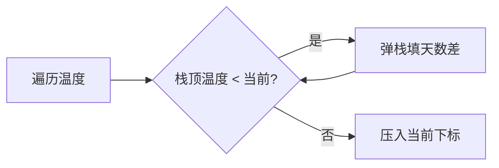

# 03 · 栈 & 队列

## 为何产生？要解决什么问题？

- **栈（LIFO）**：函数调用栈、表达式求值、括号匹配、DFS 迭代、单调递减/递增维护
- **队列（FIFO）**：任务调度、BFS 层序遍历、滑动窗口最值（单调队列）

Go：`stack` 用 `[]int` + `append/pop`；队列用 slice 或 `container/list`；标准库无 deque，单调队列手写双端。

---

## 核心考点

1. **括号匹配**：栈存左括号
2. **单调栈**：下一个更大/更小元素，O(n)
3. **BFS 队列**：最短层数、层序遍历
4. **单调队列**：滑动窗口最值 O(n)

---

## 高频题 1：有效的括号（LeetCode 20）

### 推演：`s = "{[]}"`

| i | char | stack | 动作 |
|---|------|-------|------|
| 0 | { | [{] | push |
| 1 | [ | [{,[] | push |
| 2 | ] | [{] | pop 匹配 |
| 3 | } | [] | pop 匹配 |
| end | | empty | true |

### Go 代码

```go
func isValid(s string) bool {
    stack := []rune{}
    pair := map[rune]rune{')': '(', ']': '[', '}': '{'}
    for _, c := range s {
        if c == '(' || c == '[' || c == '{' {
            stack = append(stack, c)
        } else {
            if len(stack) == 0 || stack[len(stack)-1] != pair[c] {
                return false
            }
            stack = stack[:len(stack)-1]
        }
    }
    return len(stack) == 0
}
```

---

## 高频题 2：每日温度（LeetCode 739）— 单调栈

### 思路

维护递减栈存**下标**，当前温度更高时弹栈并填答案。



### Go 代码

```go
func dailyTemperatures(temperatures []int) []int {
    n := len(temperatures)
    ans := make([]int, n)
    stack := []int{} // 下标
    for i := 0; i < n; i++ {
        for len(stack) > 0 && temperatures[i] > temperatures[stack[len(stack)-1]] {
            j := stack[len(stack)-1]
            stack = stack[:len(stack)-1]
            ans[j] = i - j
        }
        stack = append(stack, i)
    }
    return ans
}
```

---

## 高频题 3：滑动窗口最大值（LeetCode 239）— 单调队列

### 思路

双端队列存**下标**，保证队头最大且在下标递增前提下值递减。窗口滑出时从队头剔除过期下标。

### 推演：`nums=[1,3,-1,-3,5,3,6,7], k=3`

| i | nums[i] | deque(下标) | max |
|---|---------|-------------|-----|
| 0 | 1 | [0] | — |
| 1 | 3 | [1] | — |
| 2 | -1 | [1,2] | 3 |
| 3 | -3 | [1,2,3] | 3 |
| 4 | 5 | [4] | 5 |
| 5 | 3 | [4,5] | 5 |
| 6 | 6 | [6] | 6 |
| 7 | 7 | [7] | 7 |

### Go 代码

```go
func maxSlidingWindow(nums []int, k int) []int {
    deque := []int{}
    res := []int{}
    push := func(i int) {
        for len(deque) > 0 && nums[deque[len(deque)-1]] <= nums[i] {
            deque = deque[:len(deque)-1]
        }
        deque = append(deque, i)
    }
    for i := 0; i < len(nums); i++ {
        push(i)
        if deque[0] <= i-k {
            deque = deque[1:]
        }
        if i >= k-1 {
            res = append(res, nums[deque[0]])
        }
    }
    return res
}
```

---

## 高频题 4：二叉树层序遍历（LeetCode 102）

```go
func levelOrder(root *TreeNode) [][]int {
    if root == nil {
        return nil
    }
    q := []*TreeNode{root}
    var res [][]int
    for len(q) > 0 {
        size := len(q)
        level := make([]int, 0, size)
        for i := 0; i < size; i++ {
            node := q[0]
            q = q[1:]
            level = append(level, node.Val)
            if node.Left != nil {
                q = append(q, node.Left)
            }
            if node.Right != nil {
                q = append(q, node.Right)
            }
        }
        res = append(res, level)
    }
    return res
}
```
