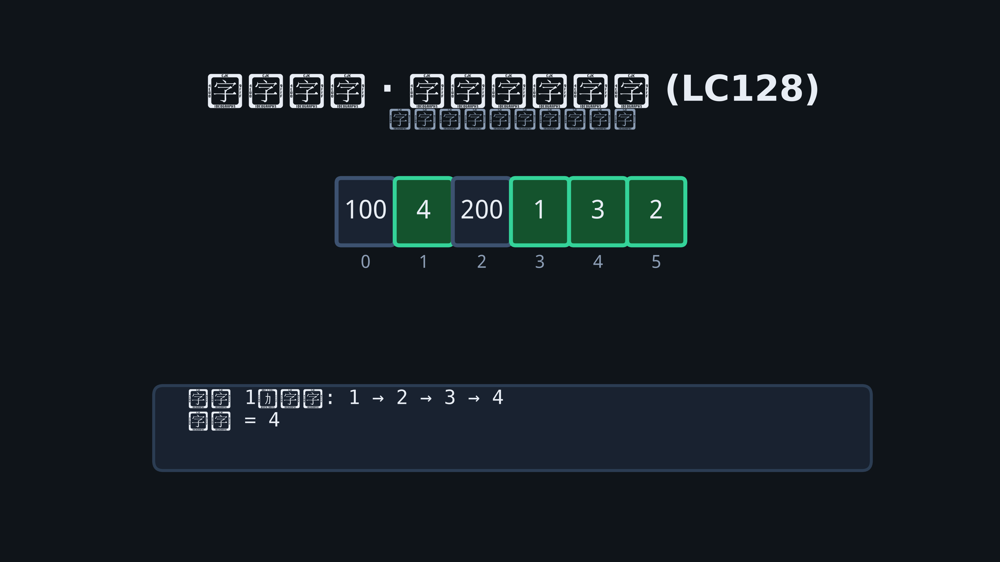

# 04 · 哈希表

## 为何产生？要解决什么问题？

数组按下标访问 O(1)，但按**值**查找需 O(n)。**哈希表**通过哈希函数将 key 映射到桶，均摊 O(1) 增删查。

| 问题 | 哈希用法 |
|------|----------|
| 两数之和 | 存 `target-x` → 下标 |
| 频次统计 | `map[T]int` |
| 去重 | `map[T]struct{}` |
| 分组 | 自定义 key（排序串、计数向量） |

冲突处理：链地址法（Go map 内部）、开放寻址。面试只需会用 `map`。

---

## 核心考点

1. **补数查找**：`seen[target-x]`
2. **频次 / 最后位置**：滑动窗口、Anagram
3. **分组键**：异位词排序串、坐标归一化
4. **前缀和配合**：子数组和（见数组专题）

---

## 高频题 1：两数之和（LeetCode 1）

### 推演：`nums=[2,7,11,15], target=9`

| i | x | map | 动作 |
|---|---|-----|------|
| 0 | 2 | {} | 存 2:0 |
| 1 | 7 | {2:0} | 9-7=2 存在 → [0,1] |

### Go 代码

```go
func twoSum(nums []int, target int) []int {
    seen := make(map[int]int)
    for i, x := range nums {
        if j, ok := seen[target-x]; ok {
            return []int{j, i}
        }
        seen[x] = i
    }
    return nil
}
```

---

## 高频题 2：最长连续序列（LeetCode 128）

### 思路

`set` 存所有数；只对**序列起点**（`x-1` 不在 set）向后延伸计数。

### 动图演示



### Go 代码

```go
func longestConsecutive(nums []int) int {
    set := make(map[int]struct{}, len(nums))
    for _, x := range nums {
        set[x] = struct{}{}
    }
    best := 0
    for x := range set {
        if _, ok := set[x-1]; ok {
            continue
        }
        length := 1
        for {
            if _, ok := set[x+length]; !ok {
                break
            }
            length++
        }
        if length > best {
            best = length
        }
    }
    return best
}
```

---

## 高频题 3：字母异位词分组（LeetCode 49）

### 思路

key = 26 位计数串或排序后的字符串。

```go
func groupAnagrams(strs []string) [][]string {
    groups := make(map[[26]byte][]string)
    for _, s := range strs {
        var key [26]byte
        for i := 0; i < len(s); i++ {
            key[s[i]-'a']++
        }
        groups[key] = append(groups[key], s)
    }
    res := make([][]string, 0, len(groups))
    for _, g := range groups {
        res = append(res, g)
    }
    return res
}
```

---

## 高频题 4：LRU 缓存（LeetCode 146）

哈希 + 双向链表：map 存 key→节点，链表维护使用顺序。

```go
type LRUCache struct {
    cap   int
    cache map[int]*list.Element
    list  *list.List
}

type entry struct{ key, val int }

func Constructor(capacity int) LRUCache {
    return LRUCache{
        cap:   capacity,
        cache: make(map[int]*list.Element),
        list:  list.New(),
    }
}

func (c *LRUCache) Get(key int) int {
    if el, ok := c.cache[key]; ok {
        c.list.MoveToFront(el)
        return el.Value.(entry).val
    }
    return -1
}

func (c *LRUCache) Put(key, value int) {
    if el, ok := c.cache[key]; ok {
        el.Value = entry{key, value}
        c.list.MoveToFront(el)
        return
    }
    if c.list.Len() == c.cap {
        back := c.list.Back()
        c.list.Remove(back)
        delete(c.cache, back.Value.(entry).key)
    }
    el := c.list.PushFront(entry{key, value})
    c.cache[key] = el
}
```
