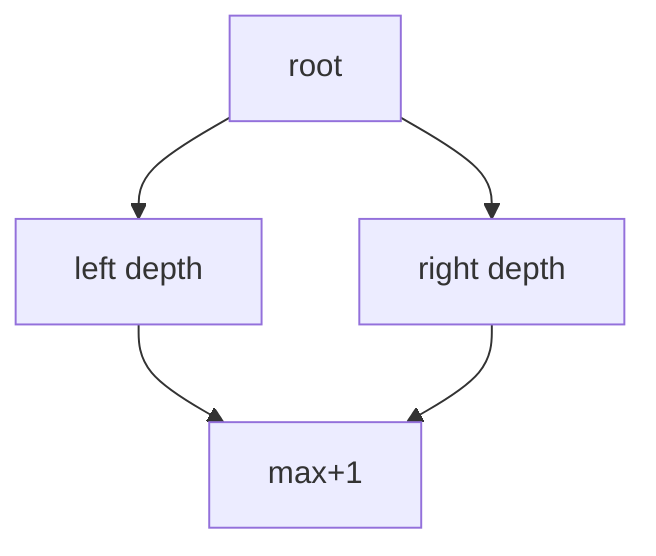
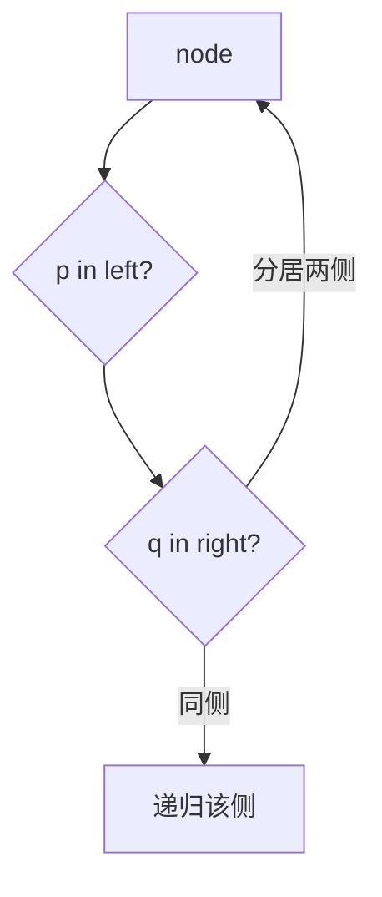

# 05 · 二叉树 & 二叉搜索树（BST）

## 为何产生？要解决什么问题？

**树**：层次化数据（文件系统、组织架构、DOM）。**二叉树**每个节点最多两子，便于递归定义。

**BST** 性质：左 < 根 < 右，中序遍历有序 → O(h) 查找/插入。平衡树（AVL/红黑）保证 h=O(log n)。

| 遍历 | 顺序 | 典型用途 |
|------|------|----------|
| 前序 | 根左右 | 序列化、复制树 |
| 中序 | 左根右 | BST 有序输出 |
| 后序 | 左右根 | 删除树、算高度 |
| 层序 | BFS | 最短层、右视图 |

---

## 核心考点

1. **递归三部曲**：返回值含义、左右子问题、合并
2. **DFS 与 BFS** 选型
3. **BST 中序 / 上下界**验证与搜索
4. **最近公共祖先 LCA**

---

## 高频题 1：二叉树的最大深度（LeetCode 104）



```go
type TreeNode struct {
    Val   int
    Left  *TreeNode
    Right *TreeNode
}

func maxDepth(root *TreeNode) int {
    if root == nil {
        return 0
    }
    l := maxDepth(root.Left)
    r := maxDepth(root.Right)
    if l > r {
        return l + 1
    }
    return r + 1
}
```

---

## 高频题 2：翻转二叉树（LeetCode 226）

```go
func invertTree(root *TreeNode) *TreeNode {
    if root == nil {
        return nil
    }
    root.Left, root.Right = invertTree(root.Right), invertTree(root.Left)
    return root
}
```

---

## 高频题 3：二叉搜索树中第 K 小（LeetCode 230）

中序第 k 个。迭代栈实现：

```go
func kthSmallest(root *TreeNode, k int) int {
    stack := []*TreeNode{}
    cur := root
    for cur != nil || len(stack) > 0 {
        for cur != nil {
            stack = append(stack, cur)
            cur = cur.Left
        }
        cur = stack[len(stack)-1]
        stack = stack[:len(stack)-1]
        k--
        if k == 0 {
            return cur.Val
        }
        cur = cur.Right
    }
    return -1
}
```

---

## 高频题 4：最近公共祖先（LeetCode 236）

### 思路

- 若 `p,q` 分居左右子树，当前为 LCA
- 若一侧为空，答案在另一侧



### Go 代码

```go
func lowestCommonAncestor(root, p, q *TreeNode) *TreeNode {
    if root == nil || root == p || root == q {
        return root
    }
    left := lowestCommonAncestor(root.Left, p, q)
    right := lowestCommonAncestor(root.Right, p, q)
    if left != nil && right != nil {
        return root
    }
    if left != nil {
        return left
    }
    return right
}
```

---

## 高频题 5：验证 BST（LeetCode 98）

传递 `(min, max)` 上下界：

```go
func isValidBST(root *TreeNode) bool {
    var dfs func(*TreeNode, *int, *int) bool
    dfs = func(n *TreeNode, lo, hi *int) bool {
        if n == nil {
            return true
        }
        if lo != nil && n.Val <= *lo {
            return false
        }
        if hi != nil && n.Val >= *hi {
            return false
        }
        return dfs(n.Left, lo, &n.Val) && dfs(n.Right, &n.Val, hi)
    }
    return dfs(root, nil, nil)
}
```
