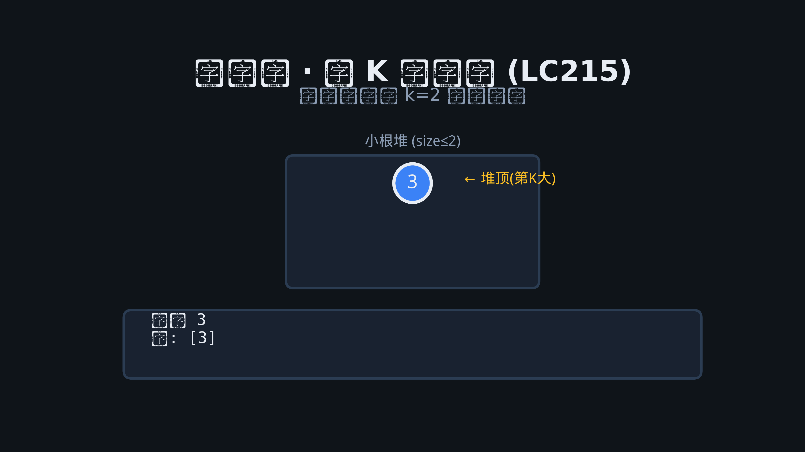

# 06 · 堆（优先队列）

## 为何产生？要解决什么问题？

需要**动态**维护最值：每次取 max/min 并可能插入。排序数组取最值 O(1) 但插入 O(n)；**二叉堆**插入/删除最值均 O(log n)。

| 场景 | 堆大小 |
|------|--------|
| Top K 大/小 | 大小 K 的堆 |
| 合并 K 个有序链表 | 大小 K 的小根堆 |
| 中位数数据流 | 大根堆+小根堆对顶 |

Go：`container/heap` 接口需实现 `Len/Less/Swap/Push/Pop`。

---

## 核心考点

1. **大根堆 / 小根堆**选型（TopK 用小根堆存最大的 K 个）
2. **heap.Interface** 实现
3. **对顶堆**维护中位数

---

## 高频题 1：数组中的第 K 个最大元素（LeetCode 215）

### 思路

维护大小为 k 的**小根堆**，堆顶为第 k 大。

### Go 代码

```go
import "container/heap"

type IntHeap []int

func (h IntHeap) Len() int            { return len(h) }
func (h IntHeap) Less(i, j int) bool  { return h[i] < h[j] }
func (h IntHeap) Swap(i, j int)       { h[i], h[j] = h[j], h[i] }
func (h *IntHeap) Push(x interface{}) { *h = append(*h, x.(int)) }
func (h *IntHeap) Pop() interface{} {
    old := *h
    n := len(old)
    x := old[n-1]
    *h = old[:n-1]
    return x
}

func findKthLargest(nums []int, k int) int {
    h := &IntHeap{}
    heap.Init(h)
    for _, x := range nums {
        heap.Push(h, x)
        if h.Len() > k {
            heap.Pop(h)
        }
    }
    return (*h)[0]
}
```

---

## 高频题 2：前 K 个高频元素（LeetCode 347）

频次入堆，小根堆按频次，保留 k 个。

```go
type pair struct{ freq, val int }

type PairHeap []pair

func (h PairHeap) Len() int           { return len(h) }
func (h PairHeap) Less(i, j int) bool { return h[i].freq < h[j].freq }
func (h PairHeap) Swap(i, j int)      { h[i], h[j] = h[j], h[i] }
func (h *PairHeap) Push(x interface{}) { *h = append(*h, x.(pair)) }
func (h *PairHeap) Pop() interface{} {
    old := *h
    x := old[len(old)-1]
    *h = old[:len(old)-1]
    return x
}

func topKFrequent(nums []int, k int) []int {
    cnt := map[int]int{}
    for _, x := range nums {
        cnt[x]++
    }
    h := &PairHeap{}
    heap.Init(h)
    for v, f := range cnt {
        heap.Push(h, pair{f, v})
        if h.Len() > k {
            heap.Pop(h)
        }
    }
    res := make([]int, h.Len())
    for i := h.Len() - 1; i >= 0; i-- {
        res[i] = heap.Pop(h).(pair).val
    }
    return res
}
```

---

## 高频题 3：合并 K 个升序链表（LeetCode 23）

K 路指针 + 小根堆按节点值。

```go
type NodeHeap []*ListNode

func (h NodeHeap) Len() int           { return len(h) }
func (h NodeHeap) Less(i, j int) bool { return h[i].Val < h[j].Val }
func (h NodeHeap) Swap(i, j int)      { h[i], h[j] = h[j], h[i] }
func (h *NodeHeap) Push(x interface{}) { *h = append(*h, x.(*ListNode)) }
func (h *NodeHeap) Pop() interface{} {
    old := *h
    x := old[len(old)-1]
    *h = old[:len(old)-1]
    return x
}

func mergeKLists(lists []*ListNode) *ListNode {
    h := &NodeHeap{}
    heap.Init(h)
    for _, node := range lists {
        if node != nil {
            heap.Push(h, node)
        }
    }
    dummy := &ListNode{}
    tail := dummy
    for h.Len() > 0 {
        node := heap.Pop(h).(*ListNode)
        tail.Next = node
        tail = tail.Next
        if node.Next != nil {
            heap.Push(h, node.Next)
        }
    }
    return dummy.Next
}
```

---

## 图示：小根堆 TopK


