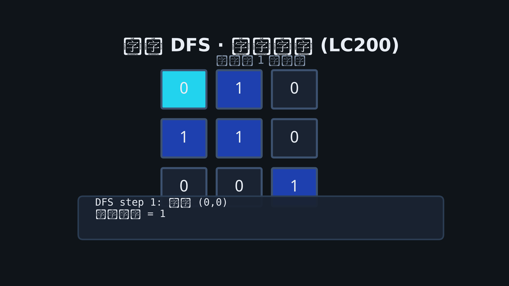
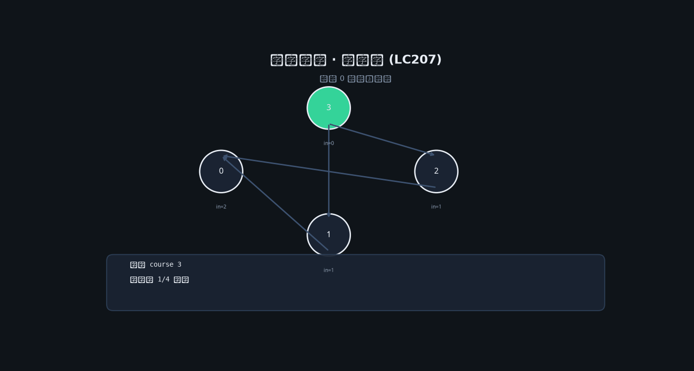

# 07 · 图

## 为何产生？要解决什么问题？

**图** G=(V,E) 描述任意关系：社交、路由、依赖。相比树，图可有环、多父。

| 问题 | 算法 |
|------|------|
| 连通分量 | DFS/BFS / 并查集 |
| 最短路径（无权） | BFS |
| 最短路径（带权非负） | Dijkstra |
| 拓扑排序 | Kahn BFS / DFS 后序 |
| 判环 | DFS 三色 / 拓扑 |

表示：邻接表 `map[int][]int` 或 `[][]int`（稀疏图常用表）。

---

## 核心考点

1. **建图**：有向/无向、权值
2. **visited** 防重复
3. **网格图**：四/八方向，坐标即节点
4. **拓扑排序**：课程表、编译依赖

---

## 高频题 1：岛屿数量（LeetCode 200）

### 动图演示（网格 DFS 逐步淹没）



### 推演：grid =

```
1 1 0
1 0 0
0 0 1
```

- (0,0) DFS → 淹没 (0,0)(0,1)(1,0) → count=1
- (2,2) DFS → count=2

### Go 代码

```go
func numIslands(grid [][]byte) int {
    if len(grid) == 0 {
        return 0
    }
    rows, cols := len(grid), len(grid[0])
    var dfs func(r, c int)
    dfs = func(r, c int) {
        if r < 0 || c < 0 || r >= rows || c >= cols || grid[r][c] == '0' {
            return
        }
        grid[r][c] = '0'
        dfs(r+1, c)
        dfs(r-1, c)
        dfs(r, c+1)
        dfs(r, c-1)
    }
    count := 0
    for i := 0; i < rows; i++ {
        for j := 0; j < cols; j++ {
            if grid[i][j] == '1' {
                dfs(i, j)
                count++
            }
        }
    }
    return count
}
```

---

## 高频题 2：课程表（LeetCode 207）— 拓扑排序

### 思路

入度表 + 队列：入度 0 入队，消边；最终处理节点数 == n 则无环。

### 动图演示



### Go 代码

```go
func canFinish(numCourses int, prerequisites [][]int) bool {
    indeg := make([]int, numCourses)
    adj := make([][]int, numCourses)
    for _, p := range prerequisites {
        a, b := p[0], p[1]
        adj[b] = append(adj[b], a)
        indeg[a]++
    }
    q := []int{}
    for i := 0; i < numCourses; i++ {
        if indeg[i] == 0 {
            q = append(q, i)
        }
    }
    seen := 0
    for len(q) > 0 {
        u := q[0]
        q = q[1:]
        seen++
        for _, v := range adj[u] {
            indeg[v]--
            if indeg[v] == 0 {
                q = append(q, v)
            }
        }
    }
    return seen == numCourses
}
```

---

## 高频题 3：腐烂的橘子（LeetCode 994）— 多源 BFS

```go
func orangesRotting(grid [][]int) int {
    rows, cols := len(grid), len(grid[0])
    q := [][2]int{}
    fresh := 0
    for i := 0; i < rows; i++ {
        for j := 0; j < cols; j++ {
            if grid[i][j] == 2 {
                q = append(q, [2]int{i, j})
            } else if grid[i][j] == 1 {
                fresh++
            }
        }
    }
    if fresh == 0 {
        return 0
    }
    dirs := [][2]int{{1, 0}, {-1, 0}, {0, 1}, {0, -1}}
    minutes := 0
    for len(q) > 0 && fresh > 0 {
        size := len(q)
        for i := 0; i < size; i++ {
            r, c := q[0][0], q[0][1]
            q = q[1:]
            for _, d := range dirs {
                nr, nc := r+d[0], c+d[1]
                if nr >= 0 && nc >= 0 && nr < rows && nc < cols && grid[nr][nc] == 1 {
                    grid[nr][nc] = 2
                    fresh--
                    q = append(q, [2]int{nr, nc})
                }
            }
        }
        minutes++
    }
    if fresh > 0 {
        return -1
    }
    return minutes
}
```
