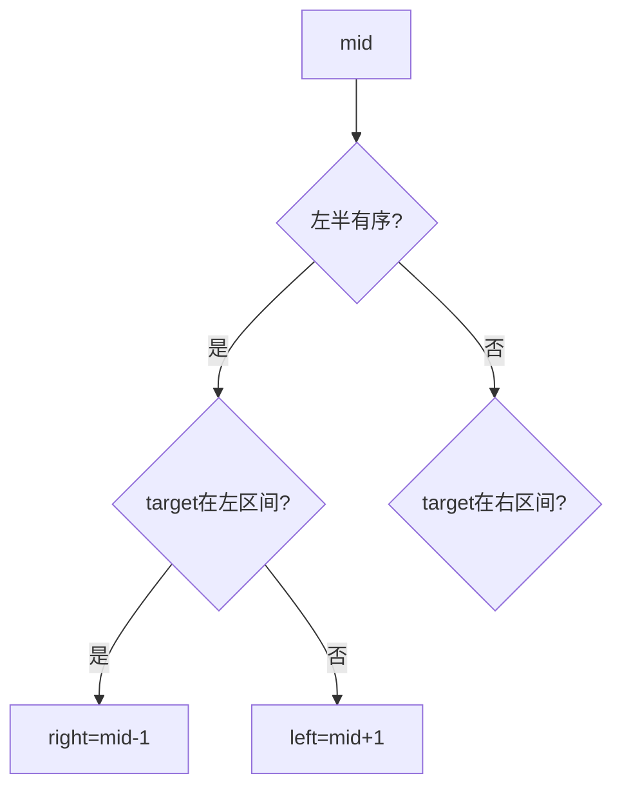

# 08 · 二分查找

## 为何产生？要解决什么问题？

有序序列上 O(log n) 定位。不仅用于数组，更用于**答案空间单调**的问题（最小化最大值、最大化最小值）。

两类模板：
1. **精确查找**：找 target 或插入位置
2. **边界二分**：第一个 ≥ x、最后一个 ≤ x

---

## 核心考点

1. **循环不变量**：`[left, right]` 闭区间 / 左闭右开
2. **旋转数组**：判断哪半边有序
3. **二分答案**：判定函数 `check(mid)` 单调

---

## 高频题 1：二分查找（LeetCode 704）

```go
func search(nums []int, target int) int {
    left, right := 0, len(nums)-1
    for left <= right {
        mid := left + (right-left)/2
        if nums[mid] == target {
            return mid
        }
        if nums[mid] < target {
            left = mid + 1
        } else {
            right = mid - 1
        }
    }
    return -1
}
```

---

## 高频题 2：搜索旋转排序数组（LeetCode 33）

### 图示



### 推演：`nums=[4,5,6,7,0,1,2], target=0`

| left | right | mid | nums[mid] | 判断 |
|------|-------|-----|-----------|------|
| 0 | 6 | 3 | 7 | 左 [4,5,6,7] 有序，0 不在 → left=4 |
| 4 | 6 | 5 | 1 | 右 [0,1,2] 有序，0<1 → right=4 |
| 4 | 4 | 4 | 0 | 命中 |

### Go 代码

```go
func searchRotated(nums []int, target int) int {
    left, right := 0, len(nums)-1
    for left <= right {
        mid := left + (right-left)/2
        if nums[mid] == target {
            return mid
        }
        if nums[left] <= nums[mid] {
            if nums[left] <= target && target < nums[mid] {
                right = mid - 1
            } else {
                left = mid + 1
            }
        } else {
            if nums[mid] < target && target <= nums[right] {
                left = mid + 1
            } else {
                right = mid - 1
            }
        }
    }
    return -1
}
```

---

## 高频题 3：在排序数组中查找元素的第一个和最后一个位置（LeetCode 34）

找左边界：第一个 `>= target`；右边界：第一个 `> target` 减 1。

```go
func searchRange(nums []int, target int) []int {
    leftBound := sort.Search(len(nums), func(i int) bool { return nums[i] >= target })
    if leftBound == len(nums) || nums[leftBound] != target {
        return []int{-1, -1}
    }
    rightBound := sort.Search(len(nums), func(i int) bool { return nums[i] > target }) - 1
    return []int{leftBound, rightBound}
}
```

---

## 高频题 4：x 的平方根（LeetCode 69）— 二分答案

```go
func mySqrt(x int) int {
    if x < 2 {
        return x
    }
    left, right := 1, x/2
    for left <= right {
        mid := left + (right-left)/2
        if mid <= x/mid {
            left = mid + 1
        } else {
            right = mid - 1
        }
    }
    return right
}
```

---

## 模板对比

| 类型 | 终止 | 更新 |
|------|------|------|
| 闭区间 [l,r] | l>r | l=mid+1 / r=mid-1 |
| 左闭右开 [l,r) | l<r | r=mid 或 l=mid+1 |

Go 标准库 `sort.Search(n, f)` 返回最小 i 使 `f(i)==true`，推荐熟用。
