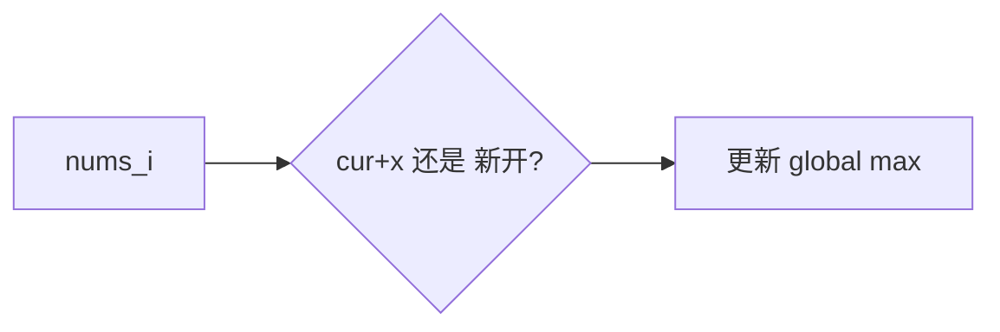

# 09 · 动态规划（DP）

## 为何产生？要解决什么问题？

暴力递归有大量**重叠子问题**；DP = 记忆化 + 最优子结构，避免重复计算。

识别信号：
- 求最值/方案数/可行性
- 当前决策依赖之前状态
- 无后效性：未来只依赖当前状态

步骤：**定义状态 → 转移方程 → 初始化 → 遍历顺序 → 空间优化**

---

## 核心考点

| 类型 | 典型题 |
|------|--------|
| 线性 DP | 爬楼梯、打家劫舍、LIS |
| 背包 | 0-1 背包、完全背包、分割等和子集 |
| 区间 DP | 戳气球、合并石子 |
| 状态机 | 买卖股票系列 |

---

## 高频题 1：爬楼梯（LeetCode 70）

`dp[i] = dp[i-1] + dp[i-2]`，斐波那契。

### 推演：n=5

| i | 1 | 2 | 3 | 4 | 5 |
|---|---|---|---|---|---|
| ways | 1 | 2 | 3 | 5 | 8 |

```go
func climbStairs(n int) int {
    if n <= 2 {
        return n
    }
    a, b := 1, 2
    for i := 3; i <= n; i++ {
        a, b = b, a+b
    }
    return b
}
```

---

## 高频题 2：最大子数组和（LeetCode 53）— Kadane

`cur = max(x, cur+x)`，全局 max。



### 推演：`[-2,1,-3,4,-1,2,1,-5,4]`

| i | x | cur | max |
|---|---|-----|-----|
| 0 | -2 | -2 | -2 |
| 1 | 1 | 1 | 1 |
| 2 | -3 | -2 | 1 |
| 3 | 4 | 4 | 4 |
| 4 | -1 | 3 | 4 |
| 5 | 2 | 5 | 5 |
| 6 | 1 | 6 | **6** |

```go
func maxSubArray(nums []int) int {
    cur, best := nums[0], nums[0]
    for i := 1; i < len(nums); i++ {
        if cur+nums[i] > nums[i] {
            cur = cur + nums[i]
        } else {
            cur = nums[i]
        }
        if cur > best {
            best = cur
        }
    }
    return best
}
```

---

## 高频题 3：最长递增子序列（LeetCode 300）

`dp[i]` = 以 i 结尾的 LIS 长度，O(n²)；或 patience sorting + 二分 O(n log n)。

```go
func lengthOfLIS(nums []int) int {
    tails := []int{}
    for _, x := range nums {
        i := sort.Search(len(tails), func(j int) bool { return tails[j] >= x })
        if i == len(tails) {
            tails = append(tails, x)
        } else {
            tails[i] = x
        }
    }
    return len(tails)
}
```

---

## 高频题 4：零钱兑换（LeetCode 322）— 完全背包

`dp[amt] = min(dp[amt-c]+1)`，初始化 `dp[0]=0`，其余 `inf`。

### 推演：coins=[1,2,5], amount=11

| amt | 0 | 1 | 2 | 3 | 4 | 5 | ... | 11 |
|-----|---|---|---|---|---|---|-----|-----|
| dp | 0 | 1 | 1 | 2 | 2 | 1 | ... | **3** |

```go
func coinChange(coins []int, amount int) int {
    const inf = int(1e9)
    dp := make([]int, amount+1)
    for i := 1; i <= amount; i++ {
        dp[i] = inf
    }
    for a := 1; a <= amount; a++ {
        for _, c := range coins {
            if c <= a && dp[a-c]+1 < dp[a] {
                dp[a] = dp[a-c] + 1
            }
        }
    }
    if dp[amount] >= inf {
        return -1
    }
    return dp[amount]
}
```

---

## 高频题 5：分割等和子集（LeetCode 416）— 0-1 背包

目标和 `sum/2`，`dp[j]` 表示能否凑出 j。

```go
func canPartition(nums []int) bool {
    total := 0
    for _, x := range nums {
        total += x
    }
    if total%2 != 0 {
        return false
    }
    target := total / 2
    dp := make([]bool, target+1)
    dp[0] = true
    for _, x := range nums {
        for j := target; j >= x; j-- {
            dp[j] = dp[j] || dp[j-x]
        }
    }
    return dp[target]
}
```

---

## 买卖股票状态机（LeetCode 121 单次）

```go
func maxProfit(prices []int) int {
    minPrice := int(1e9)
    best := 0
    for _, p := range prices {
        if p < minPrice {
            minPrice = p
        }
        if p-minPrice > best {
            best = p - minPrice
        }
    }
    return best
}
```
