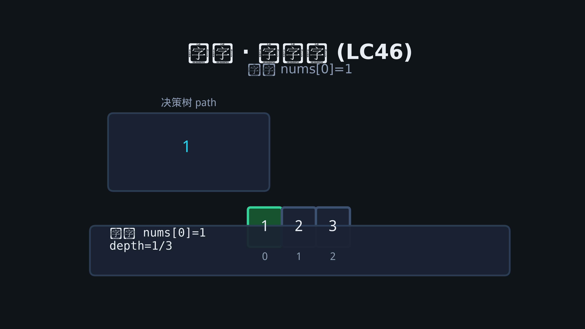

# 10 · 回溯

## 为何产生？要解决什么问题？

需要在**决策树**上穷举所有可能，但全排列是 O(n!)，必须**剪枝**。回溯 = DFS + 撤销选择（恢复状态）。

适用：排列、组合、子集、棋盘（N 皇后、数独）、分割字符串。

模板：
1. 做选择
2. 递归
3. 撤销选择

---

## 核心考点

1. **used 数组 / 去重排序**
2. **start 索引**（组合不重复）
3. **剪枝条件**提前 return
4. 与 DP 区别：回溯求**所有**解，DP 求最优/计数常可优化

---

## 高频题 1：全排列（LeetCode 46）

### 动图演示（决策树回溯全过程）



### 推演路径 [1,2,3]

| depth | path | used | 动作 |
|-------|------|------|------|
| 0 | [] | - | 选1 |
| 1 | [1] | 1 | 选2 |
| 2 | [1,2] | 1,2 | 选3 |
| 3 | [1,2,3] | all | 记录，撤销3 |
| 2 | [1,2] | | 撤销2，选3... |

```go
func permute(nums []int) [][]int {
    n := len(nums)
    used := make([]bool, n)
    path := make([]int, 0, n)
    var res [][]int
    var dfs func()
    dfs = func() {
        if len(path) == n {
            tmp := append([]int(nil), path...)
            res = append(res, tmp)
            return
        }
        for i := 0; i < n; i++ {
            if used[i] {
                continue
            }
            used[i] = true
            path = append(path, nums[i])
            dfs()
            path = path[:len(path)-1]
            used[i] = false
        }
    }
    dfs()
    return res
}
```

---

## 高频题 2：子集（LeetCode 78）

每个元素选或不选，或 `start` 递增防重复。

```go
func subsets(nums []int) [][]int {
    var res [][]int
    path := []int{}
    var dfs func(start int)
    dfs = func(start int) {
        tmp := append([]int(nil), path...)
        res = append(res, tmp)
        for i := start; i < len(nums); i++ {
            path = append(path, nums[i])
            dfs(i + 1)
            path = path[:len(path)-1]
        }
    }
    dfs(0)
    return res
}
```

---

## 高频题 3：组合总和（LeetCode 39）

可重复选，递归从 `i` 开始；剪枝：排序后 `remain < 0`  break。

```go
func combinationSum(candidates []int, target int) [][]int {
    sort.Ints(candidates)
    var res [][]int
    path := []int{}
    var dfs func(start, remain int)
    dfs = func(start, remain int) {
        if remain == 0 {
            tmp := append([]int(nil), path...)
            res = append(res, tmp)
            return
        }
        for i := start; i < len(candidates); i++ {
            if candidates[i] > remain {
                break
            }
            path = append(path, candidates[i])
            dfs(i, remain-candidates[i])
            path = path[:len(path)-1]
        }
    }
    dfs(0, target)
    return res
}
```

---

## 高频题 4：N 皇后（LeetCode 51）

列、主对角线 `row-col`、副对角线 `row+col` 用 set 标记。

```go
func solveNQueens(n int) [][]string {
    cols := map[int]bool{}
    diag1 := map[int]bool{}
    diag2 := map[int]bool{}
    board := make([][]byte, n)
    for i := range board {
        board[i] = make([]byte, n)
        for j := range board[i] {
            board[i][j] = '.'
        }
    }
    var res [][]string
    var dfs func(row int)
    dfs = func(row int) {
        if row == n {
            out := make([]string, n)
            for i := 0; i < n; i++ {
                out[i] = string(board[i])
            }
            res = append(res, out)
            return
        }
        for col := 0; col < n; col++ {
            d1, d2 := row-col, row+col
            if cols[col] || diag1[d1] || diag2[d2] {
                continue
            }
            cols[col], diag1[d1], diag2[d2] = true, true, true
            board[row][col] = 'Q'
            dfs(row + 1)
            board[row][col] = '.'
            delete(cols, col)
            delete(diag1, d1)
            delete(diag2, d2)
        }
    }
    dfs(0)
    return res
}
```
