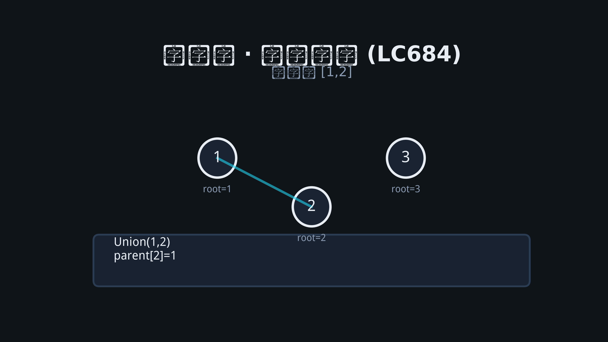

# 11 · 并查集（Union-Find）

## 为何产生？要解决什么问题？

动态场景下不断**合并集合**并查询两元素是否同集。朴素 BFS 每次 O(n)；并查集均摊近似 O(α(n))。

应用：连通分量、Kruskal 最小生成树、冗余连接、岛屿动态合并。

---

## 核心考点

1. **parent[]** 父节点，**find** 路径压缩
2. **union** 按秩/大小合并
3. 连通分量数 = n - 合并次数（成功 union 次数）

---

## 动图演示



---

## 高频题 1：省份数量（LeetCode 547）

```go
type UF struct {
    parent []int
    rank   []int
    count  int
}

func NewUF(n int) *UF {
    parent := make([]int, n)
    rank := make([]int, n)
    for i := range parent {
        parent[i] = i
    }
    return &UF{parent: parent, rank: rank, count: n}
}

func (u *UF) Find(x int) int {
    if u.parent[x] != x {
        u.parent[x] = u.Find(u.parent[x])
    }
    return u.parent[x]
}

func (u *UF) Union(a, b int) {
    ra, rb := u.Find(a), u.Find(b)
    if ra == rb {
        return
    }
    if u.rank[ra] < u.rank[rb] {
        ra, rb = rb, ra
    }
    u.parent[rb] = ra
    if u.rank[ra] == u.rank[rb] {
        u.rank[ra]++
    }
    u.count--
}

func findCircleNum(isConnected [][]int) int {
    n := len(isConnected)
    uf := NewUF(n)
    for i := 0; i < n; i++ {
        for j := i + 1; j < n; j++ {
            if isConnected[i][j] == 1 {
                uf.Union(i, j)
            }
        }
    }
    return uf.count
}
```

---

## 高频题 2：冗余连接（LeetCode 684）

第一条使 `Union` 失败的边即环边。

### 推演：edges = [[1,2],[1,3],[2,3]]

| 边 | Find(1) | Find(2) | Find(3) | 结果 |
|----|---------|---------|---------|------|
| 1-2 | 1 | 2 | - | Union 成功 |
| 1-3 | 1 | - | 3 | Union 成功 |
| 2-3 | 2 | 3 同集 | - | **返回 [2,3]** |

```go
func findRedundantConnection(edges [][]int) []int {
    n := len(edges)
    uf := NewUF(n + 1)
    for _, e := range edges {
        if uf.Find(e[0]) == uf.Find(e[1]) {
            return e
        }
        uf.Union(e[0], e[1])
    }
    return nil
}
```

---

## 高频题 3：岛屿数量 II（LeetCode 305）— 动态并查集

每添加陆地，与四邻合并，连通分量变化可跟踪 `uf.count`。

```go
func numIslands2(m, n int, positions [][]int) []int {
    uf := NewUF(m * n)
    grid := make([]bool, m*n)
    res := []int{}
    dirs := [][2]int{{1, 0}, {-1, 0}, {0, 1}, {0, -1}}
    for _, p := range positions {
        r, c := p[0], p[1]
        idx := r*n + c
        if grid[idx] {
            res = append(res, uf.count)
            continue
        }
        grid[idx] = true
        uf.count++
        for _, d := range dirs {
            nr, nc := r+d[0], c+d[1]
            if nr < 0 || nc < 0 || nr >= m || nc >= n {
                continue
            }
            nidx := nr*n + nc
            if grid[nidx] {
                uf.Union(idx, nidx)
            }
        }
        res = append(res, uf.count)
    }
    return res
}
```
