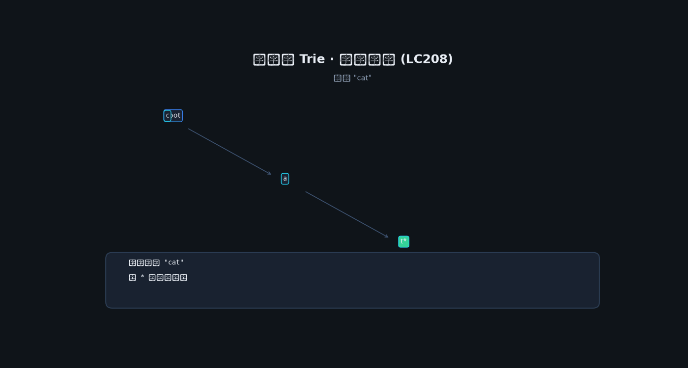

# 12 · 字典树（Trie）

## 为何产生？要解决什么问题？

哈希表精确匹配 O(1)，但**前缀查询**（自动补全、敏感词过滤、IP 路由最长前缀）需要 Trie：从根到叶的路径表示字符串前缀。

| 对比 | 哈希 | Trie |
|------|------|------|
| 精确查找 | O(1) | O(L) |
| 前缀搜索 | 需扫全表 | O(L) 自然支持 |
| 空间 | 较少 | 节点多（可压缩） |

---

## 核心考点

1. 26 叉或 `map[rune]*Node`
2. `isEnd` 标记单词结尾
3. DFS 搜前缀、单词搜索 II

---

## 动图演示



---

## 高频题 1：实现 Trie（LeetCode 208）

### Go 代码

```go
type Trie struct {
    children [26]*Trie
    isEnd    bool
}

func ConstructorTrie() Trie {
    return Trie{}
}

func (t *Trie) Insert(word string) {
    node := t
    for i := 0; i < len(word); i++ {
        c := word[i] - 'a'
        if node.children[c] == nil {
            node.children[c] = &Trie{}
        }
        node = node.children[c]
    }
    node.isEnd = true
}

func (t *Trie) Search(word string) bool {
    node := t.find(word)
    return node != nil && node.isEnd
}

func (t *Trie) StartsWith(prefix string) bool {
    return t.find(prefix) != nil
}

func (t *Trie) find(s string) *Trie {
    node := t
    for i := 0; i < len(s); i++ {
        c := s[i] - 'a'
        if node.children[c] == nil {
            return nil
        }
        node = node.children[c]
    }
    return node
}
```

---

## 高频题 2：单词搜索 II（LeetCode 212）

Trie + 网格 DFS，回溯时剪枝删除已匹配 Trie 节点。

### 动图演示

Trie 插入结构见上图；网格 DFS 沿 Trie 走字符，命中 `isEnd` 时收集单词并剪枝。


### 推演要点

- `words=["oath","pea","eat","rain"]`，board 含 "oath","eat"
- 从 'o' 出发沿 Trie 走 o→a→t→h 命中 oath
- 命中后从 Trie 删叶减少重复搜索

```go
type TrieNode struct {
    children map[byte]*TrieNode
    word     string // 非空表示单词结尾
}

func findWords(board [][]byte, words []string) []string {
    root := &TrieNode{children: map[byte]*TrieNode{}}
    for _, w := range words {
        node := root
        for i := 0; i < len(w); i++ {
            c := w[i]
            if node.children[c] == nil {
                node.children[c] = &TrieNode{children: map[byte]*TrieNode{}}
            }
            node = node.children[c]
        }
        node.word = w
    }
    rows, cols := len(board), len(board[0])
    res := []string{}
    dirs := [][2]int{{1, 0}, {-1, 0}, {0, 1}, {0, -1}}
    var dfs func(r, c int, node *TrieNode)
    dfs = func(r, c int, node *TrieNode) {
        ch := board[r][c]
        next, ok := node.children[ch]
        if !ok {
            return
        }
        if next.word != "" {
            res = append(res, next.word)
            next.word = ""
        }
        board[r][c] = '#'
        for _, d := range dirs {
            nr, nc := r+d[0], c+d[1]
            if nr >= 0 && nc >= 0 && nr < rows && nc < cols && board[nr][nc] != '#' {
                dfs(nr, nc, next)
            }
        }
        board[r][c] = ch
    }
    for i := 0; i < rows; i++ {
        for j := 0; j < cols; j++ {
            dfs(i, j, root)
        }
    }
    return res
}
```

---

## 高频题 3：最长单词（LeetCode 720）

对所有 word 排序后，Trie 插入时要求**每个前缀也是字典中的词**。

```go
func longestWord(words []string) string {
    sort.Strings(words)
    root := &TrieNode{children: map[byte]*TrieNode{}}
    best := ""
    for _, w := range words {
        node := root
        ok := true
        for i := 0; i < len(w); i++ {
            c := w[i]
            child, exists := node.children[c]
            if !exists {
                if i < len(w)-1 {
                    ok = false
                    break
                }
                child = &TrieNode{children: map[byte]*TrieNode{}}
                node.children[c] = child
            }
            node = child
        }
        if !ok {
            continue
        }
        if len(w) > len(best) || (len(w) == len(best) && w < best) {
            best = w
        }
    }
    return best
}
```
